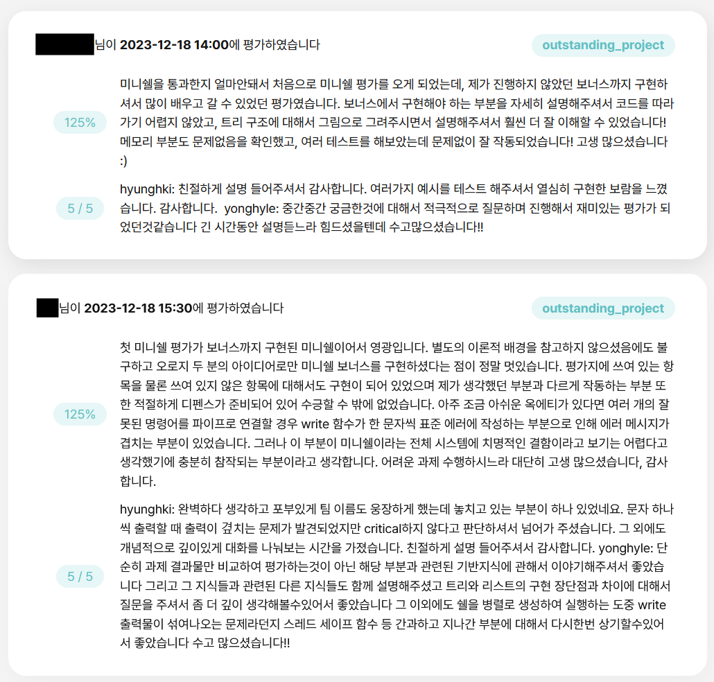
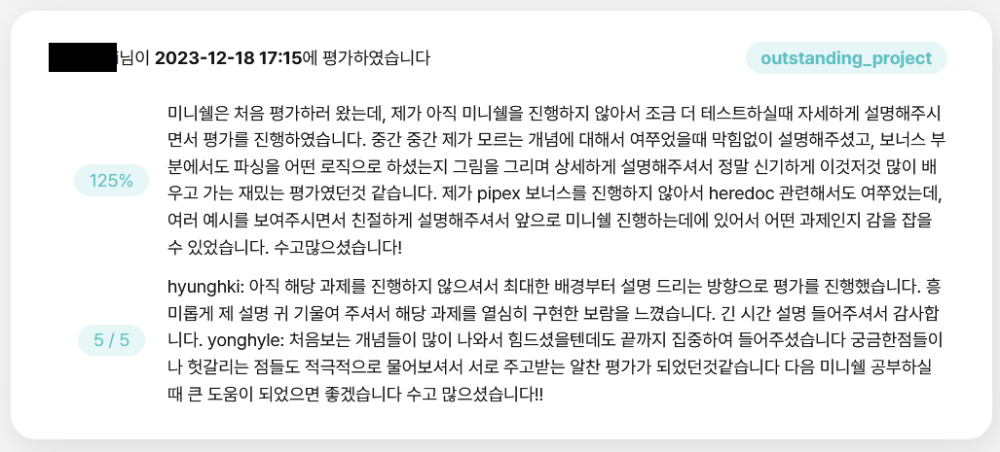

{.post-thumbnail}

::: {.callout-note appearance="simple"}
아직 작성중인 노트입니다.
:::

## intro

42 seoul의 첫 번째 시련을 담당하는 과제 minishell입니다.
이 과제는 아직 여기까지 도달하지 못한 사람들에게는 공포의 상징으로 유명합니다.
구현해야하는 범위가 넓은것도 있지만, 첫 번째 협업이다보니 커뮤니케이션 과정에서 트러블이 발생하는 경우도 잦아서 부정적인 경험을 한 선례가 많기 때문입니다.

솔직히 말하자면, 저는 협업을 하지 않았습니다.
정확하게는, 혼자서 다 구현한 다음에 같이 평가를 받아줄 한 분을 찾아서 팀을 구성해, 과제를 통과했습니다.
2인이 평가를 받는 과제에서 그래도 되는가 하는 생각이 들수도 있지만, 뭐..이것도 협업을 하는 많고 많은 방법중 하나가 아닐까 하는 생각이 듭니다.

이런 드라마 대사도 있으니까요. `답장했어. 무응답으로`   
저도 마찬가지입니다. `협업했어. non-communication으로`

## 프로젝트 설명

### 개요

[과제 명세서](https://cdn.intra.42.fr/pdf/pdf/133183/en.subject.pdf)

이 프로젝트는 bash를 c언어로 구현해야하는 과제입니다.
과제 명세서에도 완전히 똑같이 만들 필요는 없다고 나와있지만, 42 seoul의 평가자들은 절대 당신의 타협을 납득하지 않을겁니다. (사실 그정도까지는 아닙니다.)

구현 시 반드시 [norminette 규칙](https://github.com/taeng42/norminette/blob/master/pdf/ko.norm.pdf)을 준수해야 하는데, 이는 코드의 가독성을 위한 것이고, 대표적인 예시는 다음과 같습니다.

- 파일당 함수 5개 이하
- 함수당 코드 25줄 이하
- 한 줄당 80자 이하

[bash 공식 문서](https://www.gnu.org/software/bash/manual/bash.html)와 함께 [이 자료](https://mug896.github.io/bash-shell/index.html)를 많이 참고해서 구현했습니다.
자세한 내용은 [코드와 함께 설명](#코드-설명)드리겠습니다.

### Mandatory

### Bonus

## 코드 설명

::: {.callout-note appearance="simple"}
전체 코드는 [github repo](https://github.com/cryscham123/my_bash)에서 확인 가능합니다.
:::

## 결과

## outro

42 Seoul 과정 중 가장 오랜 시간을 투자한 프로젝트입니다.
사실 이렇게까지 오래걸릴 과제는 아니였는데, 개인적인 욕심으로 구현 범위를 조금씩 늘리다보니 scale이 점점 커져가는걸 멈출 수 없었습니다.
시간이 오래걸리긴 했지만, 마감기한이 없는 42 Seoul의 특성상 (black-hole 제도는 있지만) 급하지 않게 제가 원하는걸 자유로이 구현할 수 있었습니다.

일상 속에서 차근차근 아이디어를 모으고 구현하면서, 코딩 실력이 크게 향상되었음을 체감할 수 있었습니다.
돌아보면 참 보람찼던 프로젝트였던것 같아요.

후속 과제도 하나가 더 있긴 하지만 당분간은 42 과제를 더 진행할 계획이 없습니다.
그래도 혹시라도 이 글을 보시는 분 중에 42sh 과제를 진행할 생각이 있고, 팀원을 모집 중이시라면.. 연락 바랍니다.
