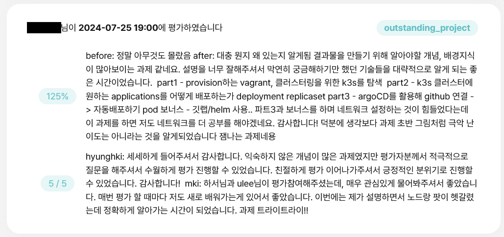

{.post-thumbnail}

::: {.callout-note appearance="simple"}
아직 작성중인 노트입니다.
:::

## intro

## 프로젝트 설명

### 개요

[과제 명세서](https://cdn.intra.42.fr/pdf/pdf/143948/en.subject.pdf)

<!--구현 시 반드시 [norminette 규칙](https://github.com/taeng42/norminette/blob/master/pdf/ko.norm.pdf)을 준수해야 하는데, 이는 코드의 가독성을 위한 것이고, 대표적인 예시는 다음과 같습니다.-->
<!---->
<!--- 파일당 함수 5개 이하-->
<!--- 함수당 코드 25줄 이하-->
<!--- 한 줄당 80자 이하-->

<!--[bash 공식 문서](https://www.gnu.org/software/bash/manual/bash.html)와 함께 [이 자료](https://mug896.github.io/bash-shell/index.html)를 많이 참고해서 구현했습니다.-->
자세한 내용은 [코드와 함께 설명](#코드-설명)드리겠습니다.

::: {.callout-note appearance="simple"}
:::

### Mandatory

### Bonus

## 코드 설명

::: {.callout-note appearance="simple"}
전체 코드는 비공개 되어있는 상태입니다.
:::

## 결과

## outro

