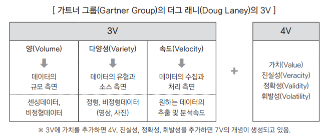
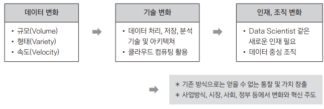

{.post-thumbnail}

## 빅데이터의 이해

### 1. 빅데이터의 정의

- 좁은 범위
   - 데이터 자체의 특성에 초점을 맞춘 정의
   - `3V(다양성, 속도, 규모)`를 강조
- 중간 범위
   - 데이터 자체뿐 아니라 처리, 분석 방법도 포함하는 정의
- 넓은 관점
   - 인재, 조직 변화까지 포함한 정의

∴ 기존 방식으로는 얻을 수 없는 통찰 및 가치 창출

### 2. 출현 배경과 변화

1. 산업계: 고객 데이터가 축적되며 새로운 가치 활용
1. 학계: 거대 데이터 활용 분야가 늘어나며 통계 도구들이 발전
1. 기술발전: 관련기술의 발전

### 3. 빅데이터의 기능

1. `산업혁명의 석탄, 철`: 산업 전반에 혁명적 변화를 가져옴
1. `21세기의 원유`: 생산성을 향상시키고, 기존에 없던 새로운 범주의 산업을 만들어낼 것으로 전망
1. `렌즈`: 데이터가 산업에 영향을 미침
1. `플랫폼`

### 4. 빅데이터가 만들어 내는 본질적인 변화

1. `사전처리 → 사후처리`
1. `표본조사 → 전수조사`
1. `질 → 양`
1. `인과관계 → 상관관계`

## 빅데이터의 가치와 영향

### 1. 빅데이터의 가치

빅데이터는 아래와 같은 이유로 가치 선정이 어렵다.

- 데이터 활용방식: 데이터를 언제 어디서 누가 사용할지 미리 예측하기 어려움
- 새로운 가치 창출: 기존에 없던 가치를 창출하기 때문에 가치를 예측하기 어려움
- 분석 기술 발전: 현재 가치가 없더라도, 추후 기술이 발전하면 가치가 생길 수 있음

### 2. 빅데이터의 영향

빅데이터는 다양한 주체(기업, 정부, 개인)에 영향을 미친다.

## 비즈니스 모델

### 1. 빅데이터 활용 사례

여러가지 활용 사례가 있다.

### 2. 빅데이터 활용 기본 테크닉

- `연관규칙학습`: 범주형 데이터의 변인들간의 규칙을 발견 (ex. 장바구니 분석)
- `유형(군집)분석`: 데이터를 분류하거나 군집화. 비지도 학습 (not 분류분석)
- `유전자 알고리즘`: 최적해를 찾는 알고리즘
- `기계학습`: 훈련한 데이터로 예측
- `회귀분석`: 연속형 데이터의 독립변수와 종속변수의 관계를 수학적으로 모델링해서 예측
- `감정분석`: 비정형 데이터 분석
- `소셜네트워크분석(사회관계망분석)`: 비정형 데이터 분석

## 위기 요인과 통제 방안

### 1. 빅데이터 시대의 위기 요인과 통제 방안

- `사생활 침해`: 동의에서 책임으로
- `책임 원칙 훼손`: 결과 기반 책임 원칙 고수
- `데이터 오용`: 알고리즘 접근 허용, `알고리즈미스트`

## 미래의 빅데이터

### 1. 빅데이터 활용의 3요소

- `데이터`: 모든것의 데이터화
- `기술`: 인공지능
- `인력`: 데이터 사이언티스트, 알고리즈미스트
