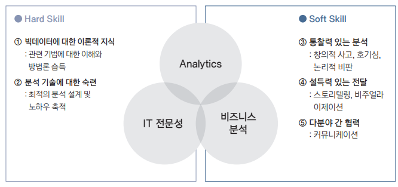

{.post-thumbnail}

## 빅데이터 분석과 전략 인사이트

빅테이터 분석은 분석을 통해 `가치를 창출`하는 것이 목적이다.

- 일차원적인 분석: 해당 부서나 업무 영역에만 효과가 있다. 변화하는 환경에서 새로운 기회를 포착하기 어려움.
- 전략도출 가치기반 분석: 일차원적인 분석을 통해 얻은 가치를 기반으로 활용 범위를 더 넓고 전략적으로 확장해야한다.

## 전략 인사이트 도출을 위한 필요 역량

`외부 환경`이 다음과 같이 `변화`함에 따라 인사이트 도출을 위한 `인문학적 역량`이 요구됨.

- `컨버전스 → 디버전스`
- `생산 → 서비스`
- `생상 → 시장창조`
