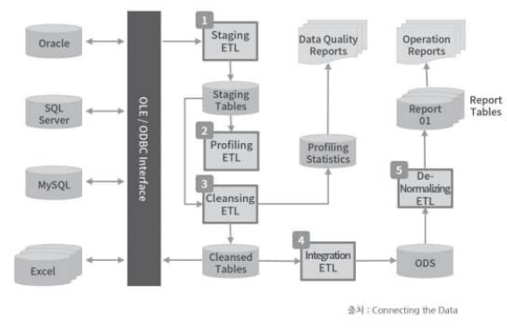
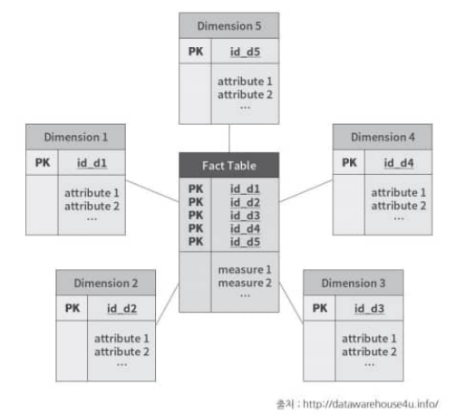
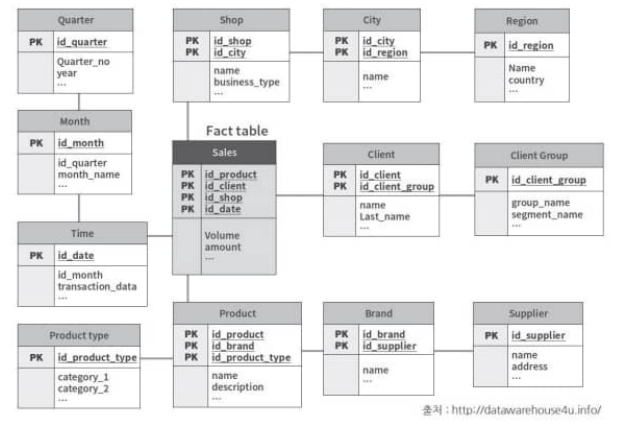
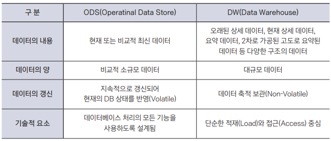
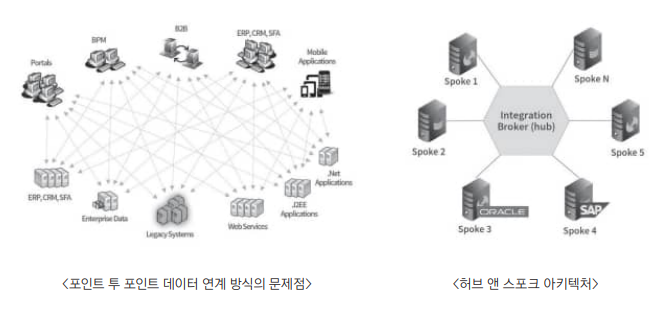
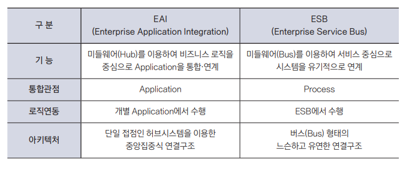
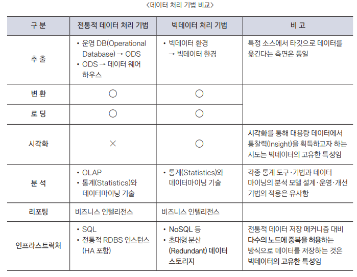

{.post-thumbnail}

## ETL

### 1. ETL 개요

- `ETL(Extract, Transformation, Load)`: 데이터 이동 및 변환 절차
- `batch ETL`, `real-time ETL`으로 나뉨

1. `Interface`: 다양한 소스로부터 데이터 휙득을 위한 인터페이스(OLEDB, ODBC, FTP) 
1. `Staging`: 정기적으로 데이터 원천으로 부터 저장. 아직은 정규화 x
1. `Profiling`: staging table의 데이터 특성을 식별하고, 품질 측정
1. `Cleansing`: profiling된 데이터를 보정
1. `Integration`: 데이터 충돌을 해소하고, 데이터를 통합. 아마 여기서 정규화가 이루어질듯(왜 책에 설명 똑바로 안해놓지)
1. `Export`: 운영보고서 생성, 데이터웨어하우스 / 데이터마트에 적재하기 위한 최적화(denormalization) 진행

### 2. ODS 구성

- 통합된 데이터를 저정하는 중간 저장소
- `실시간`, `거의 실시간`으로 데이터 적재

### 3. 데이터 웨어하우스

- ODS를 통해 정제 / 통합된 데이터를 분석 및 보고서 생성을 위해 저장

**특징**

- `주제중심성`
- `영속성/비휘발성`
- `통합성`
- `시계열성`

**모델링 기법**

- `스타 스키마(조인 스키마)`
   - 제 3정규형의 fact 테이블과 제 2정규형의 차원 테이블로 구성
   - 복잡성이 낮지만, 데이터 무결성이 떨어짐

- `스노우플레이크 스키마`
   - 스타 스키마의 차원 테이블을 제 3정규형으로 정규화한 상태
   - 데이터 무결성이 높지만, 복잡성이 높음

::: {.callout-note appearance="simple" icon=false}
제 1 정규형: 반복되는 record나 다치 attribute를 포함하지 않음
제 2 정규형: 부분 종속성(primary key의 일부가 다른 일부를 종속함)이 없음
제 3 정규형: 이행적 종속성(primary key가 아닌 attribute의 종속성)이 없음
:::

### 4. ODS vs DW

## CDC(change data capture)

### 1. CDC 개념 및 특징

- 데이터 변경을 감지하고, 변경된 데이터를 추출하는 기술
- 하드웨어 계층부터 어플리케이션 계층까지 다양한 수준에서 적용 가능

### 2. CDC 구현 기법

1. `Time Stamp on Rows`
1. `Version Numbers on Rows`: 참조테이블을 같이 사용하는게 일반적이라고 한다.
1. `Status on Rows`: time stamp, version number 보완 용도로, 사람이 레코드 반영 여부를 직접 판단할 수 있게 적용할 수 있음
1. `Time/Version/Status on Rows`
1. `Triggers on Tables`: message queue로 변경 발생시 subscribe 된 대상에 publish하는 방식. 시스템 관리 복잡도가 높아짐
1. `Event Programming`: 어플리케이션에 데이터 변경 식별 기능을 추가
1. `Log Scanner on Database`: 데이터 스키마 변경 불필요, 어플리케이션 영향 최소화, 지연시간 최소화

### 3. CDC 구현 방식

- `Push`: 데이터 원천에서 변경 식별(agent)
- `Pull`: 대상 시스템에서 원천을 주기적으로 모니터링

## EAI

### 1. EAI의 개념 및 특징

- 기업 내 혹은 기업 간 정보시스템을 연계하여 동기화.
- ETL은 `batch 처리` 중심, EAI는 `실시간 혹은 근접 실시간 처리` 중심

### 2. 데이터 연계 방식

- ETL/CDC는 운영 데이터와 분석을 위한 데이터베이스가 `구분`되지만, EAI는 `그냥 통합`

### 3. EAI 구성요소

- `Adapter`: 시스템 간 데이터 변환
- `Broker`: 데이터 전송
- `Bus`: 데이터 전송 경로 설정
- `Transformer`: 데이터 형식 변환

### 4. EAI 구현 유형

1. `Mediation`: Publish/Subscribe 방식
1. `Federaion`: Request/Reply 방식

### 5. EAI 활용 효과

- 협력사, 파트너, 고객과의 상호 협력 프로세스 연계
- 그룹 및 지주 회사 계열사들 간 상호 관련 데이터 동기화 등을 위한 데이터 표준화 기반 제공

### 6. EAI vs ESB

[추가적인 자료](https://bcho.tistory.com/1292)

## 데이터 통합 및 연계 기법

## 대용량의 비정형 데이터 처리 방법

### 2. 대규모 분산 병렬 처리

### 3. 데이터 연동

### 4. 데이터 질의 기술

