{.post-thumbnail}

## 마스터 플랜 수립 프레임 워크

### 2. 수행 과제 도출 및 우선순위 평가

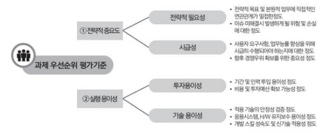

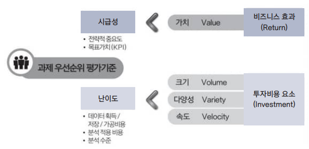

위 기준에 따라 시급성과 난이도를 평가한 후, 아래 그림에 맞게 우선순위를 정한다.

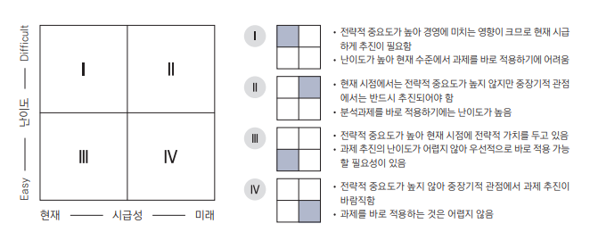

우선순위 기준을 시급성에 둔다면, 3 → 4 → 2 순, 난이도에 둔다면 3 → 1 → 2 순으로 우선순위를 정한다.

### 3. 이행계획 수립

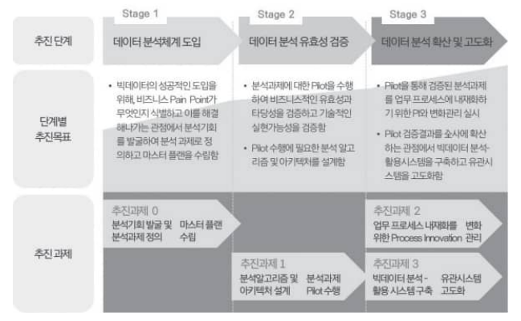

2. 세부 이행계획 수립

## 분석 거버넌스 체계 수립

### 1. 거버넌스 체계

### 2. 데이터 분석 수준진단

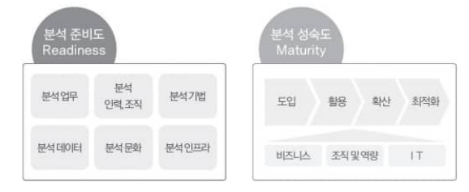

1. 분석 준비도

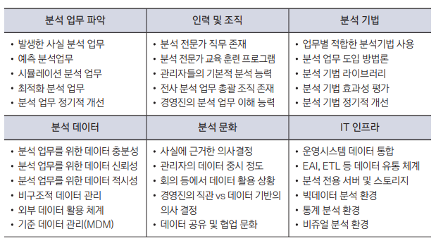

2. 분석 성숙도

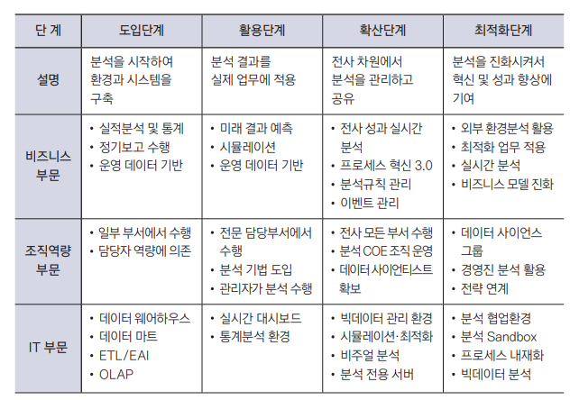

분석 준비도와 성숙도를 통해 현재 분석 수준을 파악한다.
이후 아래의 그림에 맞춰 목표 방향을 설정한다.

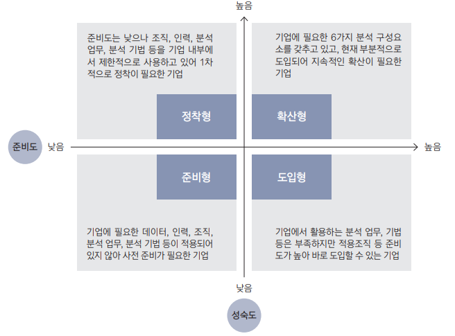

### 4. 데이터 거버넌스 체계 수립

- 구성 요소:
    - 원칙
    - 조직
    - 프로세스

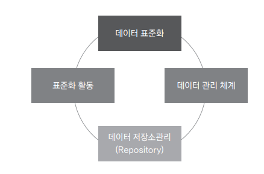

- 데이터 표준화:
- 데이터 관리 체계:
- 레포지토리:
- 표준화 활동:

### 5. 데이터 조직 및 인력방안 수립

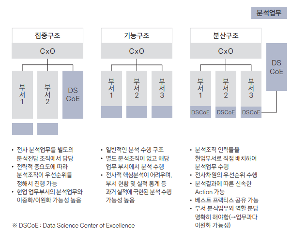

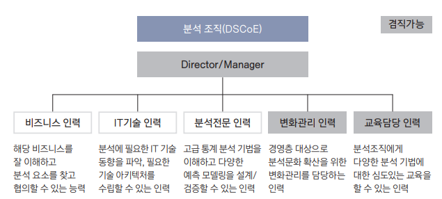

### 6. 분석과제 관리 프로세스 수립

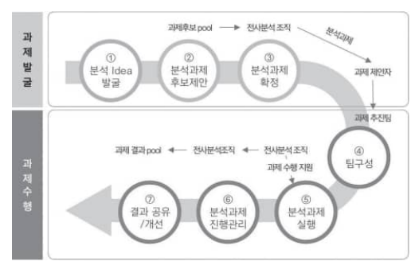
