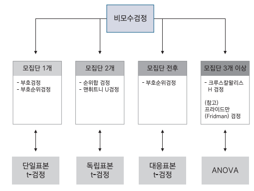
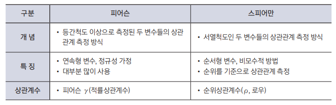

{.post-thumbnail}

## 통계분석의 이해

### 1. 표본 추출 방법

1. 단순랜덤 추출법
1. 계통추출법: k개씩 띄어서 랜덤으로 추출
1. 집락 추출법: 군집을 나눈 후, 군집 안에서 단순랜덤 추출
1. 층화 추출법: 이질적인 모집단에서, 비슷한 특성을 가진 층을 나눈 후, 각 층에서 단순랜덤 추출

### 2. 척도

1. 명목척도
1. 순서척도
1. 구간척도: 더하기, 빼기 가능. 곱셈 나눗셈 불가능
1. 비율척도: 절대적 기준인 0이 존재, 사칙연산 가능

### 3. 비모수 검정

- 모집단에 대한 가정이 없이, 서열관계나 차이를 검정하는 방법
- 분포의 형태가 동일하다, 동일하지 않다로 가정
- 관측값들의 순위나 차이의 부호에 의존

## 기초 통계분석

## 통계분석의 방법론

- t 검정
    - 일표본
    - 대응표본
    - 독립표본

- ANOVA
    - 일원분산분석
    - 이원분산분석
    - 다원분산분석
- 다변량분석

- 실험계획법
    - 요인배치법
    - 분할법
    - 교락법
    - 난괴법

- 교차분석
    - 적합성 검정: k개의 범주들에 대한 관측값 갯수가 기댓값과 일치하는지 검정
        - 자유도: k-1
        - 각 집단의 $\frac{(관측도수 - 기대도수)^2}{기대도수}$의 합이 카이제곱 분포를 따름
    - 독립성 검정
        - 자유도: (r - 1)(c - 1)
    - 동질성 검정: 독립성 검정이랑 유사

## 회귀분석

### 1. 가정

- 선형성
- 정규성: qq-plot, 대각선에 가까워야함
- 등분산성: 수평선에 가까워야함
- 독립성: 더빈 왓슨 검정(0~4), 2에 가까울수록 독립성이 있다.

→ 가정을 충족하지 않을 경우, 회귀모델을 수정해야함

1. 이상치 → 관측값 제거
1. 선형성 → 독립변수 변환
1. 정규성, 등분산성 미충족 → 종속변수 변환

변환: $x$ → $x^λ$

### 2. 회귀식

- $R^2 = \frac{SSR}{SST}$
- $R^2_{adj} = 1 - \frac{(1 - R^2)(n - 1)}{n - k - 1}$

### 3. 다중공선성

- 독립변수들 간에 강한 상관관계가 존재하는 경우
    - 상관계수: 변수간 상관계수를 직접 계산
    - 허용오차: 1 - $R^2$. 0.1 이하면 다중공선성이 존재한다고 판단
    - VIF: 허용 오차의 역수. 10 이상이면 다중공선성이 존재한다고 판단 
    → 변수 제거

### 4. 최적화 회귀방정식

- AIC, BIC나 F-value를 크게 만드는 변수 제거

1. 전진 선택법: 상수항부터 시작해, 한번에 한개씩 독립변수 추가
    - 전체 변수 사용할 수 있지만 안정성이 낮음
1. 후진 선택법: 모든 독립변수를 포함한 후, 하나씩 제거. AIC가 더 이상 작아지지 않을 때까지
    - 안정성이 높지만 변수가 많을 때 시간이 오래 걸림
1. 단계 선택법: 전진, 후진 선택법을 혼합.  
    - 이미 선택된 변수를 제거할 수 있음
    - 변수가 많으면 시간이 오래 걸림

## 고급 회귀분석

### 1. 패널티 회귀분석

지나치게 많은 독립변수를 갖는 모델에 페널티를 부과하는 방식

1. 릿지: 모델의 설명력에 기여하지 못하는 독립변수의 계수 크기를 0에 근접하게 축소 ($l_2$ 규제)
    - 회귀 계수가 비슷하고, 독립변수가 많을 때 효과가 좋다.
1. 라쏘: 모델의 설명력에 기여하지 못하는 독립변수의 계수 크기를 0으로 만듦 ($l_1$ 규제)
    - 회귀 계수 차이가 클 때 효과가 좋다.
1. 엘라스틱넷: 릿지와 라쏘를 혼합한 방법 ($l_1$ + $l_2$ 규제)

### 2. 일반화 회귀분석

- 종속변수가 연속형이면서 정규분포를 따르지 않을 때 사용

1. logistic 회귀모형
1. poisson 회귀모형

## 시계열 분석

