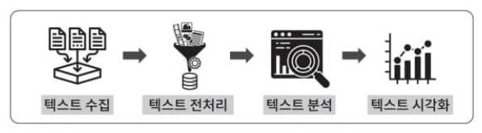
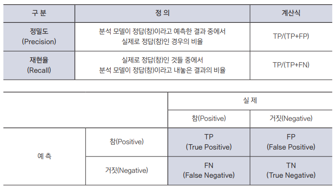
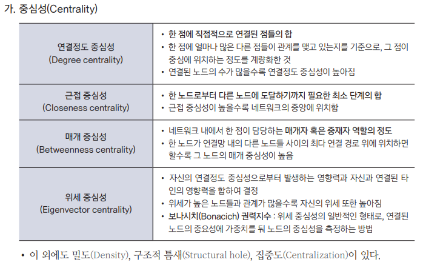

{.post-thumbnail}

## 텍스트 마이닝

- 비정형 데이터를 구조화해서 패턴을 도출한 후 결과를 평가 및 해석하는 일련의 과정

### 기능

- 목표 기능: 문서 분류, 군집, 정보 추출, 문서 요약
- 사용 기술: 자연어 처리, 컴퓨터 언어학

### 과정

1. 텍스트 수집
1. 텍스트 전처리
    - tm 패키지: 문서를 Corpus 객체로 변환해서 관리
        - VCorpus: 문서를 Corpus로 변환해서 메모리에 저장
        - PCorpus: 문서를 Corpus로 변환해서 디스크에 저장
        - DirSource, DataframeSource, VectorSource: 데이터 소스 지정
        - tm_map(x, FUN): x에 FUN을 적용
        - DocumentTermMatrix: 문서-단어 빈도표 생성
        - TermDocumentMatrix: 단어-문서 빈도표 생성
    - 전처리
        1. 정제: 노이즈 제거
        1. 토큰화
            - 단어 토큰화
            - 어절 토큰화
            - 형태소 토큰화
            - 품사 태깅
        1. 불용어 처리: 불필요한 토큰 제거
        1. 정제 / 정규화
            - 표기가 다른 같은 단어 통일
            - 대소문자 통일
            - 불필요한 단어 제거
            - 정규표현식으로 특수문자 제거
        1. 어간 / 어근 추출
        1. 텍스트 인코딩
            - one hot 인코딩
            - 말뭉치(BoW): 단어의 빈도수를 벡터로 표현
            - TF-IDF: 문서 내 단어의 빈도 수 / 단어가 등장한 문서 수
            - 워드 임베딩
    - 텍스트 분석
        - 토픽 모델링
        - 감성 분석
        - 텍스트 분류
        - 텍스트 군집화
    - 텍스트 시각화
        - 워드 클라우드
        - 의미 연결망 분석

### 정보 검색의 적절성

## 사회연결망 분석

### 2. 기법

1. 개인을 노드, 관계를 엣지로 해서 그래프 생성
1. 아래의 기준에 따라 구조 파악

