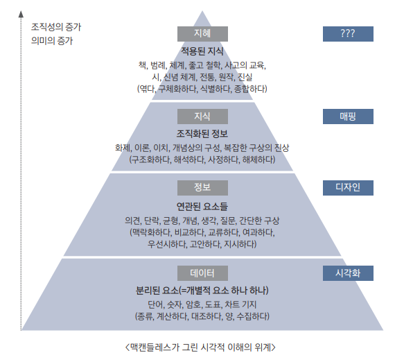
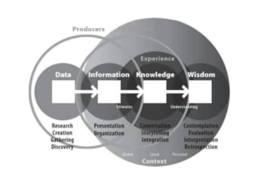
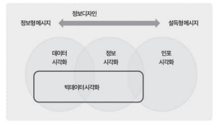
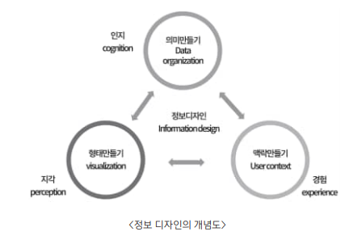
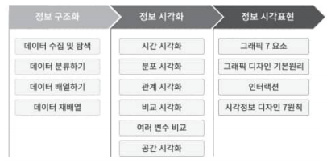
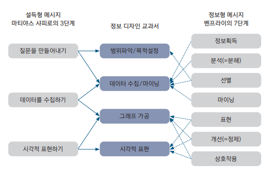
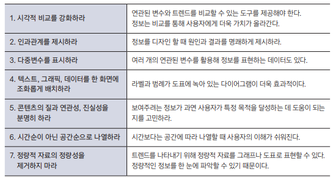
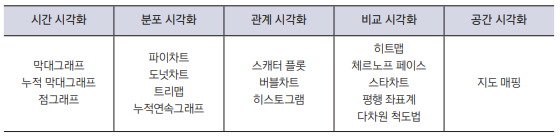
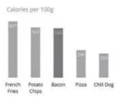

{.post-thumbnail}

## 시각화의 정의

### 1. 데이터 시각화의 중요성

데이터 시각화의 목적은 데이터 분석과 의사소통

### 2. 시각 이해와 시각화

- 데이터: 디자인의 대상이 될 수 없음
- 정보
    - 데이터가 의미를 전달하기위한 형태를 가짐
    - 자기조직화 되지 않은 일반적인 의미를 가지고 있고, 생산자와 사용자의 관점에 따라 다르게 전달될 수 있다.
- 지식: 다른 영역의 정보가 `자기조직화된 형태`
- 지혜: 지식이 내면화되어 개인적 맥락에 포함된 형태. 명시적으로 상대에게 전달하기 어려움

### 3. 시각화 분류와 구분

1. 데이터 시각화
1. 정보 시각화
1. 정보 디자인
    
    - 데이터 시각화, 정보 시각화, 인포그래픽도 정보 디자인의 범위에 속한다고 볼 수 있다.
    - 대표적인 예시로 `나폴레옹 행군 다이어그램`, `나이팅게일 폴라 지역 다이어그램`이 있다.

1. 인포그래픽(뉴스 그래픽): 중요한 정보를 한 장의 그래픽으로 표현한 것. 원 데이터는 취급 안함.
    - 정보형 메세지: 객관적인 정보를 전달하는데 목적을 둠. 대표적인 예시: 워싱턴 지하철 지도
    - 설득형 메세지: 대충 포스터 생각하면 됨

## 시각화 프로세스

### 1. 정보 디자인 프로세스

1. 데이터 수집
1. 모든 것을 읽기
1. 내리티브 찾기
1. 문제의 정의
1. 계층 구조 만들기
1. 와이어프레임 그리기
1. 포맷 선택하기
1. 시각 접근 방법 결정하기
1. 정제와 테스트
1. 세상에 선보이기

### 2. 빅데이터 시각화 프로세스

## 시각화 방법

### 2. 정보 구조화

1. 데이터 수집 및 탐색
1. 데이터 분류: 확장자 맞게 분류
1. 데이터 배열: LATCH
    - Location
    - Alphabet
    - Time
    - Category
    - Hierarchy: 정보의 변화에 따라 데이터의 값이나 중요도 순서로 정렬
1. 데이터 재배열(관계 맺기): 

### 3. 정보 시각화

- 범례 만들지 말고, 직접 그려 넣은거
- 테두리, 보조선 없는거
- 굵은 글씨 대신 글자를 흐리게
- 색깔은 최대한 적게 사용

### 4. 정보 시각 표현

1. 자크 베르탱의 그래픽 7요소
    1. 위치: 가장 중요한거는 좌측 상단에 배치
    1. 크기
    1. 모양
    1. 색
    1. 명도
    1. 기울기
    1. 질감
1. 타이포그래피
    - 산세리프: 돌기가 없음. 제목에 적합
    - 세리프: 돌기가 있음. 본문에 적합
1. 아이소타이프
