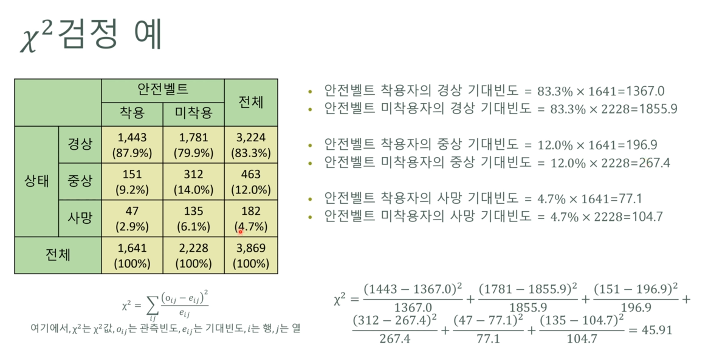

{.post-thumbnail}

비교 집단이 2개보다 많은 경우 단순히 t-test를 여러번 하면 1종 오류에 빠져서 안됨.

## One-way Anova

독립변수가 하나일 때, 3개 이상의 집단 간 평균 차이를 비교하는 방법
    - 종속변수: 연속형만 가능
    - 독립변수: 이산/범주형 변수만 가능

## F-value

2개의 분산의 비율. 전체 평균과 그룹의 평균이 필요함

- 그룹 간 변동(between variance, df1, treatment): 전체 평균과 그룹 내 데이터들의 평균과의 차이.
    - 자유도: 그룹의 수 - 1
- 그룹 내 변동(within variance, df2, error): 그룹 내 데이터들의 평균과 그룹 내 데이터들의 차이
    - 자유도: 전체 데이터 수 - 그룹의 수

between variance > within variance = 적어도 어느 한 그룹이 통계적으로 유의미한 차이가 있다.
→ 어떤 그룹이 유의미한지는 알 수 없음 → 사후검정

### 사후검정(Post Hoc Test)

- **Tukey HSD**: 모든 집단을 두 개씩 비교하는 방법
- **Bonferroni**: 모든 집단을 한 번씩 비교하는 방법

등등..

## Two-way Anova

독립변수가 2개일 때, 종속변수의 평균값이 독립변수의 수준에 따라 유의한 차이가 있는지 검정하는 방법이다.

- main effect: 각 독립변수의 수준에 따른 종속변수의 평균값 차이
- interaction effect: 한 독립변수의 종속변수에 대한 영향이 다른 독립변수의 수준에 따라 달라지는지

main effect f-value 2개, interaction effect f-value 1개를 구한다. df = $k_n - 1$, interaction df = $(k_1 - 1)(k_2 - 1)$

between variance는 1개만 있으면 됨. df = $(r-1)k_1k_2$

## 공분산 분석

분산 분석에 공변량을 추가한것

공변량: control 변수

## 반복측정 분산분석

동일한 대상에 대해 여러번 측정한 경우

## 다변량 분산분석

2개 이상의 종속변수가 있을 경우 집단별 차이를 검정

## 카이제곱 검정

범주형 변수 간 관련성이 모집단에 존재하는지 검정

- 관측빈도: 관측값
- 기대빈도
- 자유도: (r - 1)(c - 1)
- $X^2 = \sum \frac{(O - E)^2}{E}$

- 독립성 검정: 두 범주형 변수가 서로 독립인지 검정
- 적합성 검정: 범주형 변수가 하나일 때 범주별 비율 분포에 대한 가설 검정
