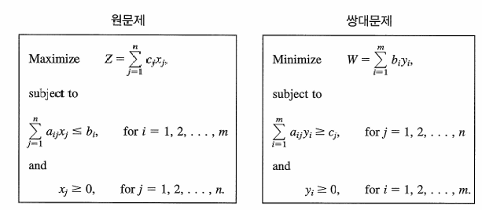

{.post-thumbnail}

## 쌍대이론의 본질

- 모든 선형계획 문제는 쌍대문제를 가진다:
    - 원문제(Primal): 예를 들어 이익 최대화.
    - 쌍대문제(Dual): 자원비용 최소화.

### 원-쌍대 관계의 성질

- 원문제의 최적해가 존재하면 쌍대문제의 최적해도 존재하며, 두 목적함수값은 같다.
- 원문제의 해로부터 쌍대해를 읽을 수 있고, 그 역도 성립한다.
- 쌍대해는 자원의 경제적 가치(잠재가격, shadow price)를 의미한다

## 원-쌍대 관계와 상보기저해

### 상보해(Complementary Solutions)

- 원문제의 기저해와 쌍대문제의 기저해는 서로 직접적으로 대응한다.
- 최적해에서는 원문제와 쌍대문제의 목적함수값이 같다.

### 상보여유성

- 원문제의 기저변수가 0이 아니면, 대응 쌍대변수는 0이고, 그 반대도 성립한다.
- 이 속성은 심플렉스 방법의 반복과정에서 두 문제의 해가 어떻게 연동되는지 설명한다.

## 다른 원문제 형태의 쌍대문제

- 비표준형(등식제약식, 변수의 음수 허용 등)에서도 쌍대문제는 항상 존재
    - 등식제약식은 쌍대에서 해당 쌍대변수의 부호제약을 제거(음수 허용)한다.
    - 변수의 음수 허용은 쌍대에서 등식제약식으로 나타난다.

### SOB(Sensible-Odd-Bizarre) 법칙

- 원문제의 제약식 및 변수의 형태(≤, =, ≥, 비음, 무제약 등)에 따라 쌍대문제의 대응 형태를 쉽게 결정하는 규칙.
- 대칭성: 쌍대문제의 쌍대는 원문제이므로, 두 문제의 관계는 완전히 대칭적이다.

## 민감도 분석

## 6.7 민감도 분석 적용 – 요약 및 주요 내용

**6.7절 "민감도 분석 적용"**은 선형계획(Linear Programming) 문제에서 민감도 분석(Sensitivity Analysis)을 실제로 어떻게 적용하는지, 그리고 다양한 매개변수 변화가 최적해에 어떤 영향을 미치는지 구체적으로 설명하는 부분입니다.

### 주요 내용 요약

- **민감도 분석의 출발점**  
  민감도 분석은 보통 자원(b₁, b₂, ..., bₘ)의 공급량 변화가 해에 미치는 영향을 분석하는 것으로 시작합니다. 이는 실제 모델에서 자원의 양을 조정할 수 있는 융통성이 크기 때문입니다.

- **우변(b) 변화의 영향**  
  자원(b)의 값이 변하면, 최종 심플렉스 표의 우변만 바뀌고 나머지(행 0의 비기저변수 계수 등)는 변하지 않을 수 있습니다. 이때는 우변만 수정해서 해가 여전히 가능(feasible)한지(기저변수 값이 모두 음이 아닌지) 확인하면 됩니다. 만약 불가능해지면 쌍대심플렉스법 등으로 재최적화가 필요합니다.

- **증분 분석**  
  자원의 값이 변화할 때, 변화분만큼의 영향(증분)을 계산해서 새로운 해와 목적함수 값을 빠르게 구할 수 있습니다.

- **허용범위(Allowable Range)**  
  각 자원(b)의 변화가 해의 가능성과 최적성을 유지할 수 있는 범위를 계산합니다. 이 범위 내에서는 잠재가격(dual price, shadow price)이 유효하게 적용됩니다.

- **동시 변화와 100% 규칙**  
  여러 자원의 값이 동시에 변할 때, 각 변화가 허용범위 내에서 차지하는 비율의 합이 100%를 넘지 않으면 잠재가격을 이용한 해석이 유효합니다.

- **목적함수 계수 변화**  
  비기저변수나 기저변수의 목적함수 계수(c)가 변할 때 해가 어떻게 변하는지, 허용범위를 어떻게 계산하는지 설명합니다.

- **새로운 제약식 추가**  
  모델에 새로운 제약식이 추가되면, 기존 최적해가 여전히 가능해인지 확인하고, 아니라면 심플렉스 표에 새로운 행을 추가해 재최적화를 진행합니다.

- **파라메트릭 분석**  
  하나 또는 여러 매개변수를 연속적으로 변화시키면서 최적해가 어떻게 달라지는지 체계적으로 분석합니다.

### 예시: Wyndor Glass Co. 모델

- b₂(자원 2의 공급량)가 12에서 24로 증가하면, 기저해가 더 이상 가능하지 않게 되고, 쌍대심플렉스법을 통해 새로운 최적해를 구해야 함을 보여줍니다.
- 허용범위 내에서만 자원의 변화에 대해 잠재가격이 유효하며, 이를 벗어나면 해가 바뀌고 잠재가격도 달라집니다.
- 여러 자원이 동시에 변할 때 100% 규칙을 적용해, 변화의 합이 100%를 넘지 않으면 기존 해석이 유효함을 설명합니다.

### 실무적 의의

- 실제 기업(예: Pacific Lumber Company)의 대규모 산림관리 최적화 문제에 민감도 분석이 어떻게 적용되어, 불확실성 하에서 더 나은 의사결정과 수익 증대에 기여했는지 사례로 제시합니다.

---

**요약:**  
6.7절은 선형계획의 해가 자원, 목적함수 계수, 제약식 등 모델의 매개변수 변화에 얼마나 민감한지, 그리고 이런 변화가 있을 때 해를 신속하게 갱신하거나 재최적화하는 절차를 구체적으로 다룹니다. 이를 통해 실제 의사결정에서 불확실성을 관리하고, 최적화 모델의 실용성을 높일 수 있음을 보여줍니다.

