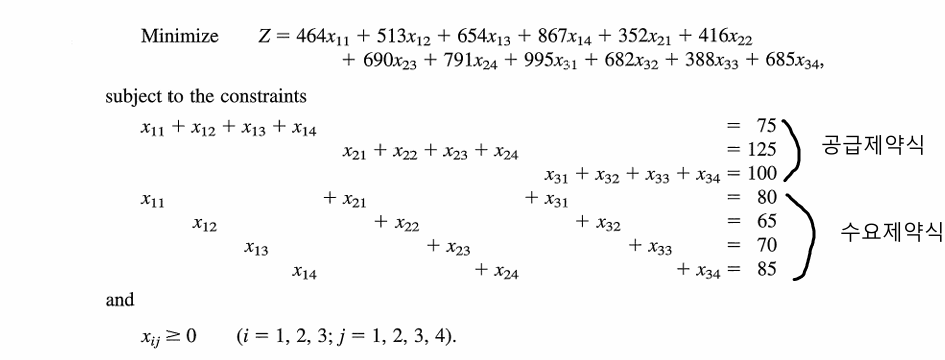
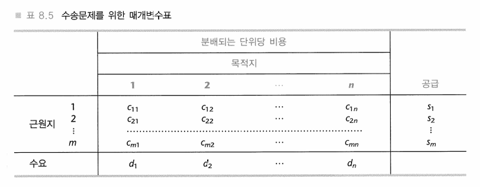
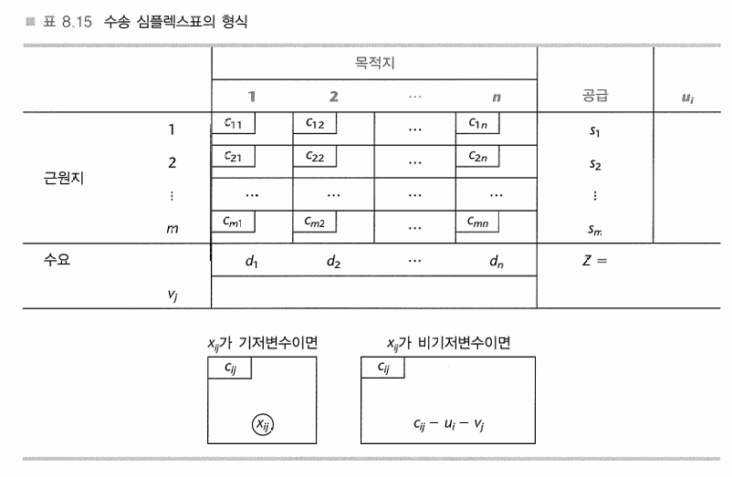
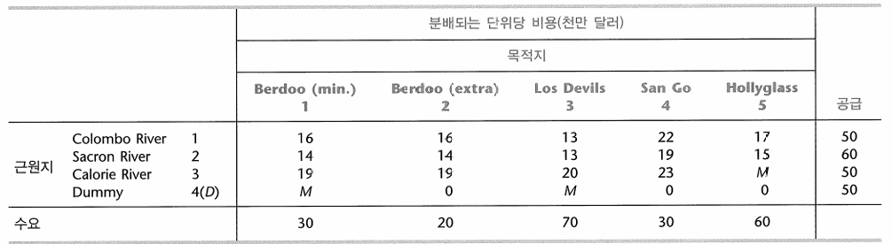
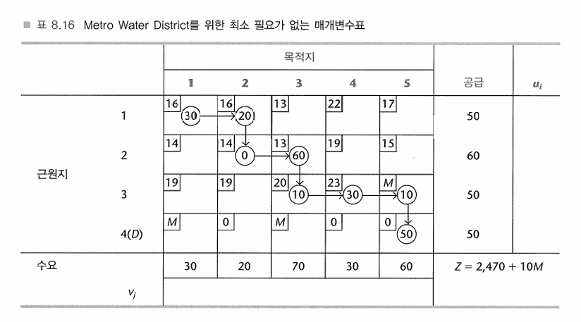

{.post-thumbnail}

## Overview

1. 수송문제: 여러 공급지로부터 여러 수요지까지 상품을 운송하는 최적의 방법을 결정하는 문제를 다루지만, 그 적용 범위는 생산 일정 계획과 같이 실제 수송과 직접적인 관련이 없는 경우까지 확장된다.
1. 할당문제: 주로 인력이나 자원을 특정 과업(tasks)에 배정하는 문제를 다룬다

## 2. 수송문제를 위한 능률적인 심플렉스 방법

### 가정

1. 공급량과 수요량은 일치
    - 일치하지 않으면 dummy 공급지를 추가, 비용은 0으로 설정
    - 불가능한 연결은 무한대 비용으로 설정
    - 수요가 정수가 아닌 범위일 경우
1. 비용은 분배되는 상품 양($x_{ij}$)에 비례

### 수식

| | | | | 창고 (트럭당 운송비용, $) | | 생산량 (트럭분) |
| :--------- | :------- | :------- | :------- | :----------------------- | :------- | :-------------- |
| | | 새크라멘토 | 솔트레이크시티 | 래피드시티 | 앨버커키 | |
| 공장 1 (벨링햄) | | 464 | 513 | 654 | 867 | 75 |
| 공장 2 (유진) | | 352 | 416 | 690 | 791 | 125 |
| 공장 3 (앨버트 리) | | 995 | 682 | 388 | 685 | 100 |
| 창고 배정량 (트럭분) | | 80 | 65 | 70 | 85 | (총 300) |

- $Z= \sum_{i=1}^{m} \sum_{j=1}^{n} c_{ij} x_{ij}$
- 공급 제약식: $\sum_{j=1}^{n} x_{ij} = s_i \quad \text{for } i=1,2,\ldots,m$
- 수요 제약식: $\sum_{i=1}^{m} x_{ij} = d_j \quad \text{for } j=1,2,\ldots,n$
- 비음 제약식: $x_{ij} \geq 0 \quad \text{for } i=1,2,\ldots,m, j=1,2,\ldots,n$

### 수송문제를 위한 매개변수 표

- 일반적인 심플렉스 방법도 수송문제를 푸는 데 적용할 수 있지만, 수송문제의 규모가 크고 제약식 행렬이 대부분 0과 일부 1로 구성된 희소 행렬(sparse matrix)이라는 특성 때문에 비효율적이다. 일반 심플렉스 방법은 초기화 단계에서 많은 인공 변수를 필요로 할 수 있다.
- 수송문제에서 기저가능해는 항상 m+n−1개의 기저 변수를 가진다.

### 초기 bfs를 만들기 위한 절차

1. 여전히 고려중인 행들과 열들로부터, 어떤 기준에 따라 다음 기저변수(할당)를 선택한다.
    - 북서모서리법
2. 할당을 충분히 크게 하여 그 행에 있는 남은 공급이나 그 열에 있는 남은 수요를 다 써버리게 한다(둘 중 더 작은 것).
1. 더 이상의 고려에서 그 행이나 열(둘 중에서 더 작게 남은 공급 혹은 수요를 가진 것)을 제거한다(만약 행과 열이 같은 남은 공급과 수요를 가지면, 임의로 행을 선택하여 제거한다. 열은 후에 퇴화기저변수, 즉 할당 0으로 표시됨을 제공하는 것으로 사용될 것이다).
1. 만약 단지 하나의 행 혹은 하나의 열이 고려 대상으로 남아 있으면, 가능한 할당과 함께 기저가 되는 그 행이나 열과 연관된 모든 남아 있는 변수(즉 전에 기저로 선택되지 않았고 행 과 열을 제거함으로써 고려 대상에서 제외되지 않은 변수들)를 선택함으로써 절차는 종결된다.

### 최적화 검사 절차

1. 가장 많은 할당이 일어난 행의 변수 하나를 0으로 설정
1. 기저인 $x_{ij}$의 ${i, j}$에 대해 $c_{ij} = u_i + v_j$를 만족한다는 성질로 $u_i$와 $v_j$를 계산한다.
1. 비기저 변수들의 $c_{ij} - u_i - v_j$를 계산한다.
1. 모두 양수이면 최적.

### 반복

1. 진입기저변수를 결정하라: 가장 큰(절댓값으로) 음의 값 $C_{jj} - u_i - v_j$를 가지는 비기저변수 $x_{ij}$를 선택하라.
1. 탈락기저변수를 결정하라: 진입기저변수가 증가할 때 가능을 유지하기 위해 요구되는 연쇄반응을 식별하라. 기증셀들 중에서, 가장 작은 값을 가지는 기저변수를 선택하라.
1. 새 기저가능해를 결정하라: 탈락변수의 값을 각 수신셀의 할당에 더하라. 그 값을 각 기증 셀의 할당에서 빼어라.
