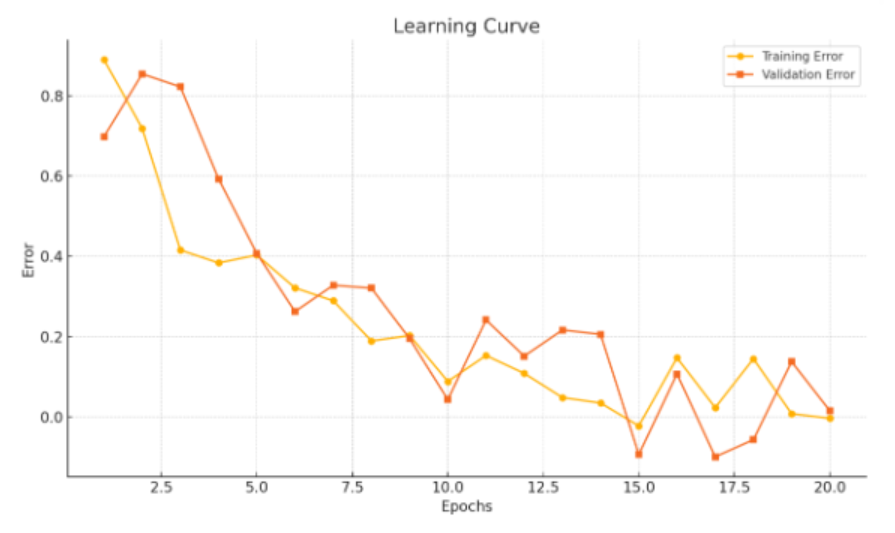

{.post-thumbnail}

## K-NN

- 새로운 데이터 포인트에 대해 k개의 가장 가까운 이웃을 찾고, 그 이웃들의 클래스를 투표하여 다수결로 분류한다.

## 의사결정 트리

불순도가 가장 낮은(한쪽의 class가 더 많은) leaves를 root에 두고, 그 다음 불순도가 낮은 leaf를 그 아래에 두는 방식으로 트리를 구성한다.
leaf 노드의 과반수가 같은 클래스를 가지면 그 클래스를 리턴한다.
overfit을 방지하기 위해 pruning을 하거나 max depth를 설정한다.

- good split: 불순도가 낮고, 분할된 각 leave의 비율이 비슷한 경우

### 과정

1. 루트 노드에서 시작전체 데이터셋을 기준으로 시작하여 가장 좋은 분할속성(feature)을 선택
1. 분할 기준 평가각 속성에 대해 데이터를 분할했을 때의 분할 평가함수 적용
    - gini index
        - gini: $1 - \sum_{i=1}^{c} p_i^2$.
        - 목표: 최소화
        - 제일 좋은게 0
        - 제일 안좋은게 0.5
    - misclassification error
        - error: $1 - \max(p_i)$
        - 목표: 최소화
        - 제일 좋은게 0
        - 제일 안좋은게 0.5
    - entropy: 유용하지 못한 정보를 포함하고 있는 정도.
        - entropy: $-\sum_{i=1}^{c} p_i \log_2(p_i)$
        - 목표: 최소화
        - 제일 좋은게 0
        - 제일 안좋은게 1
    - information gain: 어떤 속성을 기준으로 분할했을 때, 얻을 수 있는 불확실성의 감소량
        - 부모의 엔트로피 - 자식의 엔트로피 가중평균
        - 목표: 최대화
        - 단점: 고유한 값을 많이 갖는 변수를 선호하는 경향이 있음
        - 알고리즘: ID3, C4.5
    - gain ratio: information gain의 단점을 보완한 방법
        - gain ratio: $\frac{information\ gain}{entropy}$
        - 분기의 갯수와 각 분기의 크기를 함께 고려
        - 목표: 최대화
        - 단점: entropy가 낮은 것을 선택하는 경향이 있음
            - → 평균이 넘는 entorpy만 선택해서 gain ratio를 계산
        - 알고리즘: C4.5
1. 최적의 분할 선택 평가된 기준 중 가장 순도가 높은 점수를 갖는 속성을 선택 (greedy)
1. 재귀적으로 하위 노드 분할. 분할된 하위 데이터에 대해 위의 과정을 반복
1. 종료 조건 만족 시 정지
1. 가지치기 수행

### Algorithm

1. CART
    - 분할 기준
        - 분류: gini index
        - 회귀: MSE
    - 모든 분할에서 이진 트리로 분할
    - 사후 가지치기
        - 비용 복잡도 가지치기: $Total SSR + α(leaf size)$이 제일 작은 트리 선택
        - α는 cross validation으로 결정

## 평가

- confusion matrix
    - TP, TN, FP, FN
- accuracy: $\frac{TP + TN}{TP + TN + FP + FN}$
- precision(정밀도): true로 예측한 것 중 실제 true인 것의 비율
    - $\frac{TP}{TP + FP}$
- recall(민감도, 재현율): 실제 true인 것 중 true로 예측한 것의 비율
    - $\frac{TP}{TP + FN}$
- F1 score: $2 \cdot \frac{precision \cdot recall}{precision + recall}$

- macro 평균: 그냥 각 클래스의 score를 평균
- weighted 평균: 가중 평균
- micro 평균: 전체 TP, TN, FP, FN을 합쳐서 계산

- ROC curve: y축: TPR(민감도), x축: FPR(1 - 특이도)
    - AUC: ROC curve 아래 면적
        - 1에 가까울수록 좋은 모델
        - 0.5는 랜덤 추측과 같음
- (1,1): 무작위 추측과 동일. 모든 샘플을 무조건 양성으로 예측
- (0,0): 모든 샘플을 무조건 음성으로 예측
- (1,0): 완벽한 모델
- (0,1): 반대로 예측하는 모델

## learning curve

- test set에 대한 오류가 증가하는 구간(cross 되는 구간)은 과적합 구간. 여기서 stop

