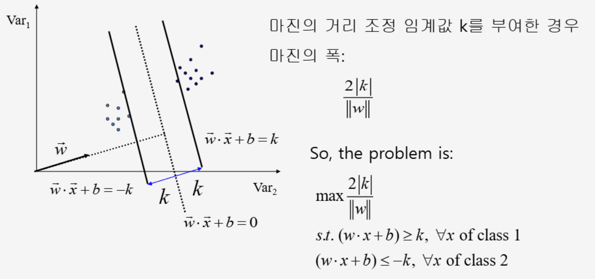
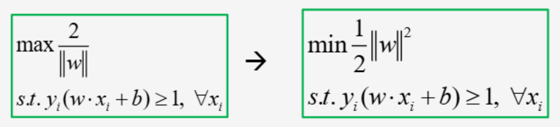

{.post-thumbnail}

- bias variance tradeoff
    - margin ↑, bias ↑, variance ↓
    - margin ↓, bias ↓, variance ↑

- suppot vector: 임계값에 가까운 데이터 포인트
- linear classification fomulation:

- if not linear solvable → kernel functions
- soft margin: 이상치를 포함할 수 있는 마진
    - cross validation으로 최적의 soft margin을 찾는다.
