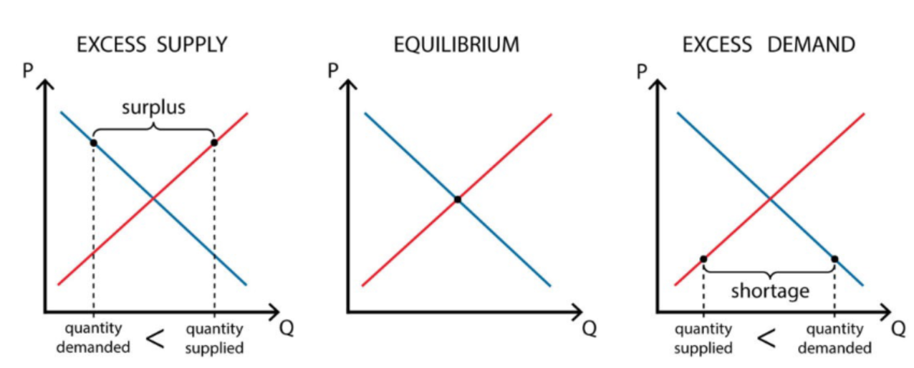

{.post-thumbnail}

## 생산시스템관리를 어떤 관점에서 바라보며 학습하는지

- 운영하는 관점에서 수요와 공급을 바라볼 예정
- 기업을 바라보는 관점: 유/무형의 제품을 생산해서 수요(양, timing, 품질, ...)에 맞게 공급하기 위해 노력하는 집단

## 수요와 공급 법칙

- 경제학 기본적인 법칙. 가격 조정은 건강한 시스템의 증거라고 봄
- 운영 관리자(OM)인 우리는 이거랑 다르게 바라봄.
    - Excess demand = lost revenue
    - Excess supply = wasted resources
    - 가격 조정만으로 수요와 공급 맞추기 어려움
- 끊임없이 변하는 수요와 비 탄력적인 공급으로 인해 수요와 공급을 맞추기 어렵다.
- 과학적 도구로 최대한 수요를 예측하고, 탄력적인 공급을 하는 방법을 찾아야 한다.

## 수요와 공급이 안 맞는 사례

- 푸바오를 보기 위해 사람들이 몰림
    - 수요 공급의 불균형은 안 좋은 효과를 가져옴
- 마스크, 먹태깡: 수요는 빠르게 변하는데, 공급은 느리게 변함
    - 수요를 예측하고, 설비를 미리 준비하는 과학적 도구가 필요

|  | 소매업 | 철광석 공장 | 응급실 | 심박조율기 | 항공 여행 |
|---|---|---|---|---|---|
| 공급 | 소비자 전자제품 | 철광석 | 의료 서비스 | 의료 장비 | 특정 항공편 좌석 |
| 수요 | 새로운 비디오 시스템을 구매하는 소비자 | 제철소 | 긴급한 의료 서비스 수요 | 심박조율기가 특정 시간과 장소에서 필요한 심장외과 의사 | 특정 시간과 목적지로의 여행 |
| 공급이 수요를 초과 | 재고 비용이 높고, 재고 회전율이 낮음 | 가격 하락 | 의사, 간호사 및 인프라가 충분히 활용되지 않음 | 심박조율기가 재고로 남아 있음 | 빈 좌석 발생 |
| 수요가 공급을 초과 | 포기한 이익 기회; 소비자 불만족 | 가격 상승 | 응급실 혼잡 및 지연; 구급차 우회 가능성 | 포기된 이익 (일반적으로 의료적 위험과는 관련 없음) | 초과 예약으로 인해 고객이 다른 항공편을 이용해야 함 (이익 손실) |
| 공급과 수요를 맞추기 위한 조치 | 수요 예측; 신속한 대응 | 가격이 지나치게 하락하면 생산 시설이 폐쇄됨 | 예측된 수요에 맞춘 인력 배치; 우선순위 설정 | 여러 장소에서 심박조율기를 보관하는 유통 시스템 | 동적 가격 책정; 예약 정책 |
| 관리적 중요성 | 소비자 전자제품 소매업의 단위당 재고 비용이 종종 순이익을 초과함 | 가격 경쟁이 치열하여 주요 초점은 공급 비용 절감에 맞춰짐 | 치료 또는 이송 지연이 사망과 연관된 사례 있음 | 대부분의 제품(가치 2만 달러)이 사용되기 전에 영업 사원의 차량 트렁크에서 4~5개월 동안 대기함[^1] | 전체 좌석의 약 30%가 빈 채로 운항되며, 좌석 이용률이 1~2%만 증가해도 이익과 손실이 갈림[^1] |

[^1]: 뭔소리지

## 생산 시스템의 performance

- 서로 상충됨. business 목표에 맞게 balance를 잘 맞춰야함
    1. `cost`
    1. `quality`: 품질이 얼마나 좋고 일관되냐
    1. `variety`: 다양한 사용자의 니즈를 얼마나 잘 맞추냐
    1. `time`

## 생산 시스템 관리를 배우면 할 수 있는 것

1. 비효율성 분석
1. 상충관계에 대한 의사결정
1. 신기술 등에 대한 평가
