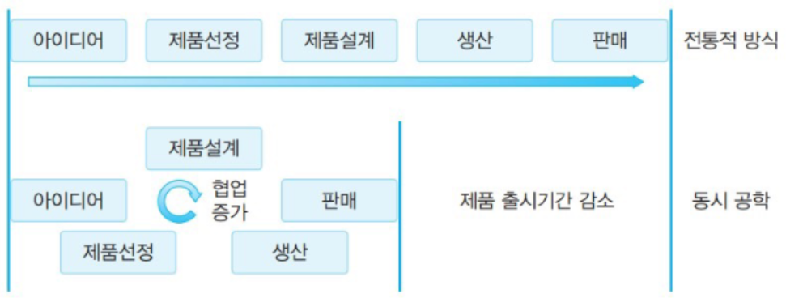
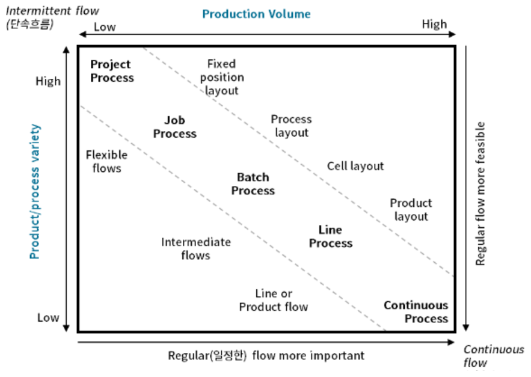
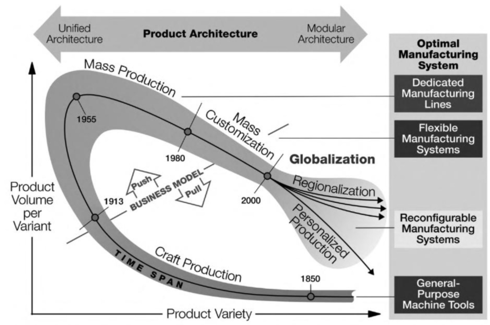

{.post-thumbnail}

## 제품 설계 및 개발

### 설계의 중요성

- 총 제품 비용 중 설계가 치지하는 비중은 적지만, 설계의 영향을 받는 비중이 높다.

### 제품 설계 프로세스

- 아이디어 선정: 소비자의 니즈, 경쟁사 제품 등 벤치마킹(reverse engineering)
- 제품 선정: 시장 분석, 경제성 분석, 기술 분석

### 제조 고려 설계

- 조립 뿐만아니라 재활용, 분해 단계도 고려
- subtract manufacturing보단 additive manufacturing(적층제조, DFAM)을 고려

### 표준화 모듈화

- 표준화: 부품 호환성 및 운영 효율성
- 모듈화: 표준화된 부품의 집합 <-> integral

### 지연전략

- 차별화 지연 전략: 수요를 알기 전까지 많은 종류 생산은 지연

## 생산 프로세스의 유형

### 주문충족 방식에 따른 분류

- make to stock: 수요가 발생하기 전에 생산. 수요가 예측이 쉬울 경우 적합 (push)
- assemble / configure / build to order: 제품 구성요소를 재고로 보유. 고객의 요구에 따라 조립하여 생산. 지연 전략에 맞닿아 있다 (pull)
- make to order: 주문에 따른 생산. 옵션이 많거나 고가 제품에 적합 (push-pull)
- engineer to order[^1]: 고객의 요구에 따라 설계 및 생산. 일회성 프로젝트에 적합 (pull)

위로 갈 수록 제공 시간은 짧아지고, 아래로 갈 수록 유연성이 높아진다.

[^1]: mto랑 eto 뭐가 다르지. 그냥 대충 뭐 eto가 더 세부적인 그런 느낌인가

### 생산 흐름에 따른 분류

- 프로젝트 프로세스: 일회성 생산. 흐름이라고 할 수는 없다.
- 개별작업 프로세스(job shop): 공정별 배치. 높은 유연성, 낮은 규모
- 배치 프로세스: job shop과 라인 프로세스의 중간 형태. batch 수가 맞춰지기 전까지 대기 / 유휴시간 존재.
- 라인 프로세스[^2]: 제품별 배치. 낮은 유연성, 대규모
- 연속 흐름 프로세스: 멈춤, 수정, 변경 최소화

- 다양한 유형의 프로세스와 설비배치를 혼합 적용하는 것이 일반적

[^2]: 라인 프로세스랑 연속흐름 프로세스는 뭐가 다르지 → 연속 흐름은 계속 흘러서 멈추기 힘듦

### 다품종소량생산, 개인맞춤생산 시대 도래

- reconfigurable manufacturing system: 다양한 제품을 생산할 수 있는 유연한 생산 시스템

### cell manufacturing

- line process랑 job shop이 혼합된거
- 비슷한 작업이 필요한 부품들을 하나의 그룹으로 묶어서 전용 셀에서 생산
