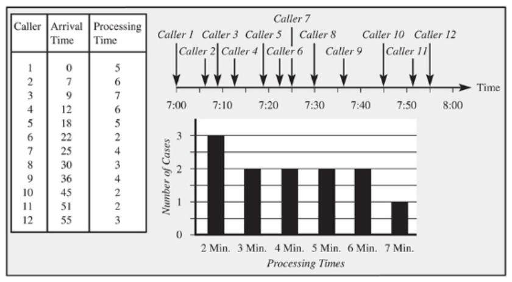
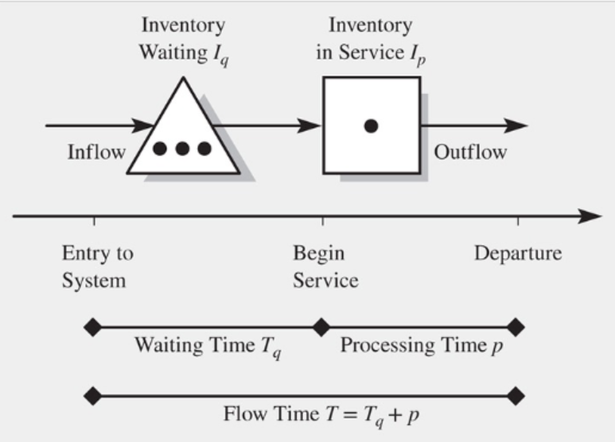
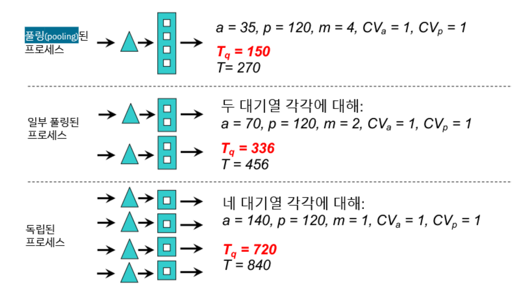

{.post-thumbnail}

## Intro

- 지금까지는 변동성을 고려하지 않았지만 프로세스 성과 평가에 중요한 영향을 미친다.
- 변동성이 대기시간에 미치는 영향을 살펴본다.

## Example

- 변동성
    - 불규칙한 도착 간격
    - 서비스 시간의 변동성
    - 영향: 재고, 대기시간, 산출 손실
- IU가 100 이하여도 대기가 발생할 수 있음

## 변동성의 원인

1. 흐름단위의 input ($CV_a$)
    - random arrival
    - incoming quality
    - product mix
1. processing time의 변동성 ($CV_p$)
    - 그냥 내재적인 변동성
    - 숙련도 (일을 못해서 오래걸림)
    - 품질 (재작업)
1. 자원의 무작위적 가용성
    - 자원 고장
    - 작업자 출근 안함
    - setup time
1. 복수의 흐름단위가 무작위적 경로결정
    - 경로의 변동성

- 변동성의 측정: $\frac{표준편차}{평균}$

## 대기시간 예측 (단일 자원)

### 가정

1. 내재활용률은 100% 미만
    - if D > C, 대기 - 처리능력 부족 (+ 변동성)
    - if D < C, 대기 - 변동성
1. 안정적 도착: 평균 고객 수가 시점에 의존하지 않고, 길이에만 의존함
    - 만약 프로세스가 안정적이지 않다면 더 짧은 시간간격으로 나누어 접근
1. 지수분포를 따르는 도착간격
    - $CV_a = 1$
    - 비기억 특성

### 변수

- a: 평균 도착 간격 (줄 기준)
- p: 평균 서비스 시간
- $CV_a$: 도착간격의 변동계수
- $CV_p$: 서비스 시간의 변동계수
- $T_q$: 대기 시간
- $I_q$: 대기열의 재고
- $I_p$: 서비스 중 재고

### 공식

- capacity: $\frac{1}{p}$
- flow rate = demand(수요 제약적 상황을 가정하니까): $\frac{1}{a}$
- utilization: $\frac{p}{a}$
- T: $T_q$ + p
- $I_p$: (1 - u) * 0 + u * 1 = u
- I = $I_q$ + $I_p$ = $I_q$ + utilization
- $T_q = p * \frac{u}{1-u} * \frac{CV_a^2 + CV_p^2}{2}$
    - 도착 간격이 지수분포를 따르지 않는 경우 근사치만을 제공
- $I_q = \frac{1}{a} * T_q = \frac{T_q}{a}$

## 대기시간 예측 (복수 자원)

- capacity: $\frac{m}{p}$
- flow rate: $\frac{p}{am}$
- $I = I_q + I_p = I_q + mu$
- $T_q = \frac{p}{m} * \frac{u^{\sqrt{2(m+1)} - 1}}{1-u} * \frac{CV_a^2 + CV_p^2}{2}$
    - 근사치만을 제공

- service level: $P(T_q ≤ TWT)$

## 풀링

- 대기할 수 있는 방법은 여러가지가 있다
- 대기시간을 줄일 수 있는 방법에 사람을 많이 뽑는것 외에 다른 고려 요소

### 풀링의 효과

- 풀링되는 시스템이 서로 완전히 독립
- 다양한 input을 처리할 수 있어야 함.

- → 대기시간, 대기 인원 감소
