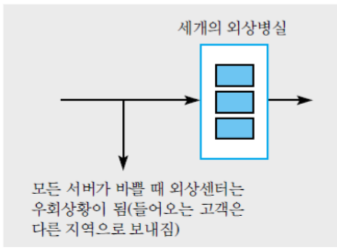
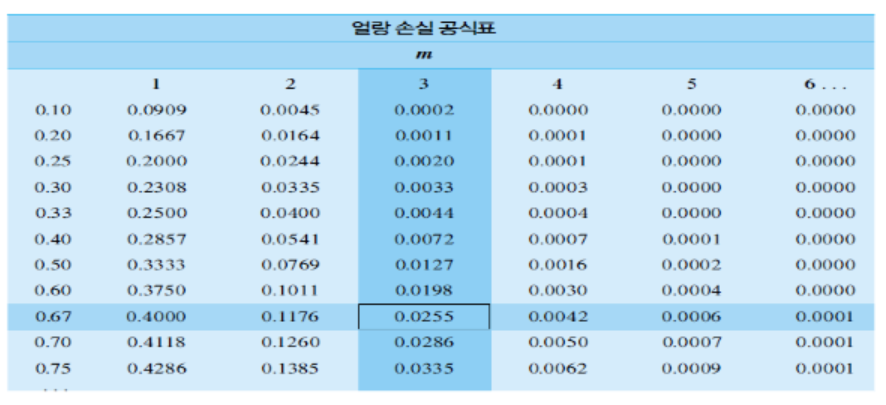
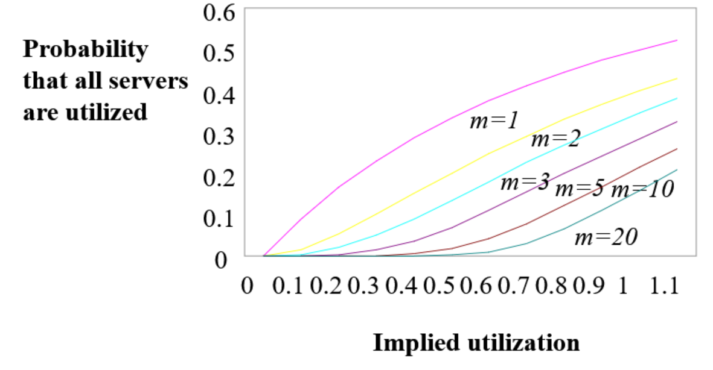
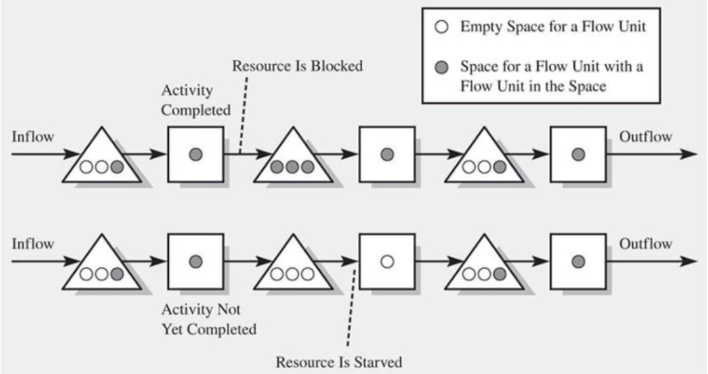
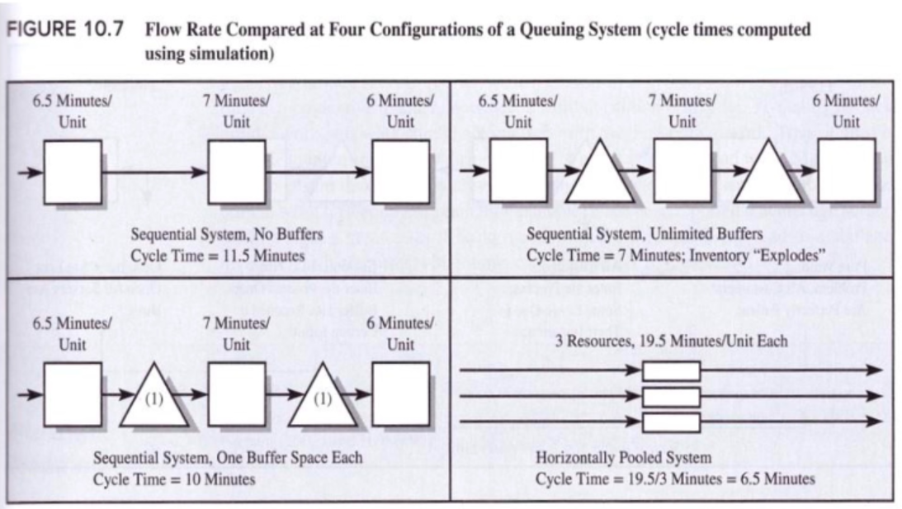

{.post-thumbnail}

- 범위는 대략 16까지

- 고객이 대기하다가 포기하는 경우를 고려

## example: Food Truck

- 변동(동일한 확률 가정)
    - **수요**
    - **공급할 수 있는 양**
- 수요와 공급이 **동시**에 발생하지 않는 경우로 인해 평균 흐름률이 실제랑 다름.
    - **변동성이 흐름률에 영향을 미침**
    - buffer가 있으면 흐름률 높일 수 있음
        - buffer가 없다면?

## example: 병원 외상 센터

- 대기해야 할 상황이 있으면 다른 병원으로 이동
    - diversion 상태, loss(service를 못 받음)

### Diversion 상태 확률

- D < C 가정하지 않음
- 도착 간격은 지수분포 가정 (processing time 분포는 가정 안함)
- 대기하지 않고 바로 이탈한다고 가정

- $P_m$: **내재활용률**과 **자원의 수**에 의해 결정됨
- $r = um = \frac{p}{a}$, 해야하는 일의 양을 의미
    - 단위: Erlang

- 들어온 인원: $\frac{1}{a}(1 - P_m(r))$
- 안 들어온 인원: $\frac{1}{a}P_m(r)$

## Erlang Loss Table

![얼랑 솔실 공식[^1]](img/2025-05-01-19-57-26.png)

[^1]: diversion 확률, 꽉 차있을 확률, 도착한 환자가 서비스 받을 확률, 다른 병원으로 갈 확률 시험에 나온다.

## buffer의 역할

- 변동성이 없다면 cycle time은 1/capacity
- 변동성이 있다면 cycle time은 늘어남. (시뮬레이션으로 계산)
- 버퍼가 있으면 1/capacity로 점점 줄어듦.
- cell layout을 사용하면 cycle time을 제일 많이 줄일 수 있음.

## 불확실성 하에서의 프로젝트 관리

- CPM(Critical Path Method): 소요 시간이 정확하게 알려져 있다고 가정
- PERT(Program Evaluation and Review Technique): 소요 시간이 불확실하다고 가정

### 가정

1. 주 경로는 각 활동의 평균 소요시간으로구함
1. 주 경로는 바뀌지 않음
1. 각 활동의 소요시간은 독립적임

### 특징

- $d_1, d_2, ..., d_n$이 확률변수이면 프로젝트 완성시간 ($X$)도 확률변수
- $d_1, d_2, ..., d_n$이 정규분포를 따른다면 $X$도 정규분포를 따름

