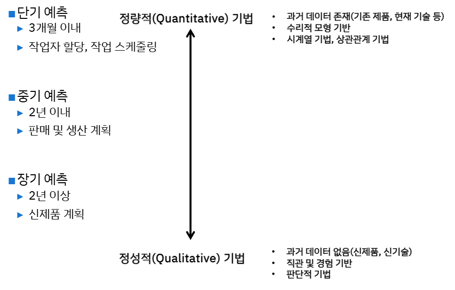
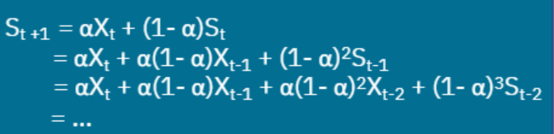
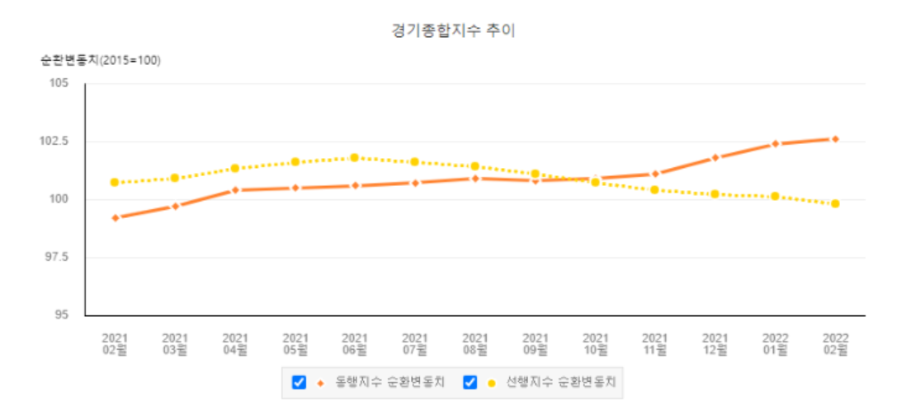
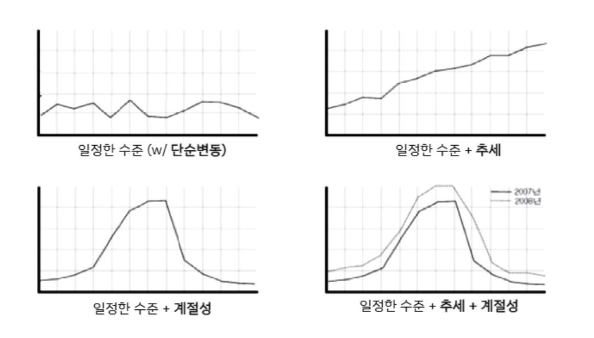
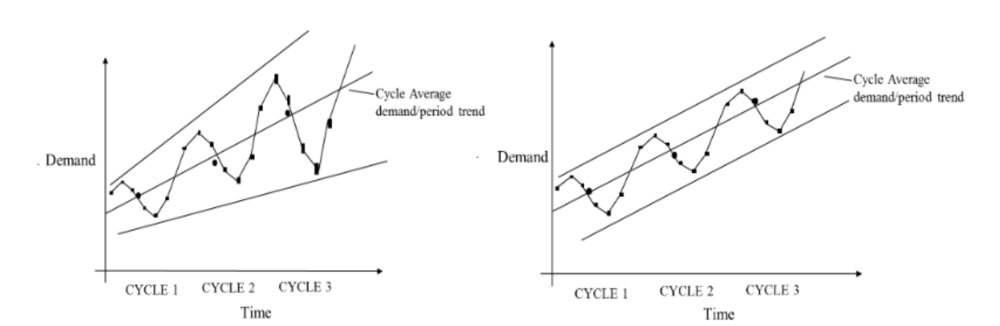

{.post-thumbnail}

## 예측

예측: 과거의 데이터를 사용하여 현재 불확실하고 미래에 실현될 결과에 대해 판단하는 과정

- 단기로 갈 수록 디테일한 예측을 하고, 기법이 달라짐.

## 예측 기법

### 판단적 기법

- 전문가의 경험과 직관에 의존하여 예측하는 기법
- 비정량적 / 주관적 데이터로 정량적인 예측치를 구함
    - 단순예측법: 최근의 자료가 미래에 대한 최선의 추정치 $\hat{p_{t+1}} = p_t$
    - 추세분석:치전기와 현기 사이의 추세를 다음 기의 판매예측에 반영하는 방법. $\hat{p_{t+1}} = p_t + p_t - p_{t-1}$
    - 시장조사법: 설문지, 인터뷰를 바탕으로 신제품의 생산량 결정이나 기존제품의 수요변화 예측
    - 전문가 의견 종합법: 여러 전문가로 예측치 수집 후 단순평균 or 가중평균
    - 사례유추법: 비슷한 제품이랑 비교
    - 델파이 기법: 여러 전문가들로 패널을 구성하고, 반복적인 질문과 결과 피드백을 통하여 합의된 예측치를 도출

### 시계열 기법

- 단순 이동평균법: time window를 계속 이동하면서 평균 구하는거
    - time window ↑: 먼 과거까지 보겠다
- 가중 이동평균법: 가중치를 다르게 부여
- 지수평활법: 과거의 모든 데이터를 가중 평균
    - 지수평활계수(α): 최근의 값을 더 높은 가중치가 부여되도록 추정
    - $\hat{y_{t+1}} = αy_t+ (1-α)\hat{y_t} = \hat{y_t} + α(y_t - \hat{y_t}$
    - 예측치와 관측치 중 어디에 중점을 둘 지에 따라서 α 결정
    - 오차를 어느정도 반영할지에 따라서 α 결정
    - α == 1: 최근 자료에 비중을 둠. α == 0: 기존 예측을 따름

### 상관관계 기법

- 회귀분석

## 계절성 수요예측

- 추세: 시간의 흐름에 따라 일정한 방향성을 가지고 수요가 변화
- 계절성

1. 승법적 모델: (일정수준 + 추세) * 계절성
    1. cycle 별로 평균을 구한다.(추세, 계절성이 제거됨)
    1. 관측치를 cycle의 평균으로 나눈다.
    1. 계절별 평균으로 SI(계절성, 추세 제거됨)를 구한다.
    1. SI를 cycle 평균 예측치에 곱해서 예측치를 구한다.
2. 합산적 모델: (일정수준 + 추세) + 계절성
    1. cycle 별로 평균을 구한다.(추세, 계절성이 제거됨)
    1. 관측치를 cycle의 평균으로 뺀다.
    1. 계절별 평균으로 SI(계절성, 추세 제거됨)를 구한다.
    1. SI를 cycle 평균 예측치에 더해서 예측치를 구한다.

## 예측의 품질 평가

- 비편향 예측: 평균 예측오차가 0

1. MSE: 편차가 클 수록 불이익
1. MAE: 각 편차가 동일하게 나쁜 것으로 간주
1. MAPE

