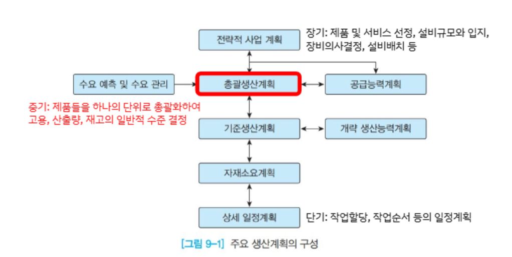
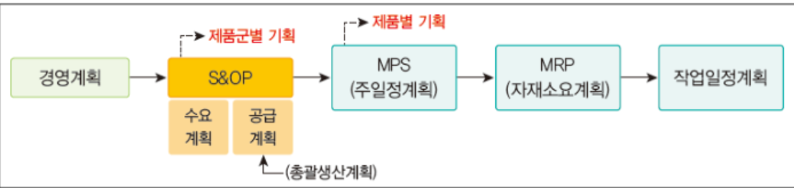
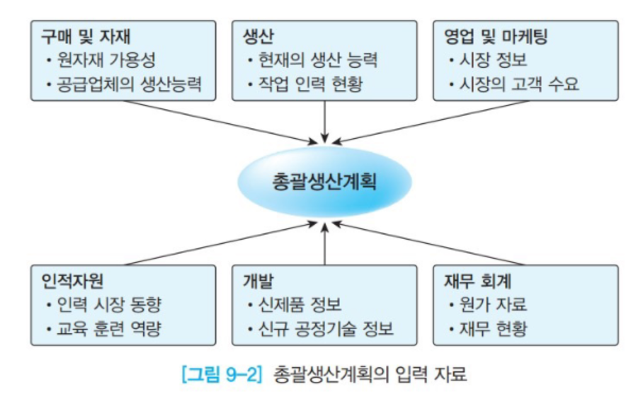

{.post-thumbnail}

## 총괄생산계획

- 중기 범위(6-18개월) 기간에 대한 유사한 제품 묶음 수준에서 수요-공급 균형을 맞추기 위한 러프한 생산 계획
- 계획 수립 후 주기적으로 업데이트

### 의사결정

- 목적: 비용, 인력변동의 최소화, 이윤의 최대화, 바람직한 고객 서비스 수준 유지
    - 보통 trade-off 관계
- 결정 사항: 고용 수준, 시간당 생산량, 재고수준, 외주 생산량 등

### 전략

- 수요대안
    - 가격책정
    - 판촉
    - 백오더(납기지연)
    - 신규수요 창출
- 공급대안
    - 수요추종전략
        - 생산량을 수요에 일치되도록 조정하는 전략. 재고가 안쌓임
        - 재고 유지비용이 높고, 생산용량 변경에 따른 비용이 적을 때 효과적
    - 생산평준화전략
        - 생산량을 평균으로 일정하게 유지하는 전략
        - 안정적 산출량
        - 재고비용 증가, 납기 지연이나 품절에 따른 고객 서비스 저하
    - 혼합전략

## 최적화 기법을 통한 총괄생산계획 수립
