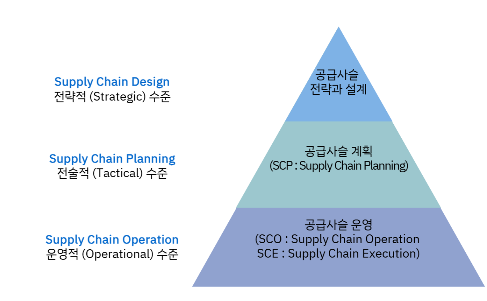
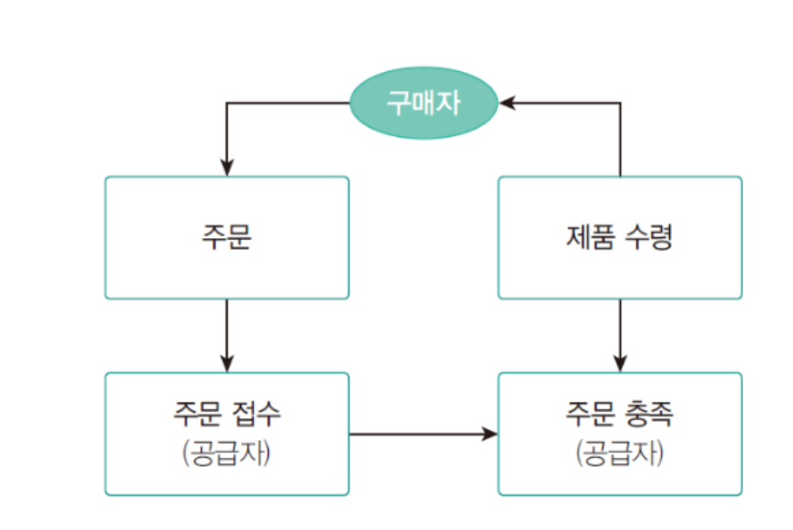

{.post-thumbnail}

## 의사결정 level

1. `supply chain (strategic) design`
    - 한 번 결정하면 오래 가고, 영향을 많이 미치는 `장기적` 의사결정
    - 기업의 `우선경쟁역량`[^1]이나 `경영전략`을 `종합적`으로 고려
    - 설비의 수, 위치 선정, 제품설계 등
    - 수년 ~ 수십년 단위
    - 최고경영자 및 임원 수준에서 결정
1. `supply chain (Tactical) planning`
    - input: 공급사슬 설계, 예측 수요
    - 생산, 재고, 운송 등의 통합적 계획 수립
    - 수요-공급 계획, 생산 하청 계획, 판촉 규모와 시기 결정 등
    - 수주, 수개월 ~ 수년 단위 계획
1. `supply chain operation`
    - SCO
    - SCE(execution)
    - 시간, 수일 ~ 수주 단위 계획

- 아래로 갈수록 범위가 좁아지고, 디테일해짐

[^1]: `cost`, `quality`(성능, 일관성), `time`(time to market, lead-time, on time delivery), `flexibility`

## 공급사슬의 프로세스 구조

### 주기(cycle) 프로세스

- 인접한 단계간 활동이 주기적으로 반복된다고 보는 관점
- 서로 다른 주기가 잘 synchornized 되어야 함

### Push-Pull 프로세스

- push: `예측` 수요에 의해 공급사슬 활동이 촉발
- pull: `실제` 수요에 의해 공급사슬 활동이 촉발

- 고객 주문을 접수하는 접점이 push-pull 경계
- 접점을 어느 위치에 두느냐에 따라 cost-quality trade-off가 달라짐

## Difficulties in SCM

### 제품개발 프로세스와의 통합

- 공급사슬 전략은 SCM뿐만 아니라 제품개발 프로세스에 의해서도 영향을 받음
- 각 단계에서 서로 다른 사람들이 책임을 져서, misalignment이 발생할 수 있음

### 전역최적화

- centralized decision making이 어려움
    - `공급사슬의 조정`이 필요
        - buy back contract: 재고를 공급자가 다시 사들이는 계약
        - quantity discount: 대량 구매시 할인

### 불확실성

- 위험과 불확실성에 노출되어 있음
- `채찍효과`: 공급사슬의 상류로 갈수록 수요 변동 폭이 확대되는 현상
