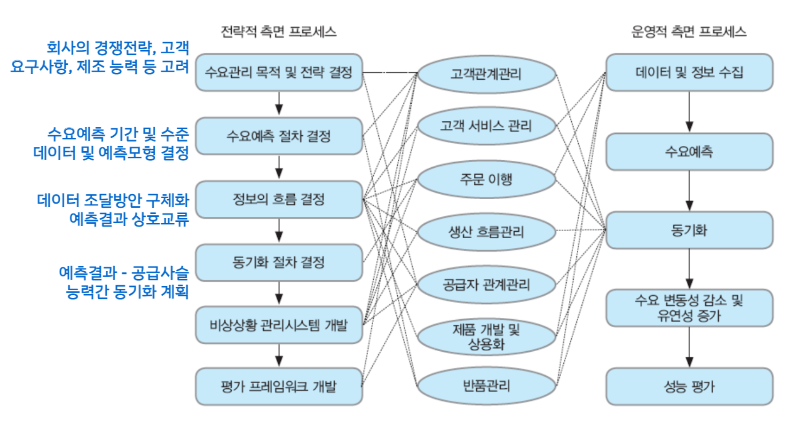
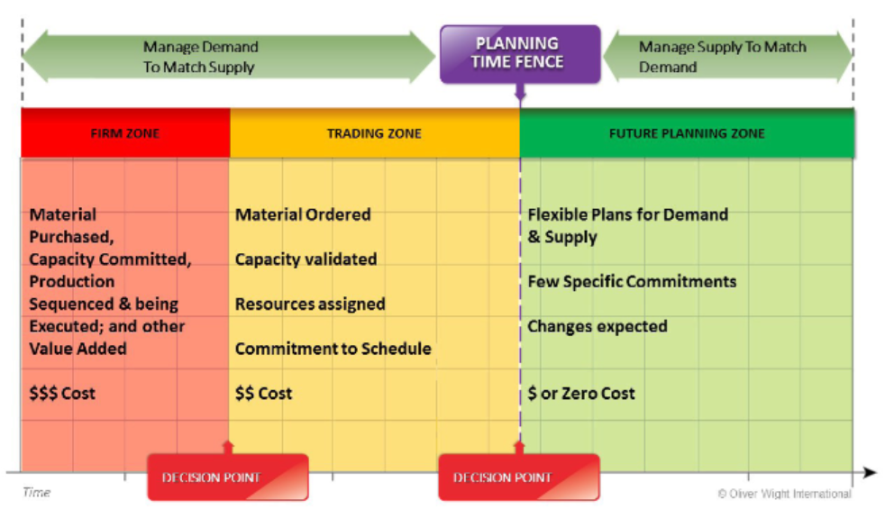

{.post-thumbnail}

## 수요관리 프로세스

### 수요관리

- 고객 요구사항과 주어진 공급사슬 능력 간의 조화를 이루기 위한 공급사슬관리 프로세스
- 예상 가능한 수요에 대해 대체 + 예상치 못한 수요에 대한 반응성 향상
    - 수요예측의 `정확도 향상`, `변동성 완화`, `운영 유연성 향상`
- 판매, 영업, 마케팅 부서, 제품 기획 부서 모든 고려가 필요

- `S&OP` (Sales and Operations Planning)
    - 수요와 공급의 균형을 맞추기 위한 통합적 계획 수립
    - 월단위로 책임자들이 만나서 계획 조정 및 수립

1. 수요 계획
    - 주기적으로 재계획
2. 수요 공유
    - 회사 내 혹은 공급사슬 내 기업 간 공유
    - `적시성`이 중요
3. Influencing Demand
    - 수요를 늘리거나 줄이기 위한 활동
    - PDCA 사이클로 진행
4. Managing and Prioritizing Demand
    - 예측 수요보다는 주문된 수요를 주로 관리
    - 주요 업무: 주문 우선순위 결정, 주문 충족
    - planning time fence 설정: 계획 변경 제한

## 수요예측 기법

- α -> 1: 최근 자료에 비중을 둠. α -> 0: 기존 예측을 따름

