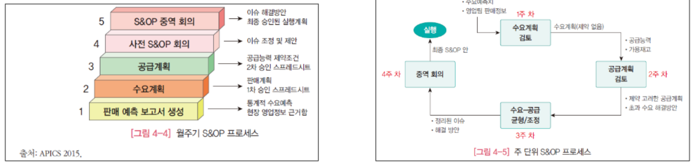
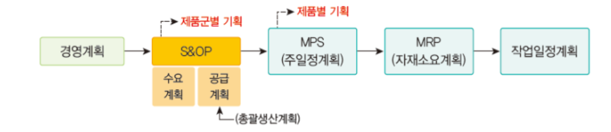
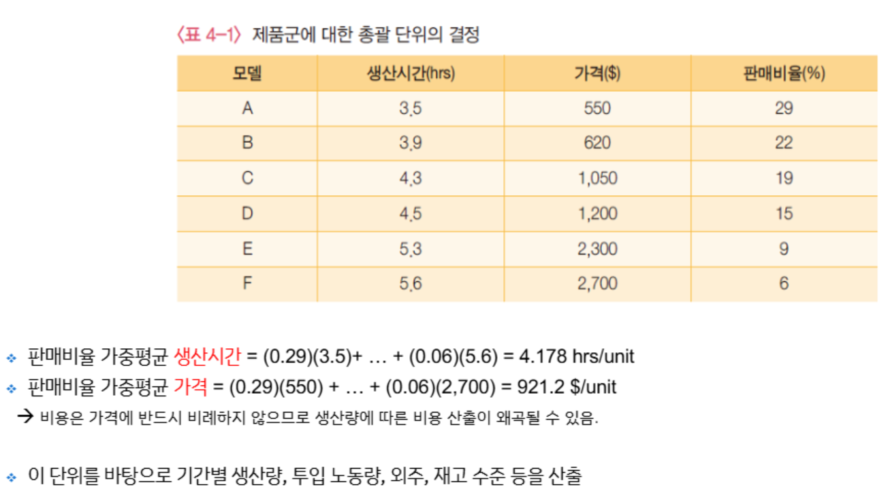
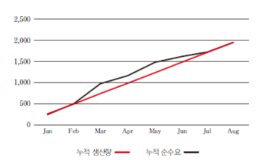
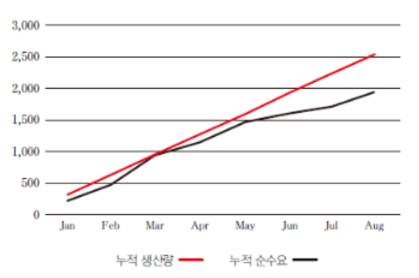
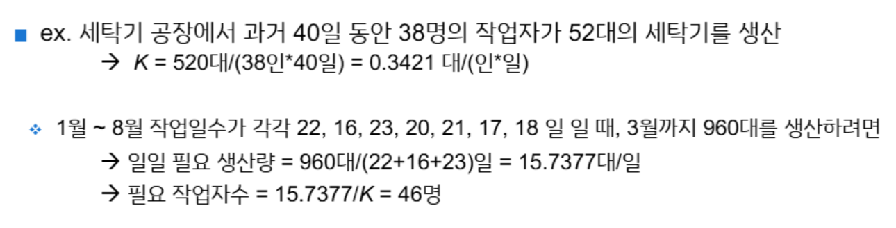

{.post-thumbnail}

## S&OP 프로세스

- 수익성을 극대화하기 위해 수요와 공급을 균형있게 맞추는 것이 목표
- Cross-Functional 팀이 실행
- 개별 제품이 아닌 제품군으로 접근

### (일정하지 않은 수요의 상황에서)높은 수요를 충족하기 위한 방법

1. 최대 수요기간의 수요를 충족하기 위한 제조 능력 유지: 낮은 재고비용, 높은 생산능력 비용
1. 비수기 동안 재고 축적: 낮은 생산능력, 높은 재고 비용
1. 소매 파트와 협력을 바탕으로 비수기 가격 프로모션: 수요 분산 효과

## 공급 관리

### 생산 능력

1. 유연한 근무 시간
1. 계절적 인력 활용
1. Dual facilities - specialized, flexible
    - specialized: 일정한 수량을 효율적으로 생산
    - flexible: 다양한 제품과 변동하는 양을 생산할 수 있는 공장
1. 하청
1. 생산 과정에 제품 유연성 설계

### 재고

1. 다양한 제품에 공통 부품 사용
1. 수요가 높은 제품 또는 예측 가능한 제품의 재고 구축
    - 수요가 불확실한 제품은 판매 시즌에 가까워질수록 예측할 수 있으므로 이때 생산

## 수요 관리

- 다양한 가격 정책 및 프로모션 활용

### 프로모션이 수요에 미치는 요인

1. 시장 성장
1. 점유율 증가
1. 선구매

## 총괄생산계획

### Constant Workforce Plan

- 일정한 인력 유지
- 현실적으로 불가능한 경우가 많음
    - 노동력을 일정하게 유지한다고 해도, 월별 작업일 수가 다를 수 있음
- 전략:
    1. 누적순수요 = 누적생산량이 되는 일정한 월생산량을 유지 ($\frac{총 누적 순수요}{총 기간} = 월별 생산량$)

        

    1. 누적 수요가 최고점을 도달하는 수요량 까지를 만족하는 생산량 ($\frac{최고점까지의 누적 수요량}{최고점까지의 기간} = 월별 생산량$)

        

### K Factor (인당 일 평균생산량)

- 작업 일수에 따른 정확한 월생산량 계산하여 필요 작업자수 산출

### Modified Constant Workforce Plan
### Chase Strategy

