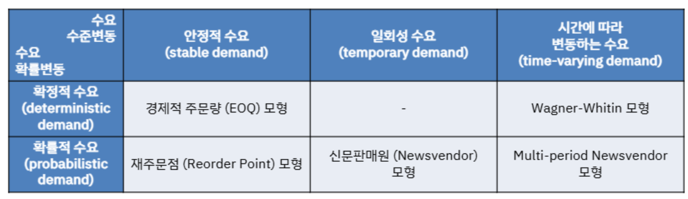
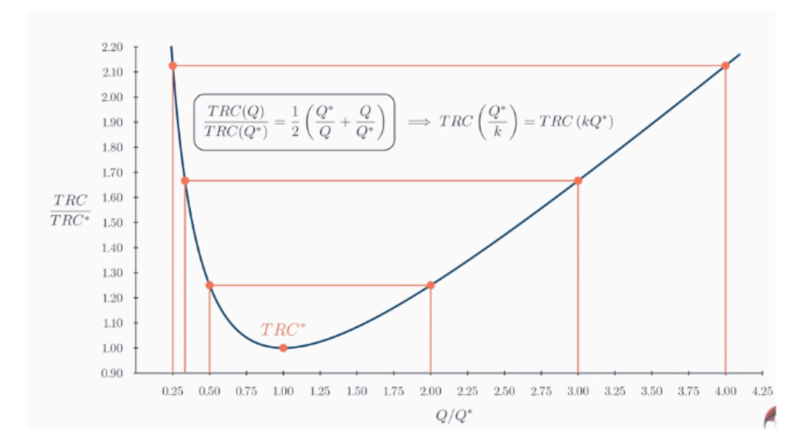

{.post-thumbnail}

## 공급사슬에서 재고의 의미

- 미래 사용에 대비하여 보관중인 재화
    - `다양한 형태`로 `다양한 위치`에 존재
- 종류
    1. 원자재 및 구매 부품
    1. 재공품(WIP)
    1. 완제품(FGI)
    1. 운송중 재고(GIT)

## 재고 유지비용

- 자본비용: 기회비용
- 보관 및 취급 비용: 창고 임대료
- 세금
- 보험료
- 가치상실
- 물리적 파손, 도난, 분실

## 재고의 필요성

- 재고비용은 늘어나지만, 공급사실의 반응성에 영향을 준다.
- ex:
    1. 주기재고: 고정비용 / 주문비용 절감
    2. 안전재고: 수요 / 공급 불확실성 대비
    3. 가격 변동 대비 재고 확보

## 재고 관리

- 재고 비용을 낮추면서 고객의 서비스 수준을 유지하는 것이 목표

### 고객 서비스 수준 지표

1. `재고 충족률(In-stock rate)`
    - 고객 주문에 대해 재고로부터 즉시 출고할 수 있는 비율
1. `백오더(Backorders)`
    - 재고 부족으로 인해 나중에 처리하는 주문 경우의 수량/횟수
1. 재고 회전율(Inventory Turnover)

### 재고 비용

1. 주문 비용
1. 보관 비용
1. 부족 비용

## 재고관리 모형

### 경제적 주문량(EOQ: Economic Order Quantity)

- 한 번에 많이 주문하기 vs 적게 여러 번 주문하기
- 결정변수: 주문량(Q)
- 단위 시간 당 수요: D
- 재고 보유 기간: T = Q/D
- 단위 제품 당 구매 비용: c
    - 주문량 Q는 단위 재품 당 구매비용에 영향을 안 줌
- 단위 제품, 시간 당 재고 유지 비용: h
- 고정 주문 비용: k

- 목적 함수: $C(Q) = \frac{KD}{Q} + \frac{hQ}{2}$
    - 단위 시간당 셋업 비용(고정 주문 비용) + 단위 시간 당 평균 재고 유지 비용(재고 비용)
    - $Q✶ = \sqrt{\frac{2KD}{h}}$
    - $C(Q✶) = \sqrt{2KDh}$
    - $\frac{C(Q)}{C(Q✶)} = \frac{1}{2}(\frac{Q}{Q✶} + \frac{Q✶}{Q})$

    - 아래로 갈 수록 가파르게 변화한다.
    - $C(\frac{Q✶}{k}) = C(kQ✶)$
- power of two policy: $\frac{T✶}{\sqrt{2}} \leq T_{base}2^k \leq \sqrt{2}T✶$
    - 위를 만족하는 제일 작은 k를 찾음
    - 하위 부품드르이 주문 주기도 고려하여 위와 같이 주문 주기를 설정
    - 그럼 최대 1.06%의 차이밖에 안 남.

### 재주문점 모형

- EOQ에서는 zero lead time을 가정
- 또한 수요는 불확실성이 있음.
- 제품 인도기간 중 재고량 부족으로 수요가 만족되지 않는 경우 재고 고갈비용 발생
- 결정변수
    - 재주문점(R): 몇 개 남았을 때 주문할지? (안전재고 수준)
    - 주문 량(Q): 몇 개 주문할 지? (주기재고 수준)
- ROP: 주문 인도기간 동안의 수요 예측값 + 안전재고
    - ROP가 높을 수록 재고 고갈 확률은 감소하지만, 재고 보유 비용이 증가
- service level: 주문인도기간 동안 고객의 수요가 만족될 가능성
- 주문 인도기간 L이 불확실할 경우
    - $D_L ≈ N(μ_Lμ_D, μ_Lσ_D^2 + μ_D^2σ_L^2)$)
