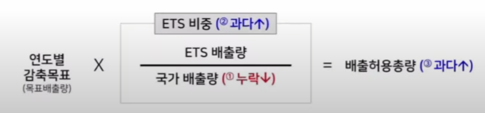
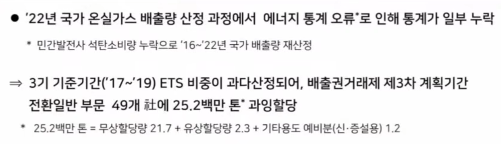
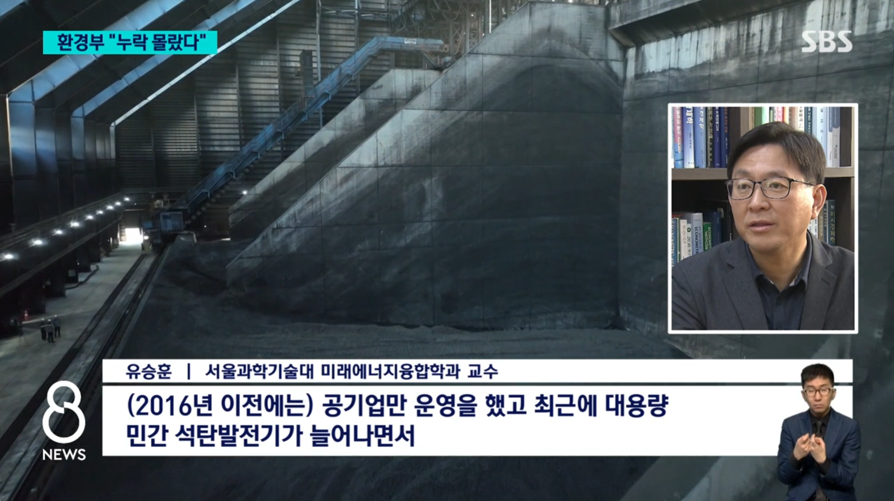
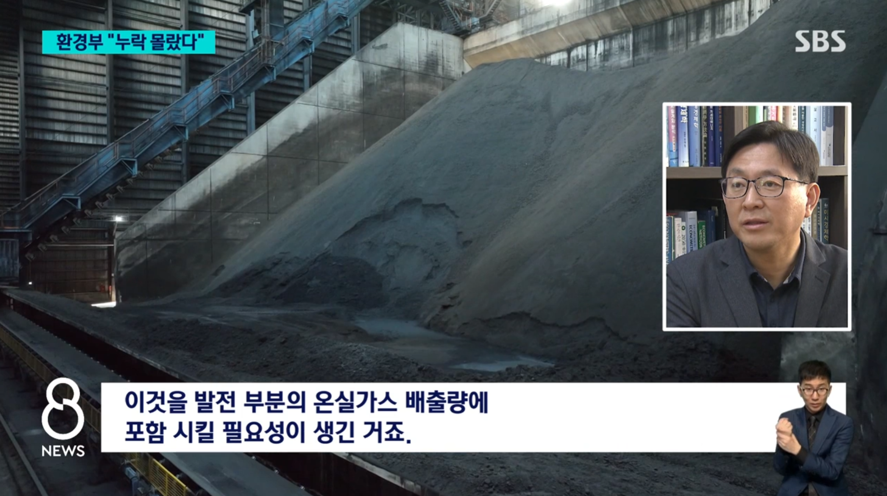
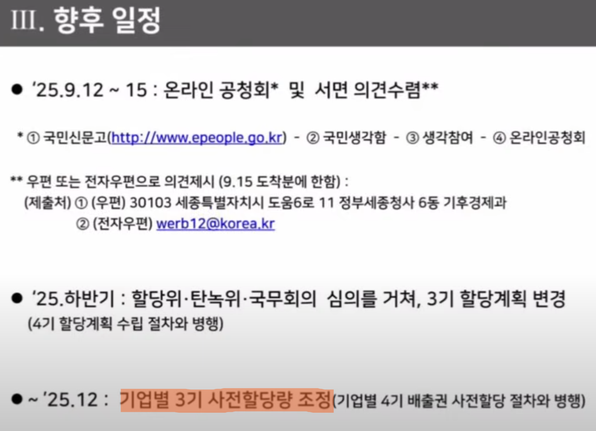
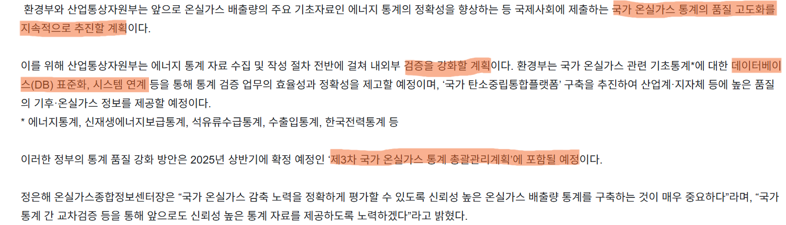

{.post-thumbnail}

### 도입

안녕하십니까. 김형훈입니다.

최근 대한민국 탄소배출권거래제 운영에서 배출권 과다할당 사건이 보고되었습니다. 정부가 기업들에게 본래보다 2,520만 톤 상당의 탄소배출권을 과다 할당했다는 내용입니다.

이는 승용차 약 550만 대가 연간 배출하는 온실가스량에 해당하는 규모로, 온실가스 감축 정책에 영향을 미칠 수 있는 사안으로 여겨집니다.

본 발표에서는 이번 배출권 과다할당 사건에 대해 공개된 자료를 바탕으로 학습한 내용을 정리해 보고자 합니다. 먼저 탄소배출권거래제의 기본 원리부터 살펴보겠습니다.

### 본론 1: 탄소배출권거래제의 작동 원리

탄소배출권거래제는 정부가 기업에 총배출허용량을 설정하여 배출권을 할당하고, 기업들이 시장에서 이를 거래할 수 있도록 하는 제도입니다.

구체적인 작동 메커니즘을 살펴보면 다음과 같은 것으로 알려져 있습니다. 기업이 할당량보다 적게 배출하면 남은 배출권을 판매하여 수익을 얻을 수 있으며, 할당량을 초과하면 다른 기업으로부터 배출권을 구매해야 합니다. 이러한 시장 메커니즘을 통해 기업의 자발적인 온실가스 감축을 유도하는 것이 이 제도의 핵심인 것으로 보입니다.

배출권 할당의 기준이 되는 총배출허용량은 다음 공식에 따라 산정됩니다.

이 공식에 따르면, 국가 전체 배출량에 배출권거래제 적용 비중을 곱하여 총 허용량을 계산한다고 알려져 있습니다. 

여기서 중요한 요소 중 하나는 국가 배출량의 정확한 측정인 것으로 보입니다. 현재 기준기간인 2017년부터 2019년까지의 국가 온실가스 배출량 평균값이 전체 시스템의 기초가 되는 것으로 알려져 있습니다.

### 본론 2: 2,520만 톤 누락 사건의 원인

이번 배출권 과다할당 사건의 발생 원인에 대해 공개된 자료를 바탕으로 학습한 내용을 정리해 보겠습니다.

보도에 따르면 **민간 석탄발전소의 배출량이 국가 온실가스 통계에서 누락된 것**이 주요 원인으로 알려져 있습니다. 이러한 누락은 2016년부터 2022년까지 약 6년간 지속된 것으로 나타났습니다.

 1:05:04 ~

보도 자료에 따르면 다음과 같은 상황이 있었던 것으로 나타났습니다.

환경부는 국가 온실가스 배출량 산정 시 한국에너지공단 에너지통계시스템(KESIS)의 '에너지밸런스' 통계를 기초 자료로 활용한다고 알려져 있습니다. 그런데 GS동해전력, 고성그린파워, 강릉에코파워 등 민간 석탄발전소들의 데이터가 이 통계에 적절히 반영되지 않았던 것으로 보고되었습니다.

이러한 문제가 발생한 배경으로는, 과거 전력 생산이 주로 한국전력공사 등 공기업 중심으로 이루어져 데이터 수집 체계가 상대적으로 단순했던 반면, 2011년 대정전 이후 전력 공급 안정성 확보를 위해 민간 발전사업자가 증가하면서 기존 통계 시스템이 이러한 변화를 적시에 반영하지 못했던 것으로 추정됩니다.

이는 부처 간 정보 공유 체계의 미비와 통계 시스템의 갱신 지연이 영향을 미쳤을 가능성이 있어 보입니다.

### 본론 3: 환경부의 대응 방안

환경부는 이번 사안에 대해 다음과 같이 대응하였습니다.

먼저, 환경부는 이번 배출량 누락 오류를 공식적으로 인정하고 사과했습니다. 그리고 제3차 할당계획을 수정하여 과도하게 발급된 배출권을 회수하겠다고 발표했습니다.

또한 향후 재발 방지를 위해 통계 시스템의 전면적인 개선과 부처 간 정보 공유 체계 강화를 약속했습니다.

### 문제 원인

### 통합 탄소 데이터 플랫폼 구축

### 향후 전망 및 활성화 방안

