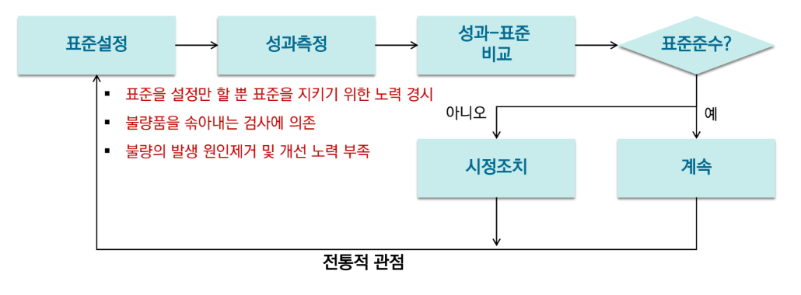
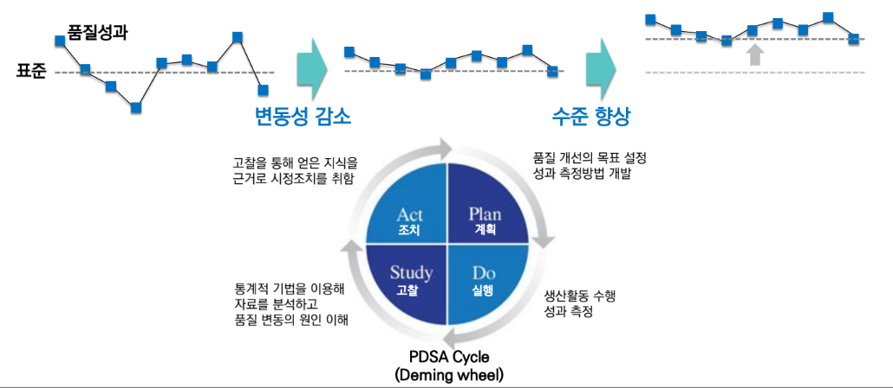
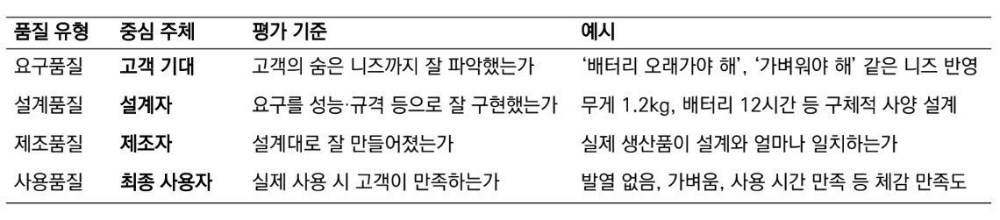
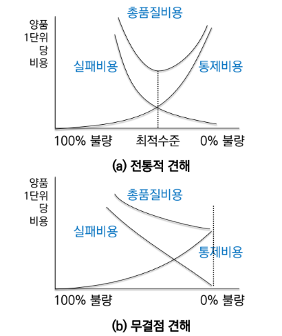
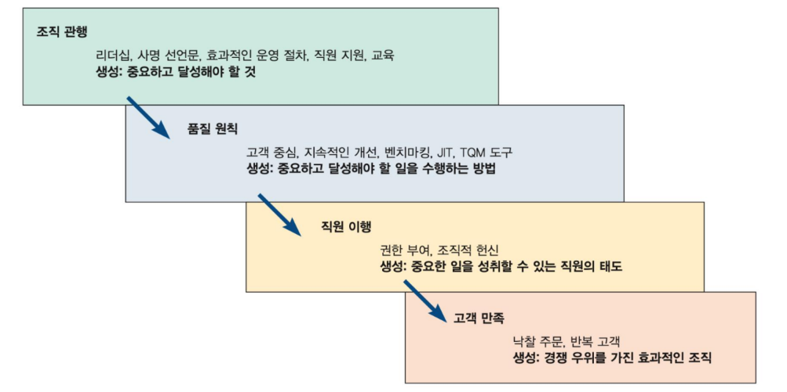

{.post-thumbnail}

## 품질이란

- 상대적으로 뛰어난 정도 / 구분되는 속성
- 품질 관자 입장에서 더 나은 품질을 만들기 위해 노력해야 함
- 품질에 대한 다양한 관점이 존재한다.
    - 사용자 기반: 나한테 오는 재품이 얼마나 좋은가
    - 제조(시스템 관리자) 기반: 제품이 설계된 대로 잘 만들어졌는가
    - 제품 기반: 품질을 정확하고 측정 가능한 변수로 보는 것

### 좋은 품질의 요건

- `우수성`(성능, 기능, 외관)
- `일관성` (단품별, 사용환경, 내구성 등)
- 둘을 만족할 때 `고객 만족`이 증가하고 `조직의 이익`이 증가함

## 품질`관리`의 정의

- 시장성이 높은 제품 및 서비스를 경제적으로 생산하기 위한 일련의 체계적 관리
- `전통적 관점(QC)`:
    - 표준을 설정할 뿐 지키기 위한 `노력 경시`
    - 불량품을 솎어내는 `검사에만 의존`
    - 불량의 발생 원인제거 및 개선 `노력 부족`
- `현대적 관점 / 종합적 품질관리(TQC)`:
    - 품질변동의 원인을 파악하여, 변동을 지속적으로 감소시키고 성과 수준을 높이는 과정
    - `PDSA cycle`: plan, do, study, act

## 품질의 분류

- `요구품질`: 시장에서 요구되는 품질. `정성적(시장조사, 경쟁제품 분석)인 방법으로 파악`
- `설계품질`: 파악한 고객요구를 설계 언어로 잘 변환했는지
- `제조품질`: 설계된 사양을 실제로 잘 구현했는지 `정량적인 방법으로 파악`
- `사용품질`: 고객이 실제로 느끼는 품질. 만족도

## 품질 관리의 유명 지도자

- F. W. Taylor: 품질에 대한 과학적(정량적) 관리법 제시
- W. A. Shewhart: `통계적 품질관리(SQC)`의 시조. 품질 변동의 원인을 우연원인과 이상원인으로 구분
- W. E. Deming: PDMA 사이클

## 품질관리의 역사

1. 작업자에 의한 품질관리: 한 명이 장인정신으로 다 함.
1. 작업반장에 의한 품질관리: 산업혁명 이후 작업자를 그룹으로 묶고 이들을 통제하는 작업반장이 품질 책임. `공식적인 품질검사 도입`
1. 검사에 의한 품질관리: 컨베이어 시스템 도입으로 작업자 수 증가. 작업이 전문화, 규격화 되면서 검사만 전문적으로 담당하는 `품질부서 등장`.
1. `통계적 품질관리`
1. `TQC`(Total Quality Control): `품질 관리`. 품질 책임을 전사적으로 담당
1. `TQM`(Total Quality Management): `품질 경영`. 품질을 전체적으로 관리하는 전략

### 품질 관리와 품질 경영의 차이

- 적용 범위에 차이가 있다:
    - `PDSA`를 기존에는 단순히 계획을 수립 및 설계하고 시스템을 운영하고 그 결과를 계획과 비교하여 `통제`하는데 집중함.
    - 생산자중심 시대에서는 시스템 `운영상의 효율`이 강조됨
    - 고객 중심 시대로 넘어옴에 따라 운영효율 뿐만 아니라 `고객의 요구를 제대로 파악`하고 이를 `설계단계에 제대로 반영`하는 `계획 및 설계 단계의 중요성`이 강조
    - 즉 품질 경영(`선행형`)은 과거 품질관리(`대응형`) 영역을 기본적으로 포함하며 `계획 및 설계 단계로 확대`한 개념

## 품질 비용

- `통제비용`: 물품, 서비스의 품질과 관련해서 발생.
    - `예방비용`: 계획, 교육, 훈련, 프로세스 개선 등 불량을 예방하는데 드는 비용
    - `평가비용`: 불량을 검사하는데 드는 비용
- `실패비용`
    - `내적 실패비용`: 생산 과정에서 발생하는 불량에 대한 비용
    - `외적 실패비용`: 고객에게 전달된 후에 발생하는 불량에 대한 비용. `정량화가 매우 어려움`

- `전통적 견해`: 최적 수준을 위해 일정량의 불량은 허용해야 한다고 봄
- `무결점 견해`: 통제비용이 올라가는 속도보다 실패비용이 감소하는 속도가 더 빠르기 때문에 품질 수준을 계속 높여야 한다고 봄

## 품질과 전략

- 품질의 향상은 판매 이익 증가와 비용 절감에 기여함.
- 좋은 품질 향상을 위해 전사적인 품질 경영(TQM)의 달성이 필요.

- TQM의 3요소
    1. 고객 중심: 고객과 시장의 요구에 민첩하게 대응하고, 고객의 목소리를 설계 규격에 반영
    1. 전사적 참여
    1. 지속적 개선
