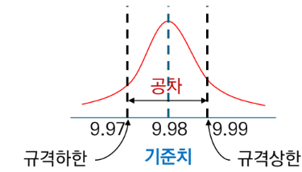
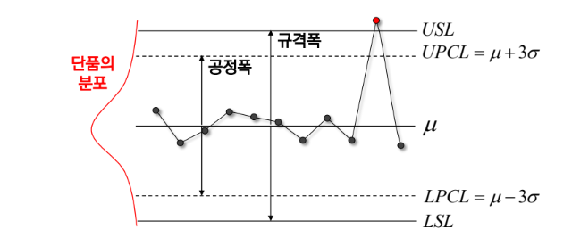
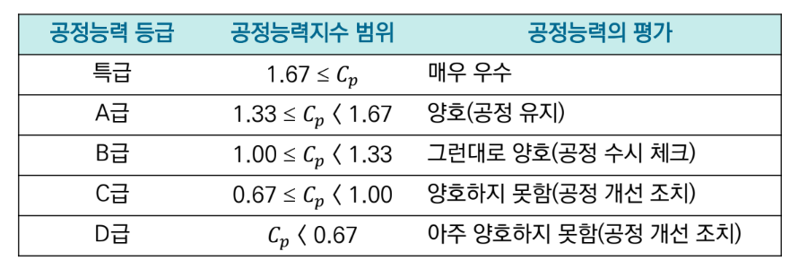
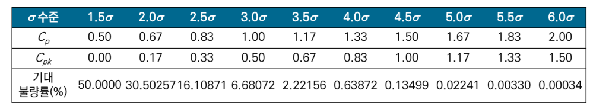
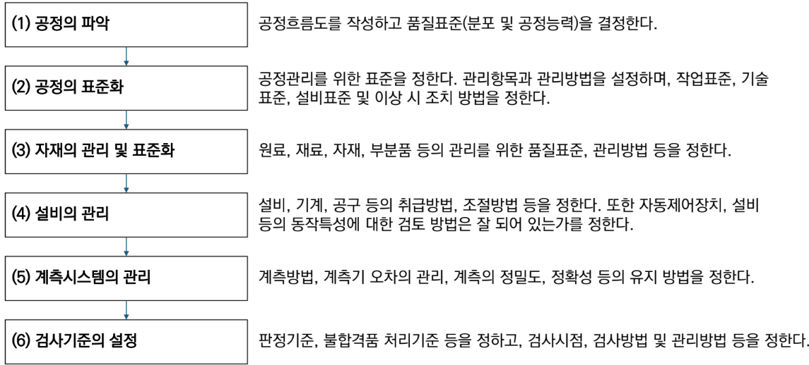

{.post-thumbnail}

## 품질특성

- 시장에서 고객의 **요구사항을 충족시키는 정도를 평가**하는 요소
    - `물리적 특성`: 길이, 무게, 온도, 압력 등
    - `감각적 특성`: 색상, 냄새, 맛, 촉감 등
    - `추상적 특성`: 신뢰성, 내구성, 유지보수성 등

- **좋은 품질**: 고객이 만족하는 **우수**한 품질을 **균일**하게 달성
- 품질은 변동이 존재.
    - 품질특성의 분포에서 설계품질 허용수준 이하의 값이 실현되면 고객은 이를 불량이라 인식함.

## 설계규격과 불량

- **설계규격**: 기준치 + 허용차
    - 공차: 허용차의 범위. **규격한계**
        - **치수공차**: 길이, 너비, 두께, 등
            - uni directional tolerance: 한쪽으로만 허용차가 있는 경우
            - bi directional tolerance: 양쪽으로 허용차가 있는 경우
        - **기하공차**: 형상의 정확성에 대한 허용 오차. 평면도, 직진도, 원형도 등

## 규격한계, 공정능력 한계

- **규격한계**: 설계규격에서 엄격하게 정한 범위 (USL, LSL)
- **공정능력 한계**: 실제 공정에서 만들어지는 제품의 특성치가 분포하는 범위 6σ (UPCL, LPCL)
    - 공정능력: 공정능력 한계가 규격한계 내에 들어와야 한다

- `이론 공정능력지수(Cp)`: 불량을 적게 생산하는 능력
    - Cp = (USL - LSL) / 6σ
        - **평균에 대한 고려**가 없음

- `실제 공정능력지수(Cpk)`: 평균이 중심에 있는지 고려
    - Cpk = min($\frac{USL - μ}{3σ} , \frac{μ - LSL}{3σ}$)
    - 평균은 시간이 지남에 따라 변동될 수 있음. 평균이 늘 공차의 중심에 있지 않을 수 있다.

- $Cp_k$는 장기적 품질 이동 가능성을 고려하여 1.5σ인 0.5를 뺀 값으로 계산
- 6σ 품질을 추구하려면 **Cp = 2.0, Cpk = 1.5**(1.5σ의 평균 이동 가정)가 되어야 함
- 공정능력지수가 1이 되면 기대불량률은 0.27%
    - 하지만 실제로는 평균이 이동할 수 있으므로 기대불량률이 더 높아짐

## 6 시그마 프로그램

- `DMAIC 프로세스 개선 모델`:
    - Define: `핵심품질특성(CTQ)` 규명
    - Measure: CTQ에 영향을 주는 독립변수와 값에 대한 데이터 수집
    - Analyze: 통계적 기법을 활용하여 분석
    - Improve: 원인이 규명되면 개선할 아이디어를 찾아 실행
    - Control: 개선사항을 표준화하여 절차 수립 및 작업자 교육

- 적합품질 결정요소
    - `5M`: 
        1. method: 간단한 절차가 좋다.
        1. man: 품질관리에 숙련된 인력이 필요하다.
        1. machine: 설비의 주기적인 점검과 고정이 필요
        1. material: 원재료의 품질이 중요
        1. measurement: 올바른 측정이 중요

