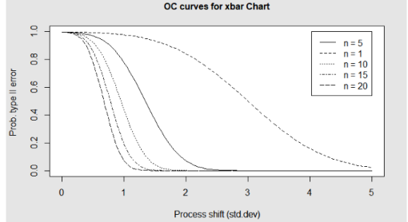

{.post-thumbnail}

## 프로세스 품질관리란?

- 시간에 따른 추이를 통해 사전에 불량을 방지하는 것
- `목표: 제조변동의 감소`

## 제조 변동의 원인

- 우연 변동
    - 일상적 변동
    - 작업환경 변화(지진같은 재해나 미세한 바람의 차이 등)
    - 작업자간 숙련도 차이
    - 설비 간의 기능 차이
    - 원자재간의 미세한 차이
    - `피할 수 없는 변동`.
- 이상 변동(assignable variable): 품질에 확연한 차이를 가져오며, `제거 가능한 원인`
    - `피할 수 있는 변동`
- `관리상태`: 분포가 지정된 한계 내로 유지되는 것.
    - 관리상태에서의 우연 변동은 허용 된다.
    - 우연적 원인만 있는 경우, 변동은 안정적이고 예측 가능한 분포를 형성
    - 이상변동이 있는 경우 `중심 경향`, `표준편차`, `모양`에 따라 달라지는 `예상 불가능한 분포`를 생성

## 관리도

- 이상원인에 의한 품질변동의 발생 여부를 조사하기 위해 개발된 도구
- `관리한계를 벗어날 확률: 0.0027`, `하나라도 밖으로 나가면 공정 이상`
- 규격 상하한 != 관리 상하한
- 불량을 탐지하는 것이 아니라, 공정이 안정상태에 있는지 없는지를 선행적으로 판단하여 불량 발생을 예방하는 것
- `P(불량 | only 우연 변동) < P(불량 | 우연 변동 + 이상 변동)`
    - 관리한계를 벗어났을 때 다시 중심으로 되돌려 줘야함. 즉 예방 필요

### 합리적 표본군

- n: 표본의 갯수, k: 단위 시간 당 표본 추출 횟수
- 같은 표본군 안에는 우연변동만 존재(균일한 표본군)이 합리적임.
- `표본의 크기가 커질수록`, `추출 빈도가 높을 수록` 관리 규격이 좁아지며 작은 변동에 더 `민감`해짐
    - `비용과 trade-off`
    - 또한 표본의 크기가 커질수록 균일하지 않은 표본군이 생성될 확률이 높아짐(그림 참조)
    - 적당히 작은 표본을 여러번 뽑는게 좋다.

### 패턴 이상

- 공정이 관리상태에 있다:
    1. 관리도의 점들이 관리한계선을 벗어나지 않는다.
    1. 관리도의 점들에 특정한 패턴이 나타나지 않는다.
        - 관리 한계를 벗어날 징조
            - 한계선 가까이 여러 개가 나타난다.
            - 경향성이 나타난다.
        - 변동의 크기를 줄일 수 있는 단서
            - 런의 길이가 너무 길거나 짧다.
                - 긴 길이: 평균 이동 가능성
                - 짧은 길이: 표본군 간 변동 요인 존재(층화 현상)
            - 주기성이 나타난다: 주기적 변동 요인(환경 변화, 작업자 능률 변화 가능성)
            - 층화현상이 나타난다. -> 관리한계선이 잘못 설정되었다.

## 관리도의 종류

- $R_m$은 시계열 moving average
- 부적합품 수: 불량품이 얼마나 있는지
- 부적합 수: 하나의 제품(크기가 일정한)에서 몇개의 결함이 있는지

### 변량(계량형) 관리도(연속형)

1. $\bar{X} - R$ 관리도

- 정규성 가정 시 관리도용 계수표 사용 가능
- OC 곡선: 추정치 이동에 따른 β 값의 변화. n과 변화를 알면 B값을 바로 구할 수 있다.
    - $θ ≠ θ_0$일 때, $θ_0$와 가까울 수록 헷갈리고, 멀 수록 명확하다.

- B 계산 시 분산은 $H_0$를 기준으로 계산.

2. $x - R_m$ 관리도

- 일반적으로 평균의 `변화를 탐지`하는데는 $\bar{x}$ 관리도가 효율적
- 하지만 x 관리도는 매 관측값을 감시하므로 변화 발생시 `빠른 조치 가능`
    - 둘의 장점을 섞은 $\bar{x} - x - R$ 관리도 사용 가능

### 속성(계수형) 관리도(이산형)

- 연속적인 양으로 측정 가능한(계량형) 품질 특성을 계수형으로 관리하는 것은 부적합 -> 정보의 손실

1. np 관리도
    - 불량개수 관리도

- OC 곡선

- 분산은 $P_0$ 기준. LCL은 -무한으로 설정
