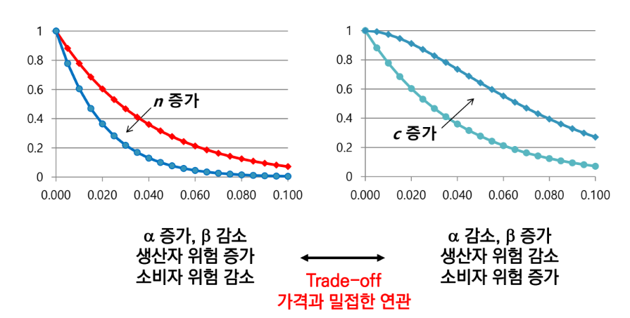
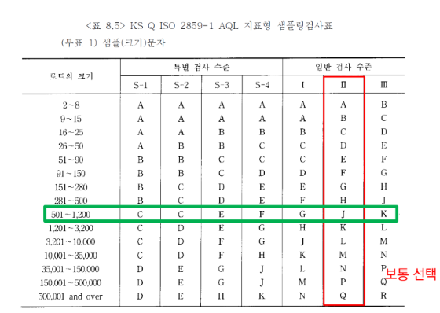
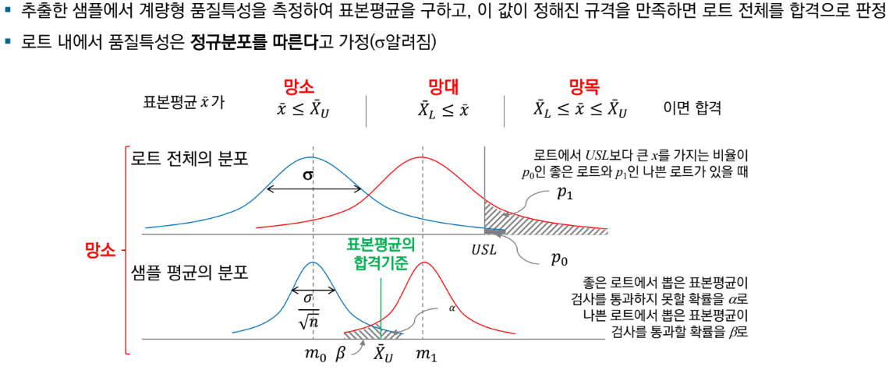
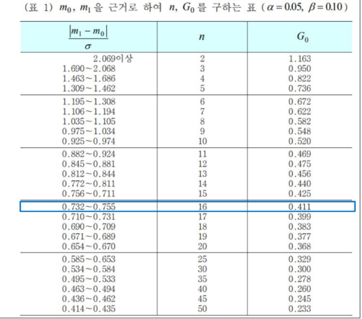

{.post-thumbnail}

## 프로세스 품질관리

- 샘플링 검사법: lot 단위로 제품을 검사하여, 그 결과에 따라 lot 전체를 합격 또는 불합격으로 판정하는 방법
1. 규준형 샘플링 검사법: 샘플링 검사 후 규격을 만족하지 못하면 로트 전체 불합격 판정
2. 선별형 샘플링 검사법: 샘플링 검사 후 규격을 만족하지 못한 제품만 선별하여 양품으로 교체

### 전제조건

1. 로트 단위의 생산
1. 표본 채취의 무작위성
3. 명백한 품지기준
4. 품질 특성값의 분포를 알고 있음

### 검사의 위험

- 일부를 가지고 판별하면 통계적 오류의 가능성이 존재함

## 샘플링의 오차

- 정밀도: 시료를 무한히 많이 측정할 대 측정값이 가지는 산포의 크기가 얼마나 좁은 가(측정 결과가 얼마나 일관성 있게 나오는가)
    - $z_{α/2} * \frac{σ}{\sqrt{n}}$
- 신뢰도: 신뢰구간(95% 등)
- 목표 신뢰도와 정밀도를 위한 n 계산 가능

## 샘플링 방법의 종류

1. 랜덤 샘플링
1. 층별 샘플링: stratified sampling
1. 집락 샘플링: 그룹을 랜덤으로 샘플링 해서 선택된 그룹 내에서 전수조사
    - 시간과 비용을 절약할 수 있지만, 선택된 그룹이 전체를 대표하지 못할 위험 존재
1. 2 단계 샘플링
    1. 집락 샘플링 처럼 그룹을 랜덤으로 선택(더 많이 선택)
    2. 선택된 그룹 내에서 전수 조사가 아닌 랜덤 샘플링 수행
    - 기존 집락 샘플링에서 전수조사를 함으로써 균질된 진랍 내에서만 대표성을 가지는 문제 해결

## 샘플링 검사법

1. 계수형 샘플링 검사
    - 계수 규준형 샘플링 검사
    - 계수 조정형 샘플링 검사
    - 계수값 축차 샘플링 검사
2. 계량형 샘플링 검사

## 계수 규준형 샘플링 검사

- 크기 N인 로트에서 n개를 샘플링하여 불량이 c개 이하면 로트 전체 합격
- $p_0$: 합격품질수준(AQL)
- $p_1$: 한계품질수준(LQL)
- 생산자 위험: 불량률이 AQL 이하인 로트가 불합격할 확률
- 소비자 위험: 불량률이 LQL 이상인 로트가 합격할 확률

- OC 커브: 로트의 실제 불량률이 p라고 할 때, 로트의 합격 확률을 나타내는 곡선
- 샘플에서 발견되는 불량의 개수 X는 초기하분포를 따름. $L(p) = P(X ≤ c) = Σ (Np C x) * (N - Np C n - x) / (N C n)$
- N이 크면 이항분포로 근사. $L(p) = P(X ≤ c) = Σ (nCx) * p^x * (1-p)^(n-x)$
- n이 충분히 크면 포아송 분포로 근사. $L(p) = P(X ≤ c) = Σ (e^(-np) * (np)^x) / x!$

- n이 클수록 예방 비용, 검사 비용 증가, 외부 실패비용 감소
- c가 클수록 외부 실패비용 증가, 폐기 비용 감소
- n의 변화에 따른 기울기 변화가 더 가파르다.
- p가 줄어들면 당연히 합격 확률이 증가. 생산자 위험 감소

### 계수 규준형 1회

- $α, β$를 만족할 수 있는 n, c 조합 찾기. 하지만 매우 복잡함
- 고로 표를 이용함

### 계수 규준형 다회 샘플링 검사

- 마지막 회차 r은 c + 1
- OC 곡선을 그릴 때는 r도 고려해야 함

### 계수 조정형 샘플링 검사

- 생산자의 품질 수준에 따라 차별적인 샘플링 검사 시행
- 검사 절차(AQL 지표형 샘플링 검사표 참고)
    1. 검사 로트의 구성 및 크기를 정한다.
    2. AQL을 설정한다.
    3. 검사 수준을 결정한다.
    4. 검사의 엄격도를 정한다. 일반적으로 보통 검사에서 시작.
    5. 샘플링 형식을 정한다.
    6. 정해진 샘플문자, AQL, 샘플링 형식, 엄격도로부터 샘플링 검사 방식을 정한다.
    7. 검사로트로부터 샘플을 채취, 검사하고 합격 불합격을 판정한다.

- 로트의 크기가 커질 수록 검사가 빡빡해짐
- 특별 검사: 한번 한번의 샘플링이 어려운 경우. 검사 수준이 일반 검사 수준에 비해 낮다.

- 전환 스코어 Ac: 2가 기준인건 좀 이상하긴 하지만 어쨌든 Ac가 높다는건 샘플링도 많이 했다는 뜻으로 생각해 가산점을 더 많이 주는 것
- 계수 조정형에서는 명시적으로 LQL, β를 고려하지 않음. 검사 엄격도로 β가 간접적으로 조절된다고 봄.

### 계수값 축차 샘플링 검사

- 샘플링 개수를 정하지 않고, 로트에서 `1개씩 검사`(다회 샘플링과의 차이)하여
    - 누적 부적합 / 불량 개수(D_t)가 합격판정 개수(A_t) 이하면 합격, 불합격 판정개수(R_t) 이상이면 불합격
    - 최대 샘플링 개수에 도달하면 마지막 회차 합격 판정개수에 따라 합불 판정

## 계량 규준형 샘플링 검사

- 정보의 양이 많기 때문에 계수형에 비해 샘플링 개수가 적어도 정확한 판정 가능
    - 파괴 검사 등 검사 비용이 높을 경우 유리
- 하지만 계량형이 덜 직관적이다.(표본에 불량이 없어도 로트 불합격 가능)

### 불량률 보증 (로트가 단품의 묶음인 경우)

- $\bar{X}_U$: USL - kσ, 샘플링의 평균의 합불 여부를 USL이 아닌 안전마진이 있는 값과 비교. (샘플에 극단적인 값들이 포함될 수 있기 때문)
- σ는 $\bar{R}/d_2$로 추정 혹은 알려져 있다고 가정.

- σ와 무관하게 m을 바꿔가며 p와 L(p) 조합을 찾을 수 있다.

### 평균 보증 (로트가 연속체인 경우)

- n이 의미하는건 1000ml 단위 1병, 2병, ...

