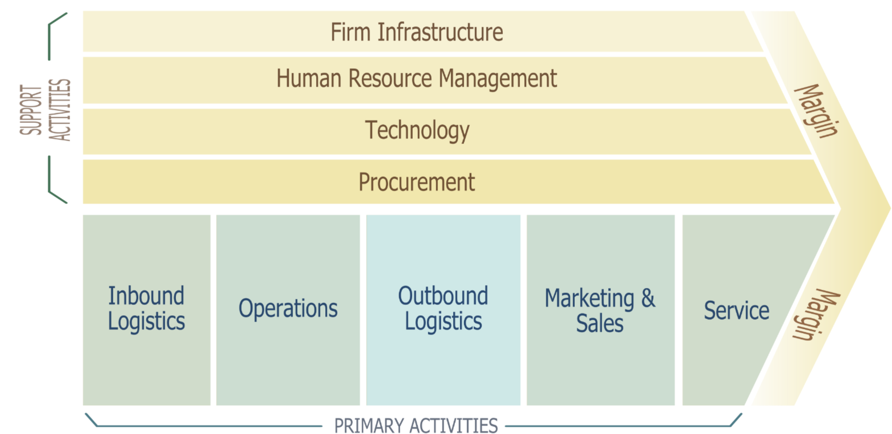
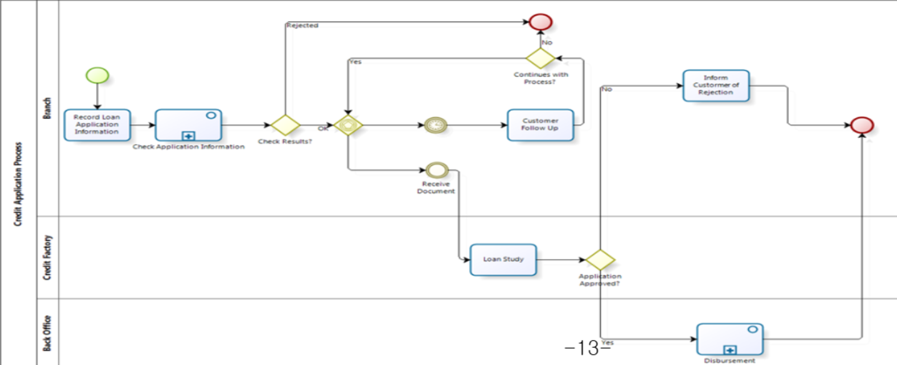
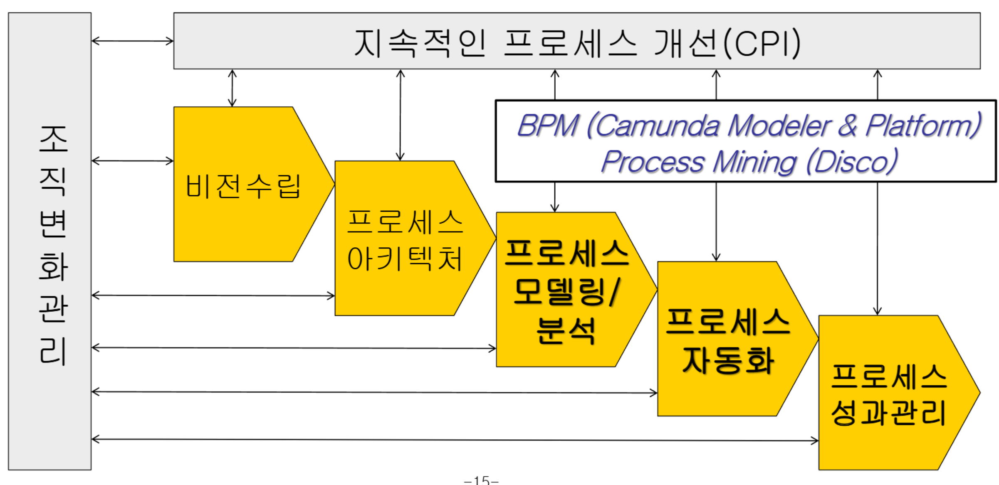

{.post-thumbnail}

## 경영환경 변화와 무한 경쟁

- `기술 발전`과 `경쟁 격화`로 기업의 `평균 수명`은 지속적으로 단축되고 있음
- 아래의 주요 변화 요소들에 적응하고 뛰어난 성과를 창출하기 위해 프로세스 경영이 필요

### 주요 요소

- Globalization
- 제품 수명 주기 단축 및 비용 압력
- 제품과 서비스의 개인화 및 맞춤화
- 기업의 인수합병
    - 기존의 업무 프로세스가 많이 바뀌어야 함
    - `변화에 대한 민첩한 적응력(agility)` 요구
- 가치사슬의 확대
    - 협업의 범위 및 레벨 확장/심화
- AI & 자동화 확산
- `DX`
- 사이버 보안 및 개인정보 보호
- ESG
- `CX`: 프로세스 설계의 기준이 고객 경험이 됨

## 프로세스 경영이란?

- `고객가치 창출`을 위해 내외부의 업무 `프로세스`를 `최적화`하는 경영체계
- 내부의 고객과 외부의 고객에게 가치를 전달하는 `시작점`과 `종료점`까지의 업무 처리 전 과정을 통합적으로 관리함으로써 기업의 성공을 도모
- 기업의 모든 활동을 프로세스를 중심으로 `가시화`함으로써 경영환경 변화에 민첩하게 대응할 수 있도록 하고, 이를 통해 가치사슬 전반에 걸쳐 비효율을 개선
- `IT의 전략적 활용`

## 프로세스 중심적 사고방식

- 사물을 구조보다는 `프로세스`로 인식하는 사고 방식
- 기업 역시 기업 외부와의 상호작용, 내부의 업무 흐름을 `비즈니스 프로세스`의 집합으로 인식

## Business process 및 workflow

- `Business process`: `고객 중심`
    - 특정 `고객`또는 `시장`을 대상으로 필요한 `산출물(output)`을 생서하기 위해 정의된 `구조화`되고 `측정가능`한 활동들의 집합
    - 고객이나 기업에게 가치를 주는 `결과(outcome)`으로 이끄는 activities, events, decisions의 모임
    - end-to-end 고객 여정

- `workflow`: `작업 중심`
    - business process를 `자동화`한 것

### Business process 특징

1. `대상 고객`이 있다.
1. `cross organizational boundaries`이다.
    - 조직 경계와 무관하게 업무가 진행됨

## 프로세스 경영 구축 프레임워크

1. 비전수립
1. 프로세스 아키텍처 - `Michael Porter's Value Chain`
1. 프로세스 모델링 / 분석
1. 프로세스 자동화
1. 프로세스 성과 관리

## 프로세스 경영의 역사

### 공정 기술

1. 1910년 초반 테일러의 과학적 관리
    - `공정`을 분석하여 `분업화`, `전문화` 하여 생산성 향상
1. 테일러 이론에 의한 `공정기술`의 발전
1. 구매, 회계, 배송, 고객 서비스 등 `조직 전체 업무 영역`으로 확대
1. 제조업을 넘어 여러 `서비스 산업 전반`으로 확산

### 품질 경영

1. SQM
1. TQM
1. `6 시그마`, 'lean`'
- `품질 경영`: 오늘날의 프로세스 경영
    - 품질 뿐만 아니라 플세스를 활용하는 조직 전반의 `포괄적 경영 패러다임`으로 확장한 것
