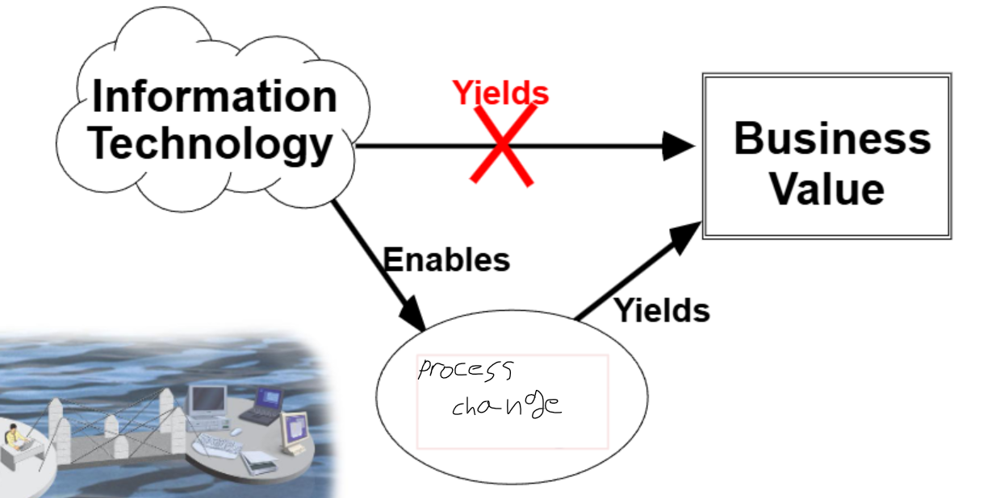
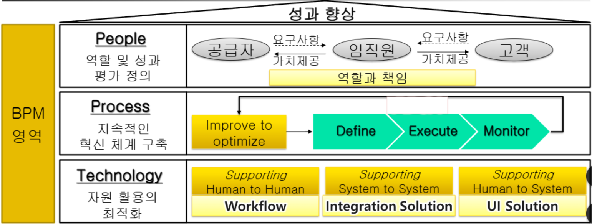
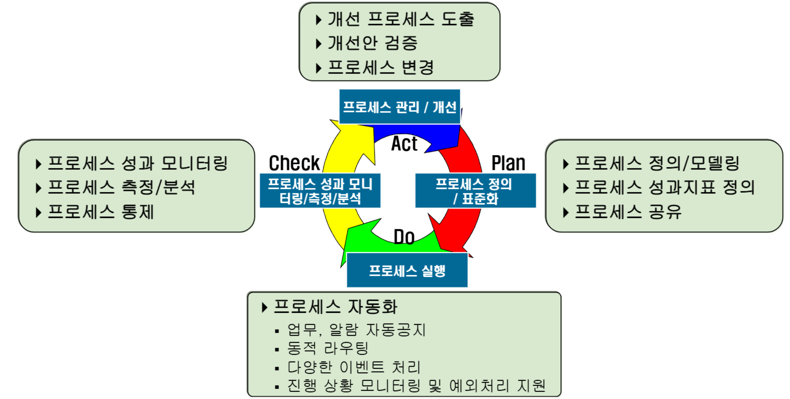
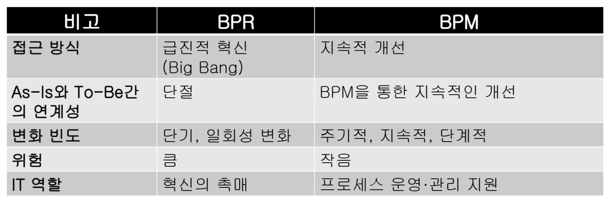

{.post-thumbnail}

## BPM이란?

- 프로세스 관점에서 기업을 경영하는 것
- `소프트웨어 도구`를 활용하여 조직의 업무와 `프로세스`를 끊임없이 `최적화`하는 구조적인 접근방법 및 관리역량이자 `도구`의 집합
- 즉, `프로세스 경영` + `IT 도구`의 접목
- 경영전략과 IT 기술의 alignment를 위한 방법론

### BPM의 영역 및 정의

1. BPM의 영역
    - people: 공급자, 임직원, 고객
    - `process`: PDCA
    - technology: workflow, integration solution, UI solution

## BPM의 특징

- 어플리케이션 로직에서 프로세스 로직을 분리하여 명시적으로 관리한다.
    - `agility`와 `visibility` 제공

## BPMS (BPM System)의 개념

- 프로세스를 지속적으로 혁신시키고 실행시키는 것을 가능하게 하는 `범용 소프트웨어 시스템`
    - BPM suite로 발전: BPM을 위한 모든 솔루션을 통합 제공

## BPM의 도입효과

1. 프로세스 `가시화`를 통한 실시간 관리 및 모니터링 능력의 향상
1. `자동화`를 통한 프로세스 `운영 효율성` 및 `생산성 향상`
1. 프로세스의 `병렬처리` 가능
1. `accountability` 향상
    - 프로세스의 각 단계에서 실행 결과와 진행상태를 모두 기록 -> `감사`와 통제에 활용
1. 프로세스 `모니터링` 및 데이터 분석을 통한 최적화
1. 고객과 파트너와의 `통합`
    - 공동 목표를 대상으로 `가상기업(VE)`화 하여 생산성을 높임
1. 조직의 `agility` 제고
    - `RTE`(Real Time Enterprise) 구현

## BPR

- `Fundamental` `radical` `dramatic improvements` process redesign

### 추진방향

1. `reduction` input
1. `innovation` process
1. `value up` output

### 추진 원칙

1. 정보는 최초 발생지에서 1회 입력
1. 병렬 처리
1. 정보 생성 부서에서 바로 처리
1. 업무 단위가 아닌 결과 중심 설계

### 방법론

1. 프로세스 선정
    - 대표적 증상 (data redundancy, bottleneck)을 제시하여 개선 대상 process 발굴
1. As-Is 이해
    - 현재 프로세스의 목적과 흐름을 고객 관점에서 분석
    - what to do 정의
1. To-Be 설계
    - 프로세스 재설계 원칙을 적용
    - 새로운 프로세스 모델 설계
1. 변화 관리
    - 현 위치 파악 및 위기 의식 공유
    - vision 제시, 구성원 참여 유도

### RPA 성공을 위한 요인

1. `경영진의 지원과 참여`
1. `비전` 및 명확한 `목표 설정`
1. `정보기술`의 활용
1. `변화 관리`

