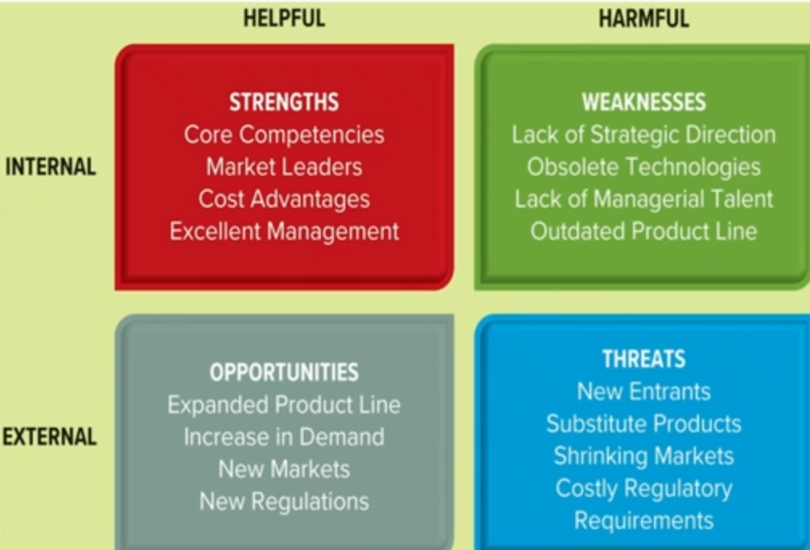
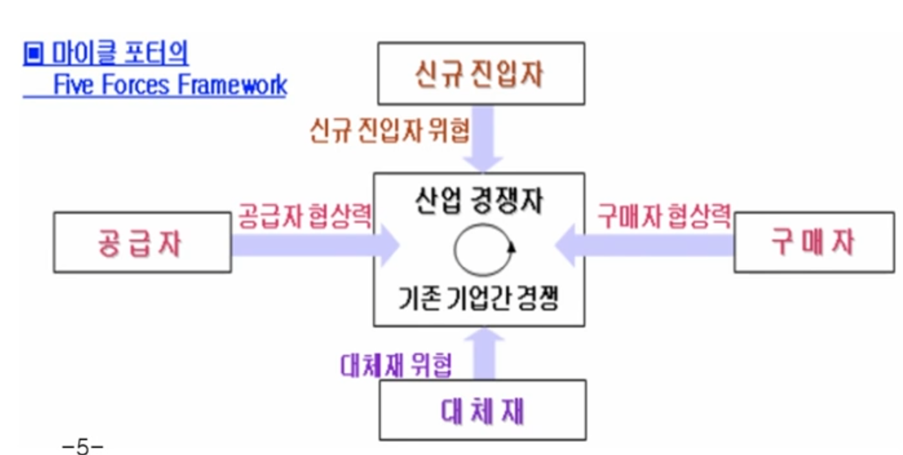

{.post-thumbnail}

## 프로세스 경영을 위한 전략(`Visioning`)

### 1. 대내외 환경 분석

### 2. 기업 비전 수립

- 기업의 총체적인 방향과 목표 설정
- 보통 2~5년 주기로 변화관리 수행
- 다음의 요소를 정의해야 함
    - `비전`: 기업이 달성하고자 하는 미래상
    - `미션 또는 사명`: 기업의 존재 이유
    - `가치 제안`: 경쟁사와 차별화되는 요소
    - `목적(Goal)`: 실현하고자 하는 일
    - `목표(Objective)`: 목적을 이루기 위해 구체적으로 해야하는 일

### 3. 기업 전략 탐색

- `가치규율모델(value discipline model)`: 세 가지 전략 중 하나를 선택하여 집중
    - 운영 우수성: 제조 프로세스 및 업무 절차를 자동화하여 운영 업무를 간소화하고 비용을 절감하는데 집중
    - 고객 친밀도: 서비스의 `개인화`와 `맞춤화`를 통해 각기 다른 고객의 요구를 충족하는데 집중
    - 제품 리더십: 프리미엄 전략
- `BSC(Balanced Score Card)`
    - 재무적인 지표에만 치중하지 않고, 균형된 성과 지표의 조합을 보는거
    - 4가지 영역
        1. `재무`
        1. `고객`
        1. `프로세스`
        1. `학습과 성장`

### 4. 전략측정지표 정의(KPI)

- 상위 수준의 전략 성과 측정지표 정의

## 프로세스 아키텍처

### 1. 프로세스 관리 목표 수립

- 비전수립 단계에서 수립된 기업 전략을 프로세스 관점에서 해석하여 프로세스 관리 목표 수립

### 2. 프로세스 관리 원칙 수립

### 3. 프로세스 모델 수립

- `분류 체계`: 프로세스 간 계층관계
- `스키마` 
- `콘텐츠`

### 4. 프로세스 통합 및 검증

### 5. 프로세스 아키텍처 운영

## 프로세스 모델링 / 분석

- `As-Is` 모델링
    - 프로세스의 논리적 흐름을 정의
    - 현재의 업무 프로세스를 분석하여 문제점을 도출

### 단계

1. 대상 프로세스의 `목표`와 `고객` 확인
1. 프로세스 정보 취합과 `태스크 정의`
    - 프로세스 수행 조직 및 참여자
    - 기동되는 이벤트
    - 다른 프로세스와의 연관관계
    - 관계되는 역할들
    - 관련 전문 용어
1. 프로세스 맵 작성
1. 프로세스 분석
    - `품질 향상`, 리드타임 단축, 생산성 향상, 원가 절감
1. 프로세스 맵 검증 및 워크숍 등을 통한 확정

## 프로세스 자동화

- 분석 설계 대상
    - 프로세스
    - 어플리케이션
    - 인터페이스

## 프로세스 성과관리

- 프로세스의 End-to-End 관점에서 진단/분석/대책 수립
- `결과`뿐만 아니라 `과정`에 대한 지표를 포함

1. 전사 성과관리 체계 수립
1. 성과관리 대상 프로세스의 선정
1. 성과관리 지표 및 성과측정 모형의 설계
1. 성과지표 모니터링
1. 지속적 성과창출을 위한 전략 수립
