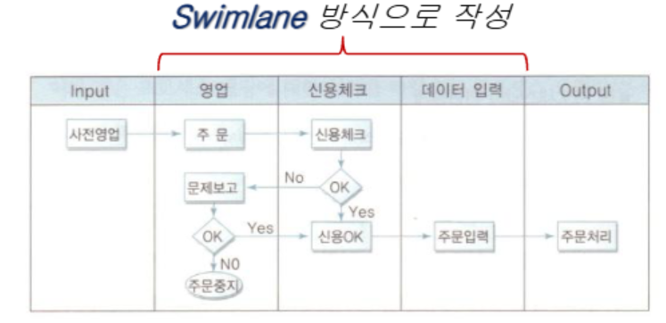
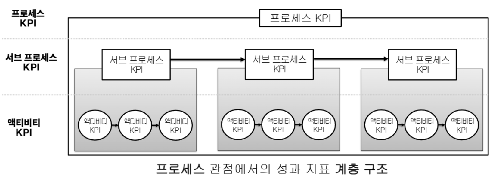
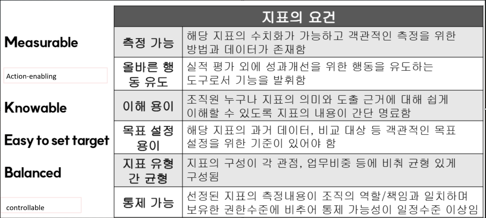
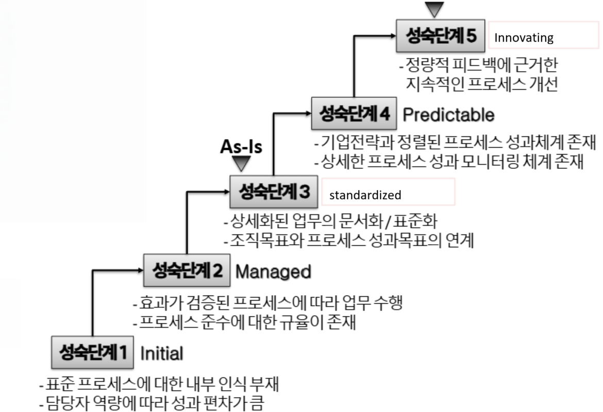

{.post-thumbnail}

## 프로세스 경영을 위한 전략(`Visioning`)

### 1. 대내외 환경 분석

### 2. 기업 비전 수립

- 기업의 총체적인 방향과 목표 설정
- 보통 2~5년 주기로 변화관리 수행
- 다음의 요소를 정의해야 함
    - `비전`: 기업이 달성하고자 하는 미래상
    - `미션 또는 사명`: 기업의 존재 이유
    - `가치 제안`: 경쟁사와 차별화되는 요소
    - `목적(Goal)`: 실현하고자 하는 일
    - `목표(Objective)`: 목적을 이루기 위해 구체적으로 해야하는 일

### 3. 기업 전략 탐색

- `가치규율모델(value discipline model)`: 세 가지 전략 중 하나를 선택하여 집중
    - 운영 우수성: 제조 프로세스 및 업무 절차를 자동화하여 운영 업무를 간소화하고 비용을 절감하는데 집중
    - 고객 친밀도: 서비스의 `개인화`와 `맞춤화`를 통해 각기 다른 고객의 요구를 충족하는데 집중
    - 제품 리더십: 프리미엄 전략
- `BSC(Balanced Score Card)`
    - 재무적인 지표에만 치중하지 않고, 균형된 성과 지표의 조합을 보는거
    - 4가지 영역
        1. `재무`
        1. `고객`
        1. `프로세스`
        1. `학습과 성장`

### 4. 전략측정지표 정의(KPI)

- 상위 수준의 전략 성과 측정지표 정의

## 프로세스 아키텍처

### 1. 프로세스 관리 목표 수립

- 비전수립 단계에서 수립된 기업 전략을 프로세스 관점에서 해석하여 프로세스 관리 목표 수립

### 2. 프로세스 관리 원칙 수립

### 3. 프로세스 모델 수립

- `분류 체계`: 프로세스 간 계층관계
- `스키마` 
- `콘텐츠`

### 4. 프로세스 통합 및 검증

### 5. 프로세스 아키텍처 운영

## 프로세스 모델링 / 분석

- 개별 프로세스와 세부 액티비티의 `논리적 흐름을 정의`하고 `개선기회`를 발견하여 `최적화` 시킴

### 1. 대상 프로세스의 목표와 고객 확인

- 프로세스 `모델링 목표`와 `프로세스 자체의 수행 목표`, `고객`을 확인한 이후 다이어그램 작성
    - 모델링 목표:
        - 프로세스 발견
        - As-Is 모델링
        - To-Be 모델링
        - 자동화 실행 모델 구축

### 2. 프로세스 정보 취합과 태스크 정의

- 인터뷰, 자료 조사 등을 통해 관련 정보를 취합
- 관련 액티비티(태스크) 들을 개략적으로 정의
- 취합 정보:
    - 프로세스 수행 조직 및 참여자
    - 기동되는 이벤트
    - 다른 프로세스와의 연관관계
    - 관계되는 역할들
    - 관련 전문 용어
- 프로세스 책임자를 통해 수집된 정보의 1차 검증 실시

### 3. 프로세스 맵 작성

- 프로세스 내에 존재하는 액티비티들 간 `업무 흐름`을 작성

- `As-Is` 모델링
    - 프로세스의 논리적 흐름을 정의
    - 현재의 업무 프로세스를 분석하여 문제점을 도출
- Check List:
    - 목표를 가지고 있는가?
    - Input과 Output이 있는가?
    - 1회 이상 반복되고 있는가?
    - 효과를 측정할 수 있는가?
    - 시작과 끝이 존재하나?
    - 각 단계를 수행하는 작업자가 명확한가?
    - 성과 측정과 개선을 책임지는 인력이 존재하나?

### 4. 프로세스 분석

- 작성된 프로세스 맵을 대상으로 `개선기회`를 모색
    - 개선기회:
        - 품질 향상
        - 리드타임 단축
            - `병렬화`나 `파레토 법칙` 적용
        - 생산성 향상
        - 원가 절감
- `To-Be` 모델링

### 5. 프로세스 맵 검증 및 워크숍 등을 통한 확정

### 단계

1. 대상 프로세스의 `목표`와 `고객` 확인
1. 프로세스 정보 취합과 `태스크 정의`
1. 프로세스 맵 작성
1. 프로세스 분석
    - `품질 향상`, 리드타임 단축, 생산성 향상, 원가 절감
1. 프로세스 맵 검증 및 워크숍 등을 통한 확정

## 프로세스 자동화

- 자동화 이전에 프로세스 `표준화`와 `개선과정`이 선행되어야 함

### 1. BPM Suite 및 HW 장비 휙득

- 사내 전산 부서에서 개발 혹은 전문 솔루션 업체로부터 구매 혹은 오픈소스 솔루션
- BPM Suite 구성 요소
    - `BPE(Business Process Execution)`: Camunda8

### 2. 자동화 대상 프로세스 선정

### 3. 요구사항 분석 및 설계

- `실행 관점`에서 비즈니스 프로세스의 상세 분석 및 설계를 수행함
- 분석 설계 대상
    - 프로세스
    - 어플리케이션
    - 인터페이스

### 4. 구현 및 이행

## 프로세스 성과관리

- 프로세스의 End-to-End 관점에서 진단/분석/대책 수립
- `결과`뿐만 아니라 `과정`에 대한 지표를 포함

### 1. 전사 성과관리 체계 수립
### 2. 성과관리 대상 프로세스의 선정
### 3. 성과관리 지표 및 성과측정 모형의 설계

### 4. 성과지표 모니터링

- `실시간` 성과지표 모니터링
- `BAM(Business Activity Monitoring)` 도구 활용

### 5. 지속적 성과창출을 위한 전략 수립

- 환경의 변화에 따라 대상 프로세스의 재선정, 성과지표의 재설계 등 수행

## 프로세스 개선

## 조직 변화관리

- 관리 원칙:
    1. `최고 경영진`이 변화관리의 주체가 되어야 함
    1. 쳬계적인 방법론을 가지고 접근해야 함
    1. 시간을 필요로 함
    1. 외부 변화를 고려해야 함
    1. 객관적인 평가와 보상이 뒷받침 되어야 함

