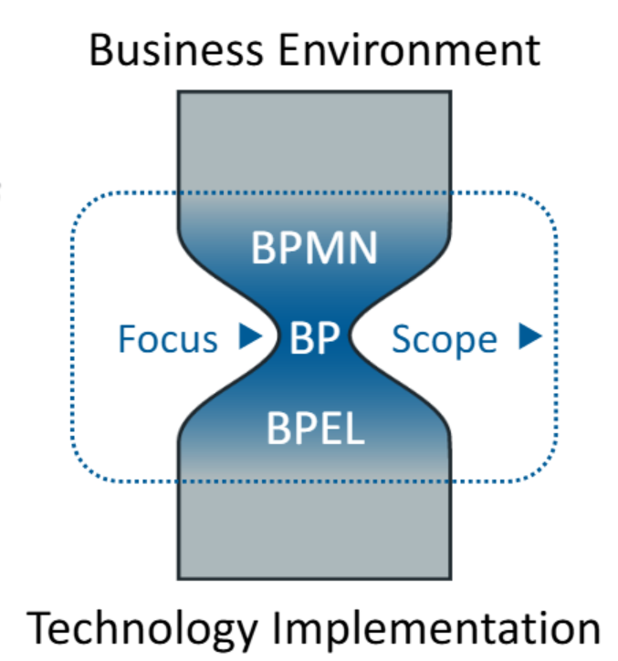
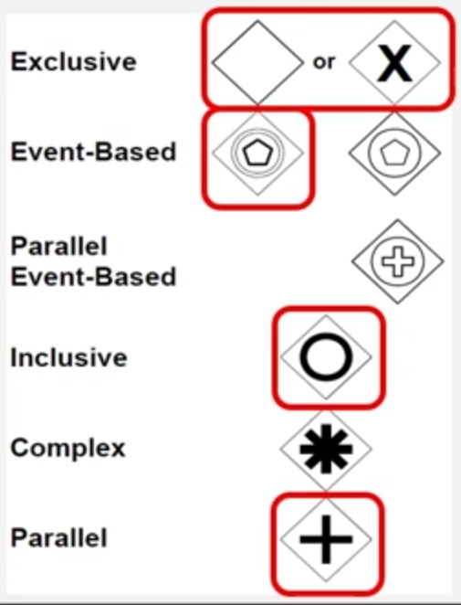
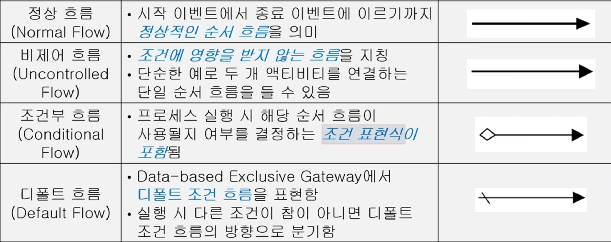
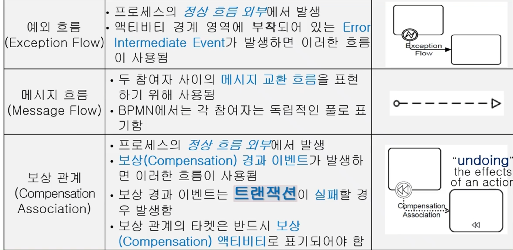
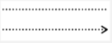
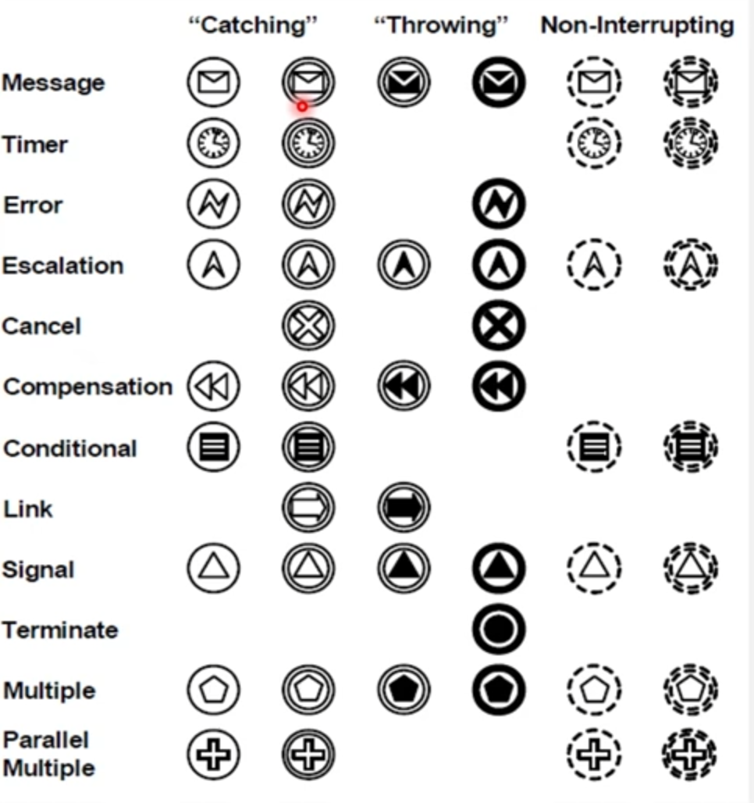
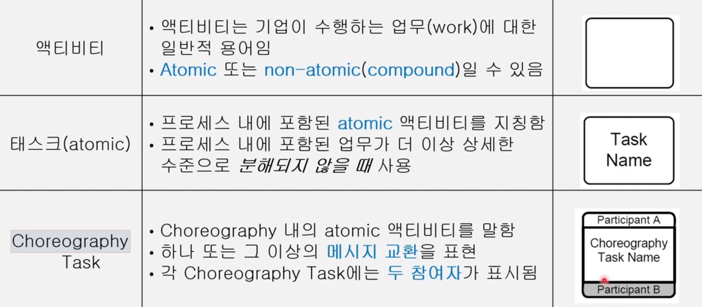

{.post-thumbnail}

- BPEL은 구현 중심, BPMN은 `모델링 중심`
- 다양한 `Business users`도 편하게 사용할 수 있도록 설계된 표기법
    - 전통적인 플로우 차트 표기법을 사용

## 모델링 유형

1. `Process`
    - `Private(internal) Business Process`
        - 조직 내부에서 수행되는 비즈니스 프로세스를 하나의 pool에 작성
    - `Public Process / Abstract Process`
        - 다른 프로세스와 의사소통하는 액티비티만 표현. 양자간 `메세지 교환`으로 표현됨
2. `Collaboration`: 2개 이상의 `Public Process`가 상호작용하는 것
3. `Choreography`: pool `사이`의 `메시지 교환`에 초점

## BPMN의 상충되는 목표

1. 비즈니스 분석가가 쉽게 사용 가능해야 한다
    - `Basic BPMN Modeling Elements`
2. 복잡한 비즈니스 프로세스를 표현할 수 있어야 한다.
    - `Extended BPMN Modeling Elements`

## Basic

1. `Flow Objects`

- Start Event: 프로세스의 시작
- `Intermediate Event`: 프로세스 도중 발생하는 이벤트
- End Event: 프로세스의 종료

- Task: 단일 단위 작업
- Sub-Process: 여러 작업을 포함하는 복합 작업. `+` 아이콘
    - `Collapsed`: 내부 상세 내용 숨김
    - `Expanded`: + 누르면 나오는 거
    - `Collapsed Sub-Choreography`
    - `Expanded Sub-Choreography`

- And, Or, Xor
- Event-based: event가 연결된 여러 경로 가운데 하나만 배타적으로 활성화
- branching, `forking`, merging, `joining`

2. `Data`
    - Data Object: 프로세스에서 사용되는 데이터
    - Message: 두 참여자가 의사소통 시 교환하는 내용을 표현
3. `Connecting Objects`

- 활동 간의 `순서`

- 다른 pool 간의 `메시지 교환`

- Artifacts와 Flow Objects 간의 연결
- 방향이 있는 경우 화살표 사용

4. Swimlanes
    - Pool: 조직 또는 참가자 그룹
    - Lane: Pool 내의 역할 또는 부서
5. Artifacts
    - Group: 관련 활동 그룹화
    - Annotation: 추가 정보 제공

### Task

1. `Service task`: 자동화된 서비스 호출
2. `User task`: 사람이 시스템으로 수행하는 작업
3. `Manual task`: 자동화되지 않은 수동 작업
4. `Script task`: BPMN에서 스크립트로 정의된 작업

## Extended

- Non-Interrupting: 서브 프로세스에서 계속 진행되는 것.
- Message, Timer, Error, `Escalation`, `Compensation`, Termination, Cancel

- 이 이상은 그냥 pdf 보고 외우셈
