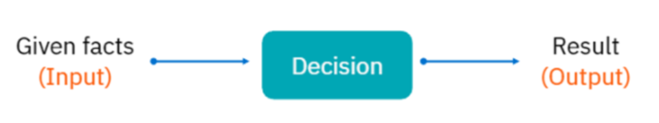
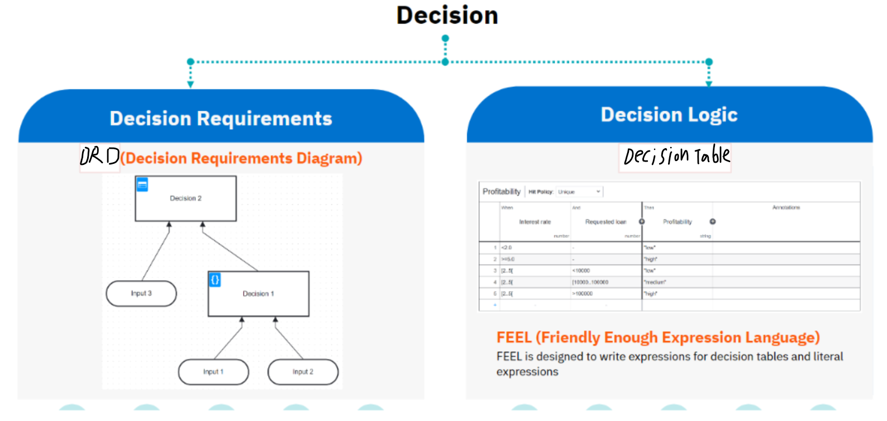
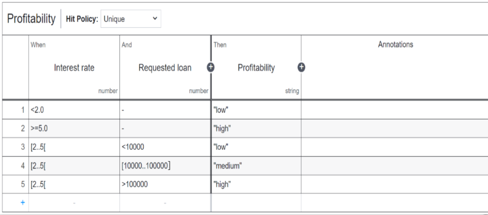

{.post-thumbnail}

## what is DMN?

- Decision Model and Notation
- `Decision Logic`을 시각적으로 모델링 하는 것

- `XML` 기반
- `operational decisions`에 적합함.
- `strategic decisions`에는 적합하지 않음.

## why DMN?

1. `Transparency` 향상
    - `Decision Logic과 code 분리 가능`
2. `Efficiency`
    - `자동 의사결정` 가능
3. `Agility`
    - 새로운 규칙이나 변경이 쉽게 가능

## DMN 구성 요소

- `DRD`: general structure of decision
- `Decision Table` (`Decision Logic`): 
    - `rules of a decision` 설정
    - `FEEL`(Friendly Enough Expression Language) 사용
- `Decision Box`: 사각형
    - 주어진 입력으로 부터 출력을 결정하는 decision
        - 입력: value or the result of another decision
- `Decision Requirement`: 화살표
    - 연결된 input과의 관계 설정. input이 decision에 required 하다는 것을 의미

- 한 row가 하나의 rule을 나타냄
- input과 output은 특정 type을 가짐
    - string, number, boolean 등
- multiple outputs 가능
- multiple columns는 and로 연결됨
- `Hit Policy`: 여러 rule이 매칭될 때 어떻게 처리할지 결정

### FEEL 문법

1. Expressions
2. `Unary Tests`: 특정 조건을 만족하는지 확인
    - `Comparision`
    - `Interval`
    - `Disjunction`: , 쓰면 or로 연결
    - `Negation`: not(조건이나 값)

