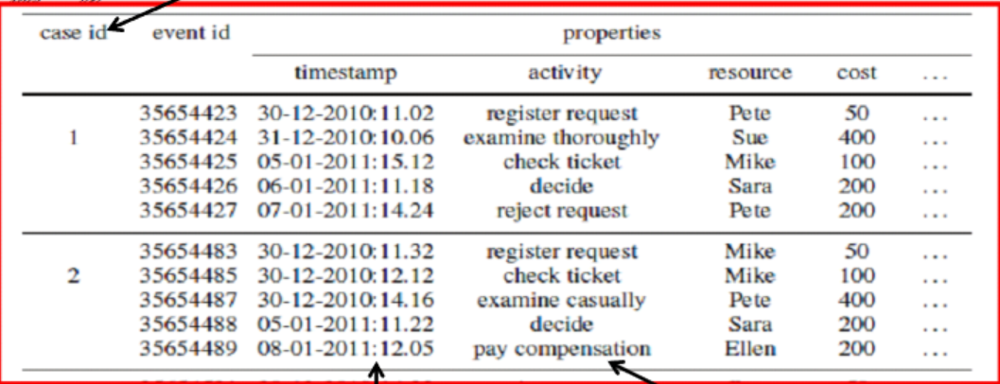
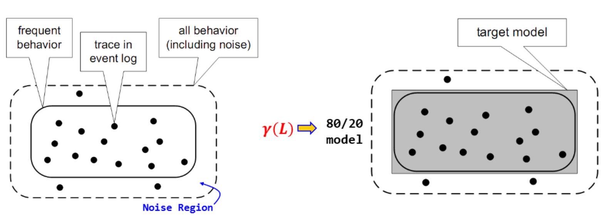
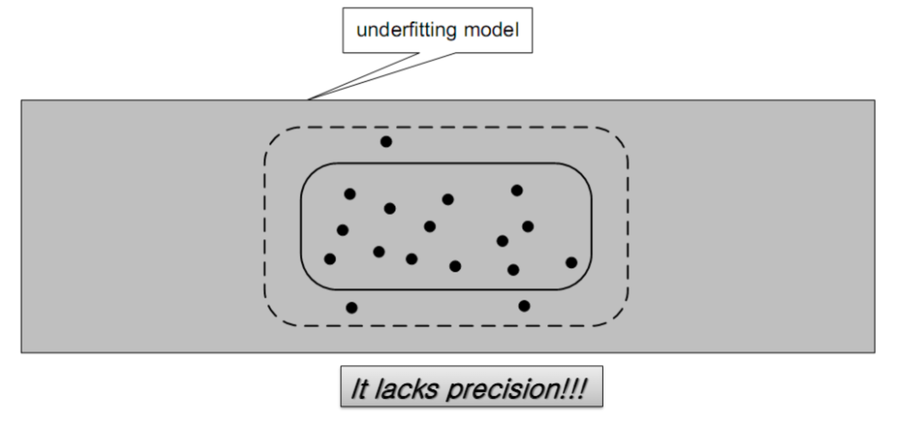

{.post-thumbnail}

## 프로세스 마이닝(Process Mining)이란?

- `이벤트 로그`로부터 `프로세스 관련 정보(meaningful & useful)`를 추출하는 것

- 프로세스 마이닝을 활용하면 사전 지식 없이 process model이나 organization 정보를 도출할 수 있다.

## BPM Life-cycle 완성을 위한 process mining 역할

- 프로세스 실행 결과 생성된 데이터에 기초해서 현황 `진단` 및 추가 `요구사항` 분석이 수행되어야 함.
- 실제로는 심각한 문제점이 발생하거나, 주요 외부 환경 변화가 있을 경우에만 life-cycle 순환이 일어나고, 재설계 의사결정 과정에 `프로세스`에 대한 `실제 정보`가 잘 사용 안됨
- 프로세스 마이닝이 `truly close the BPM life-cycle` 실현에 기여

## 프로세스 마이닝 유형

1. `Discovery`
    - 사전 지식이 없는 상태에서 `이벤트 로그`로부터 `프로세스 모델(control flow)`을 도출
    - `α-algorithm` -> `petri net` 모델 도출 -> BPMN 다이어그램 변환
2. `Conformance checking`
    - 기존 `프로세스 모델`과 `이벤트 로그`에 기록된 `현실(reality)`이 일치하는지 확인
    - `규정 준수 여부 확인` 가능
    - `Deviations`이 어디서 발생하는지 감지하여 설명할 수 있다.
3. `Enhancement`
    - `repair`: 현실을 잘 반영하기 위해 프로세스 모델을 수정
    - `extension`: 프로세스 모델에 새로운 관점이나 `성과 지표`를 추가함

## Event log

- 반드시 `케이스` 또는 `프로세스 인스턴스`를 식별할 수 있어야 함.
    - `case id`, `timestamp(하나만 있으면 완료 시간 의미)`, `acitivity` 이름이 필수로 있어야 한다.

## 복잡도 제어

- `Spagethetti` 프로세스에서 `Lasagna` 프로세스로 개선하는 방법
- `Fuzzy mining`: 저빈도 `activity`들이 제거되거나 `클러스터 노드`로 병함됨. 저빈도 아크는 설정된 `임계치` 값에 따라 제거됨

## Challenges of Process Discovery Techniques

## 적합성(적합도) 검사

- 불일치 시 두 가지 해석 가능
    1. 이벤트 로그가 틀림: 기준이 되는 바람직한 모델을 따르지 않음
        - model is `normative` (`de jure model`)
        - 교정:
            1. 문제 인식
            2. 원인 분석
            3. 교정 조치 실행
            4. 재검증 및 모니터링
    2. 모델이 틀림: 모델이 현실을 잘 설명하지 못함
        - model is `descriptive` (`de facto model`)

## Enhancement - `extension`

1. `조직` 관점
    - 특정 activity를 담당하며 업무를 수행하는 `역할(role)`은 무엇이며, 어떤 `작업자`들이 업무 수행을 담당하는가?
    - log 데이터에서 resource가 기록되어 있어야 함
2. `case` 관점
    - `케이스`의 어떤 `특징`이 의사결정에 영향을 미치는가?
    - log 데이터에 `부가적 속성`이 기록되어 있어야 함. 데이터 마이닝 `분류 기법`을 사용하여 분기 규칙 발견(`의사결정 마이닝`)
3. `시간` 관점
    - 프로세스 내 `병목` 지점이 어디인가?
    - 애니메이션 등을 추가

- activity 대기시간, 수행시간, 분기 확률 파악 가능

- discovery에서 발견한 `control-flow 관점`을 포함해 세 관점을 통합해서 `통찰력` 제공
    1. obtain an event log
    2. create or discover a process model
    3. connect events in the log to activities in the model
    4. extend the model
    5. return integrated model
- `규정 준수` 여부와 연계 가능
- 사생활 보호 이슈를 고려해야 함
    - `비식별화` 또는 `익명화` 요구됨

## 소셜 네트워크 분석(SNA)

- `작업 이양(work handover)` 지표를 이용하여 소셜 네트워크 생성
- 업무에 참여한 사람/역할/부서/자원 사이의 상관 관계 분석

## `Dotted Chart`

- `절대적 혹은 상대적 시간`에 따른 특성을 점으로 찍은거

- `Desire lines` in process model

## 프로세스 마이닝 사례

### 외래진료 프로세스 분석(분당 서울대 병원)

1. 적합성 검증
    - 도출된 진료 프로세스 모델과 병원의 진료 지침(`CPG: Clinical Practice Guideline`)이 얼마나 일치하는지 검증
    - 약 90% 일치(잘 지켜지고 있다.)
2. 진료 프로세스 패턴 분석
    - 환자 유형별 다양한 진료 패턴이 존재함
    - 이 분석 결과는 `환자 안내 시스템` 개선에 활용
3. 시뮬레이션 모델 작성
    - 로그 분석을 바탕으로 `시뮬레이션 모델` 작성. 환자가 늘어날 경우 진료 시간에 어떤 변화가 있는지 분석
    - 병원의 키오스크 적정 대수 산정

### 건강검진센터 프로세스 분석(삼성서울병원)

1. 스마트 건강검진 시스템 도입 효과 검증
    - 프로세스 마이닝을 통해 프로세스 개선 효과 `정량적 / 객관적 검증`
    - 수검자 대기시간, 검사시간 및 가동률 등의 성과 비교 분석
2. 적합성 검증
    - 검사간 선후관계를 따르지 않는 `Deviation` 발견
    - 고도화 전후의 프로세스 비교 분석(주요 sequence 패턴 대상)
3. 성과 분석
    - 전반적으로 각 검사실의 `대기시간`이 `감소`한 것을 정량적으로 확인
    - 고도화 이후 평균 검사 개수에 따른 `검진 시간` 및 `특정 검사 항목 예측`

### 모바일 게임 이용자 여정 분석

1. 모바일 게임 신규 이용자들의 `이용 패턴` 및 `이탈 패턴` 분석
    - `과금 유저 전환율 제고`를 위한 시사점 도출
- 기대효과: 신규 이용자를 이해하는데 핵심적인 역할. `수익 극대화`에 기여

### 중소 숙박업소 운영 프로세스 분석

1. 중소 숙박업소 특징
    - 상품 = 객식 사용 시간
    - 재고 소멸성: 시간이 지나면 활용 불가능
    - 표준 프로세스 모델 부재
    - 국내 중소숙박업소 정보 시스템은 매우 빈약
2. 실제 수행 프로세스 분석
    - 객실 이용형태에 따른 절차상 공통점, 차이점 발견
    - 발견된 모델을 활용하여 `마케팅 자료`로 이용
3. 이용 패턴 발견에 따른 고객 행동 패턴 예측

### 삼성전자 MES 분석

- MES(Manufacturing Execution System) 로그 데이터를 활용한 `반도체 제조 공정` 분석

### 멜론 서비스 여정 분석

- 사용자를 행동 패턴에 따라 5개 그룹으로 세부화 하고, 세부 그룹별 전환율을 높이기 위한 `타켓 마케팅 캠페인` 계획 수립

## 프로세스 마이닝 도구

- Celonis
- Minit
- myInvenio
- Perceptive

## Disco Demo

- 예제 목적
    1. 프로세스에 대한 상세한 이해를 통한 효율화 방안 모색
    2. 가이드라인 준수 여부 확인
    3. 병목 지점 발견 / 개선을 통한 프로세스 성능 목표치 통제
        - performance filter로 확인 가능

- activity에 activity, role 등을 설정해서 어떤 관점으로 분석할지 선택 가능
