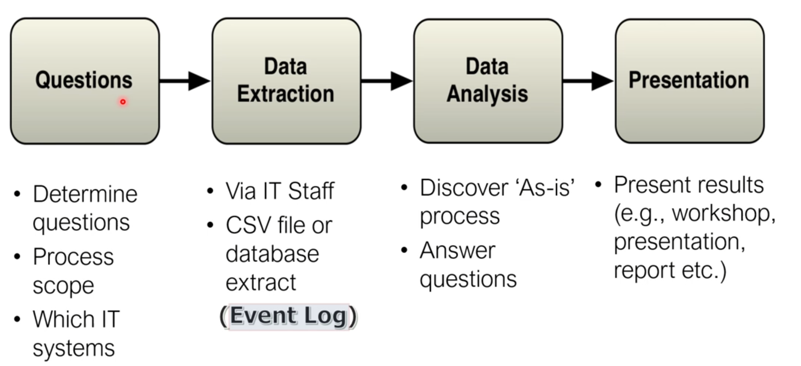

{.post-thumbnail}

## 프로세스 마이닝 사례

### 외래진료 프로세스 분석(분당 서울대 병원)

1. 적합성 검증
    - 도출된 진료 프로세스 모델과 병원의 진료 지침(`CPG: Clinical Practice Guideline`)이 얼마나 일치하는지 검증
    - 약 90% 일치(잘 지켜지고 있다.)
2. 진료 프로세스 패턴 분석
    - 환자 유형별 다양한 진료 패턴이 존재함
    - 이 분석 결과는 `환자 안내 시스템` 개선에 활용
3. 시뮬레이션 모델 작성
    - 로그 분석을 바탕으로 `시뮬레이션 모델` 작성. 환자가 늘어날 경우 진료 시간에 어떤 변화가 있는지 분석
    - 병원의 키오스크 적정 대수 산정

### 건강검진센터 프로세스 분석(삼성서울병원)

1. 스마트 건강검진 시스템 도입 효과 검증
    - 프로세스 마이닝을 통해 프로세스 개선 효과 `정량적 / 객관적 검증`
    - 수검자 대기시간, 검사시간 및 가동률 등의 성과 비교 분석
2. 적합성 검증
    - 검사간 선후관계를 따르지 않는 `Deviation` 발견
    - 고도화 전후의 프로세스 비교 분석(주요 sequence 패턴 대상)
3. 성과 분석
    - 전반적으로 각 검사실의 `대기시간`이 `감소`한 것을 정량적으로 확인
    - 고도화 이후 평균 검사 개수에 따른 `검진 시간` 및 `특정 검사 항목 예측`

### 모바일 게임 이용자 여정 분석

1. 모바일 게임 신규 이용자들의 `이용 패턴` 및 `이탈 패턴` 분석
    - `과금 유저 전환율 제고`를 위한 시사점 도출
- 기대효과: 신규 이용자를 이해하는데 핵심적인 역할. `수익 극대화`에 기여

### 중소 숙박업소 운영 프로세스 분석

1. 중소 숙박업소 특징
    - 상품 = 객식 사용 시간
    - 재고 소멸성: 시간이 지나면 활용 불가능
    - 표준 프로세스 모델 부재
    - 국내 중소숙박업소 정보 시스템은 매우 빈약
2. 실제 수행 프로세스 분석
    - 객실 이용형태에 따른 절차상 공통점, 차이점 발견
    - 발견된 모델을 활용하여 `마케팅 자료`로 이용
3. 이용 패턴 발견에 따른 고객 행동 패턴 예측

### 삼성전자 MES 분석

- MES(Manufacturing Execution System) 로그 데이터를 활용한 `반도체 제조 공정` 분석

### 멜론 서비스 여정 분석

- 세부 그룹별 전환율을 높이기 위한 `타켓 마케팅 캠페인` 계획 수립

## 프로세스 마이닝 도구

- Celonis
- Minit
- myInvenio
- Perceptive

## Disco Demo

