**1. 인공지능의 정의**

- 튜링테스트: 사람처럼 행동하는가?
- AI 파라독스: 어제의 AI로 간주되던 것이 오늘은 AI가 아님

**2. 탐색**

1. 맹목적 탐색(전체 탐색): 깊이 우선탐색, 너비 우선 탐색, 반복적 깊이 싶화 탐색, 양방향 탐색

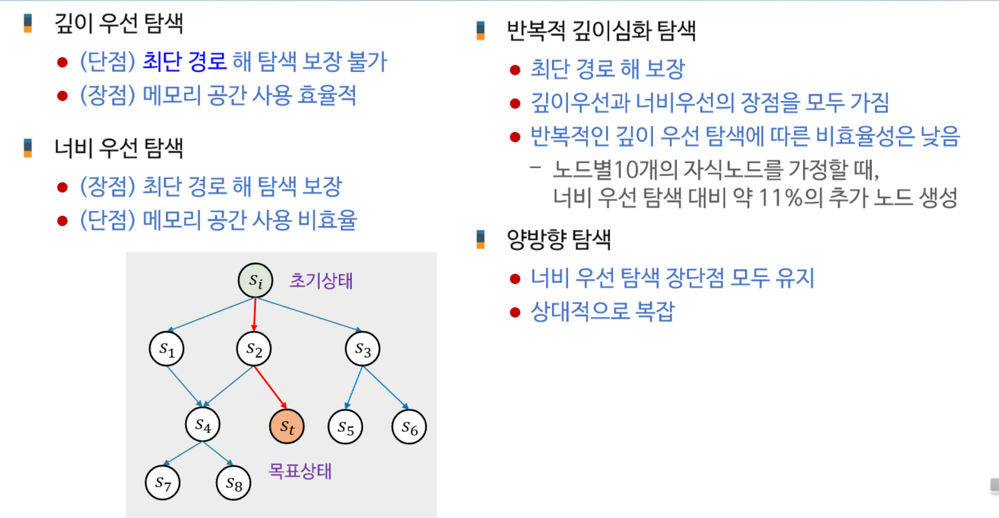{width=30%}

2. 정보 이용 탐색(부분 탐색, **휴리스틱 탐색**):  최상 우선 탐색, 빔 탐색, $A^{*}$ 알고리즘
    - **언덕 오르기 탐색**: **국소 최적점(local optima)에 빠질 위험 존재**
    1. 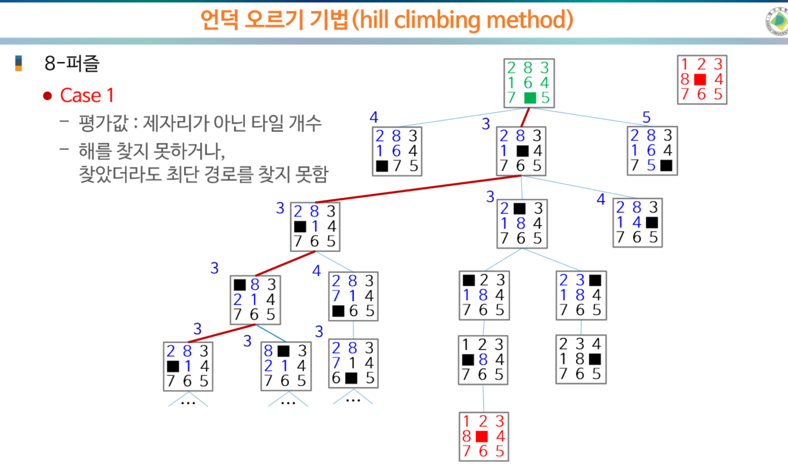{width=20%}
    2. 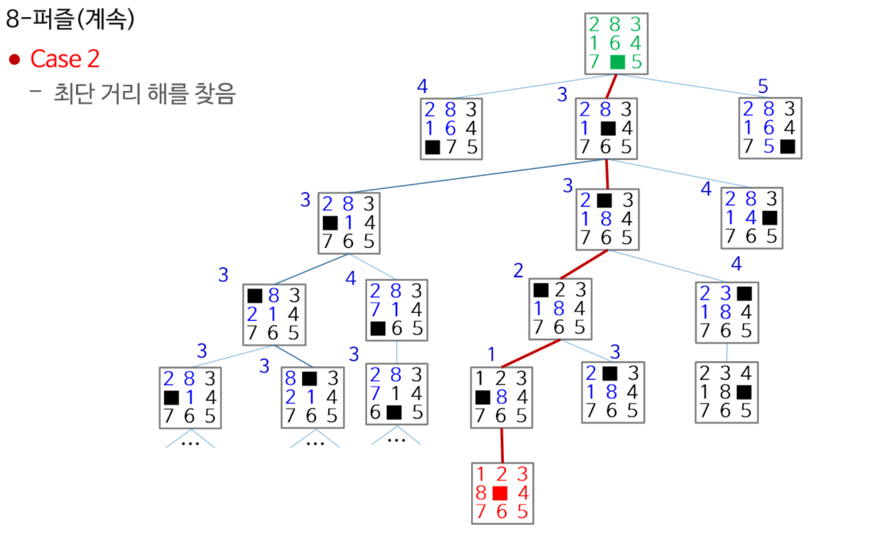{width=20%}

3. 게임 탐색(상대적 탐색): 
    - **mini-max 알고리즘**: **지정된 깊이의 게임트리를 제작**, 단말 노드부터 위로 올라가면서 연산을 반복해 **판세 계산**
        - 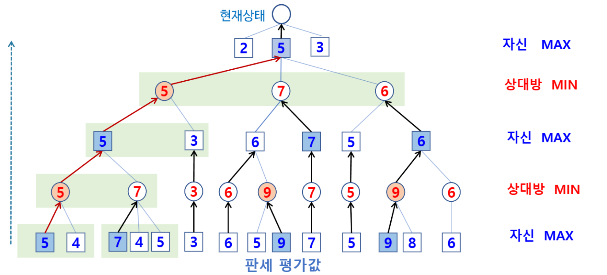{width=20%}
    - **α-β 가지치기**: 검토할 필요 없는 노드 탐색에서 제외
    - **몬테칼로 트리 탐색**

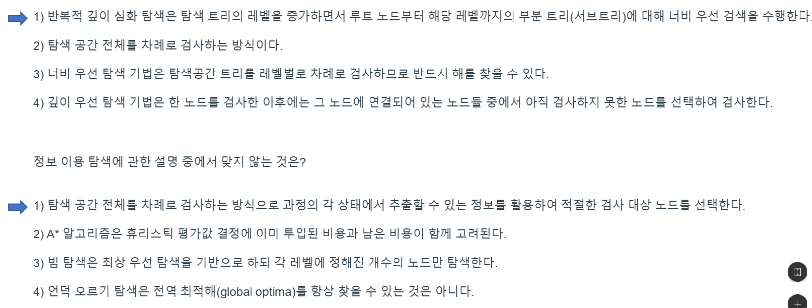{width=40%}

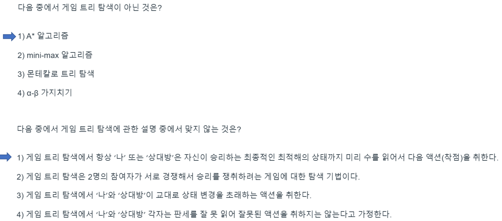{width=40%}

**3. 지식 표현의 개요**

- AI 초창기에는 탐색 중심의 GPS(General Problem Solver) 제작에 주안점을 둠. 지금은 실제적인 문제를 해결하기 위해 **지식 + 추론 패러다임**과 **특화**로 방향 전환
- 인공지능은 **형식지**에 주안점

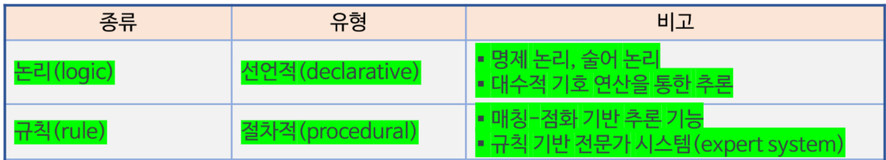{width=30%}

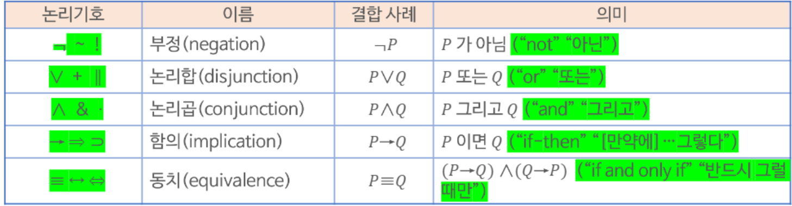{width=30%}

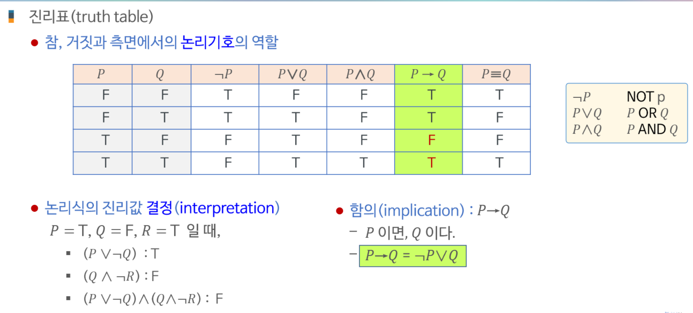{width=30%}

- 정형식(wff)
- **리터럴**: 한 명제기호와 해당 명제 기호의 부정을 통칭
- **절**: 리터럴들이 논리합이나 논리곱으로만 연결된 논리식
- **논리곱 정규형(conjunctive normal form, CNF)**: 논리합 절들의 논리곱 형태의 논리식
- **논리합 정규형(disjunctive normal form, DNF)**: 논리곱 절들의 논리합 형태의 논리식
- **모델**: 논리식에 포함되어 있는 각 명제기호의 진리값 상태($2^n$ 개의 모델 존재)
- **항진식(tautology)**: 모든 모델에서 참인 논리식
- **모순적 또는 충족불가능한 논리식(contradiction or unsatisfiable)**: **항위식(contradiction)**: 모든 모델에서 거짓인 논리식
- **충족가능한(satisfiable)** 논리식: 적어도 하나의 모델에서 참인 논리식
- **연역적 추론**: 참인 사실들로부터 새로운 참인 명제를 도출하는 것
    - **추론의 정당성(soundness)**: 추론 규칙을 통해 도출된 논리식은 항상 논리적 귀결이 된다. ($∇ ⊢ 𝔴$ -> $∇ ⊧ 𝔴$)
    - **추론 규칙의 완전성(completeness)**: 주어진 논리식들의 논리적 귀결은 항상 추론 규칙을 통해 찾아낼 수 있다.
    - **정리 증명(theorem proving)**: ∇가 공리(추론을 할 때 참인 것으로 주어지는 논리식), 𝔴가 정리(공리들에 추론 규칙을 적용하여 얻어지는 논리식)

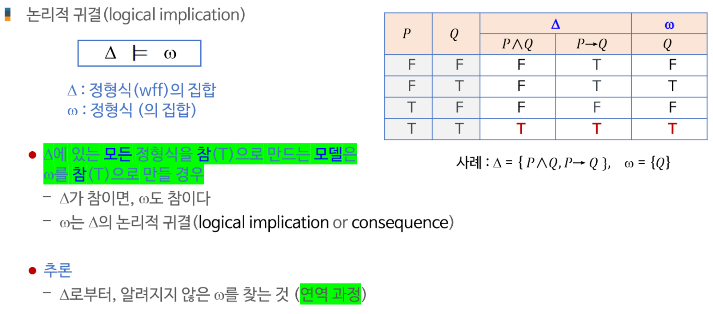{width=30%}

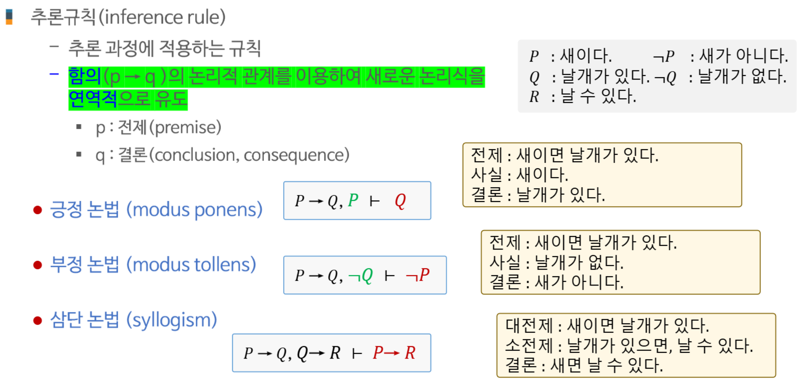{width=30%}

- **장점**:
    - 대수학적 근거를 바탕으로 논리 개념을 자연스럽게 표현 가능
    - 지식의 첨가와 삭제가 용이
    - 정리증명 등 정형화된 지식 영역에 적합
- **단점**:
    - 절차적인 지식의 표현이 난해
    - 실세계의 복잡한 구조의 표현이 난해

- **술어 논리(predicate logic)**: 명제 논리의 한계를 극복하기 위해 고안된 논리 체계. **술어명(인수)** 형태로 표현
    - **항(term)**: 상수, 변수, 함수로 구성된 표현식. 그 개수는 제한이 없음
        - ex) `John`, `x`, `father(John, legs(John))`

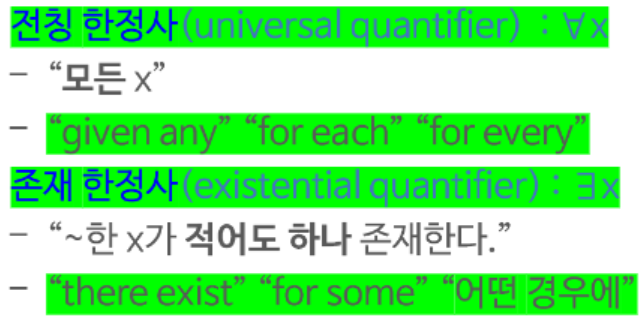{width=20%}

- **일차 술어논리(first-order predicate logic)**: 변수에만 한정사를 쓸 수 있도록 한 술어논리

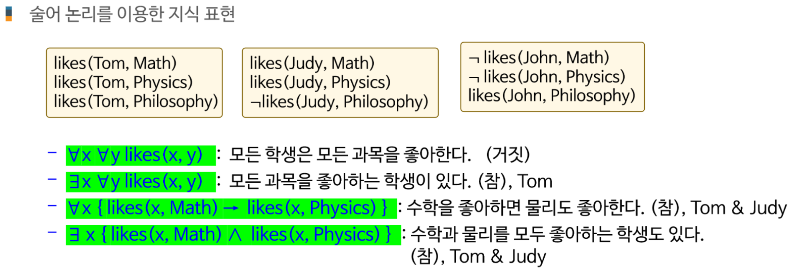{width=30%}

- **Horn 절**: 절의 한 형태로, **긍정 리터럴이 최대 하나인 절** ex) `p -> Q`(Horn 절이 아님), `¬p ∨ Q`(Horn 절)
- 논리(logic) 기반 지식 표현 및 추론
    - 기호를 사용하여 문장들을 표현 & 기호의 조작을 통해 문장들의 참 또는 거짓을 판정하는 분야
    - 명제논리와 술어논리로 구분
        - 명제논리는 문장을 기호로 표현 하여 지식을 표현
        - 술어논리는 문장의 내용을 술어(predicate)과 객체(주체 또는 대상)으로 나눠 지식을 표현
    - 긍정논법, 부정 논법, 삼단논법, 도출(resolution) 등의 대수적 기법을 사용한 추론
• 장단점
    - 선언적 지식 표현 및 지식의 추가 • 삭제가 용이
    - 실환경의 복잡한 지식의 표현에는 한계
        - 술어논리 기반의 PROLOG 언어가 한 때 주목을 받았지만 실패

- **규칙 기반 추론**: 
    - 전문가시스템은 상대적으로 지식 표현이 수월하고, 불확실한 지식을 표현하는데 장점이 있어 규칙 기반으로 제작됨
    - 지식의 자동추출 및 축적(학습) 불가능

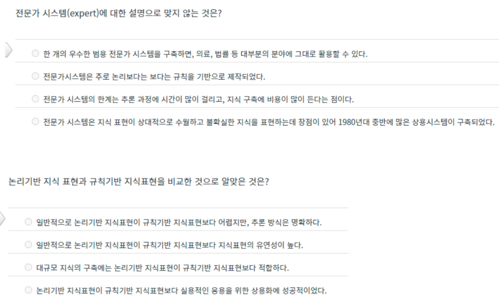{width=30%}

**머신러닝의 개념**

- 인공지능 > 머신러닝 > 딥러닝
- 프로그래밍은 해결할 수 없는 문제가 많았다: **특징점 자동 추출 학습, 새로운것 인식**(필기체, 얼굴 인식 등)
- **머신 러닝 태스크**: **분류, 상관관계 파악(회귀), 군집화**
- **학습 방식**: 감독학습, 비감독학습 등
- **분류**: 분류 대상 카테고리(클래스)는 사전에 지정됨. 사물 인식, 손글씨 숫자 인식, 음성 인식 등
- **회귀(상관관계 분석)**: 출력은 실수. 상관관계 모델링을 통한 예측 및 추세 분석
- **로지스틱 회귀**: 종속변수가 범주형. 이항형, 다항형, 사실은 확률적 성격을 가미한 분류 기법.
- **군집화**: 클러스터의 개수는 사전에 정해져 있지 않음. 문서 분류, 영샹의 색조에 따라 영상을 분류(위성 사진으로 곡물 수확량, 화재 상황 분석 등)
- **감독 학습(지도 학습)**: 데이터에 사람이 작업을 한 라벨을 다한 학습 데이터 구축. 분류, 회귀
    - 학습 샘플은 **샘플과 목표치 쌍**
- **비감독 학습(비지도 학습)**: 라벨이 없는 데이터로 학습. 군집화 등
- **강화 학습**: 게임 수행(아타리 알파고) 등
- **딥 러닝**: 학습 데이터(MNIST, CIFAR-10 등)에서 특징점 자동 추출 학습. **다층구조, 계층적 추상화 학습, End-to-End 학습**

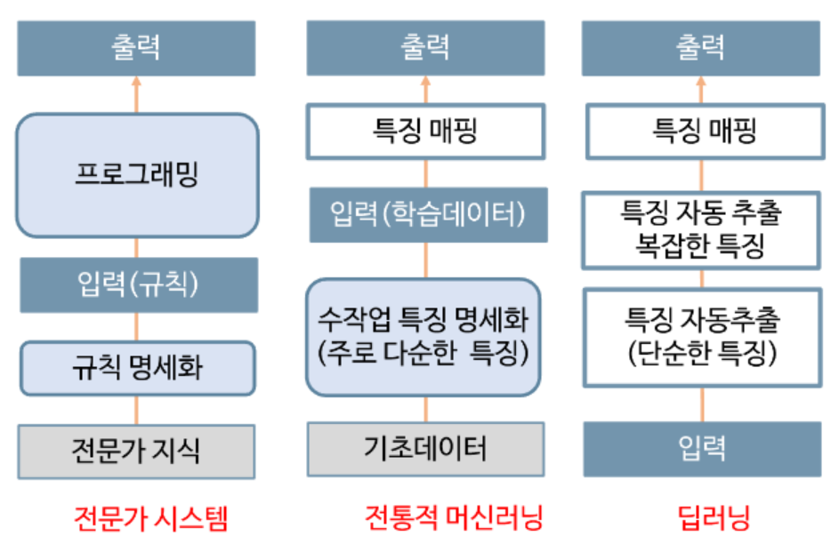{width=30%}

**신경망**

- **신경명의 학습**: **가중치 변경**
- 생물학적 뉴련: 시냅스 연결 강도, 인공 뉴럴 네트워크: 연결선의 가중치 크기
- 학습 데이터를 입력으로 사용하여 연결 강도에 반영
- b = -θ

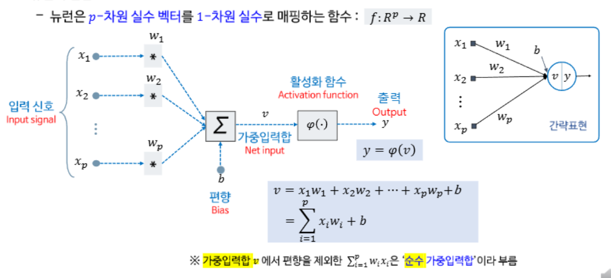{width=30%}

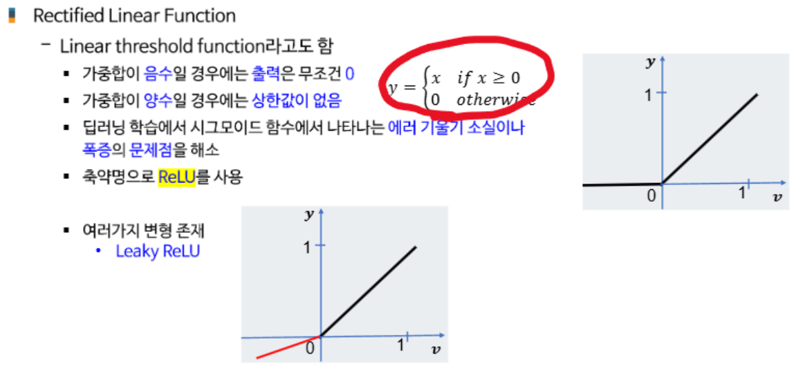{width=30%}

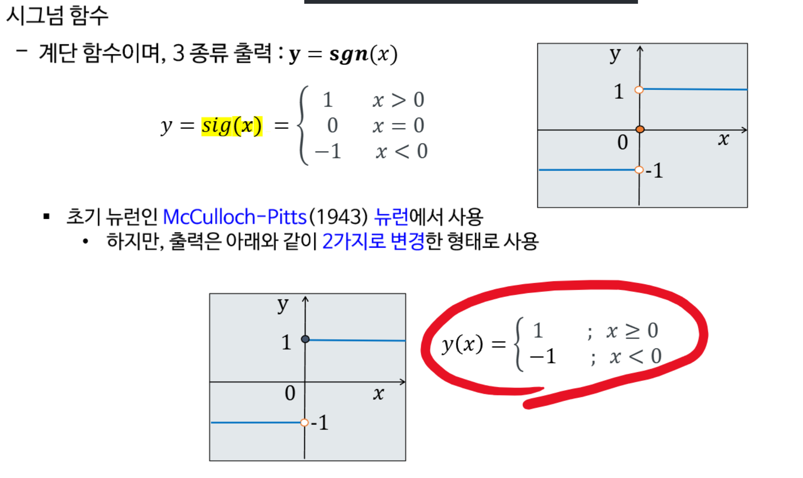{width=30%}

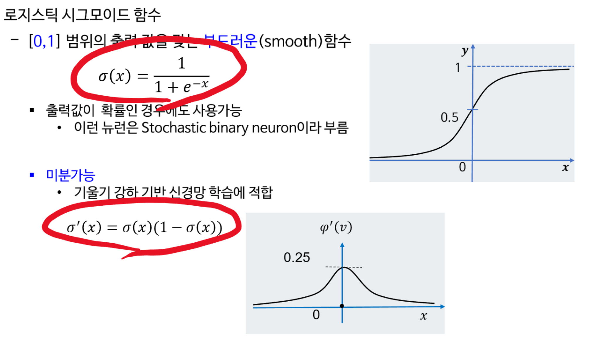{width=30%}

- **퍼셉트론**: 입력층과 출력층만으로 구성. 엄밀하게는 뉴런은 아니다. **시`그넘 함수의 수정본** 사용. (1 v >= 0)
    - **선형 분리 가능한 데이터에 대해서는 무조건 수렴**
    - 퍼셉트론의 한계: 선형분리성 (OR 연산은 가능하지만 XOR 연산은 불가능)

**FNN**

- **No cyclick link, 한 개 이상의 히든 계층, 다양한 활성화 함수 사용**
- **완전연결층**

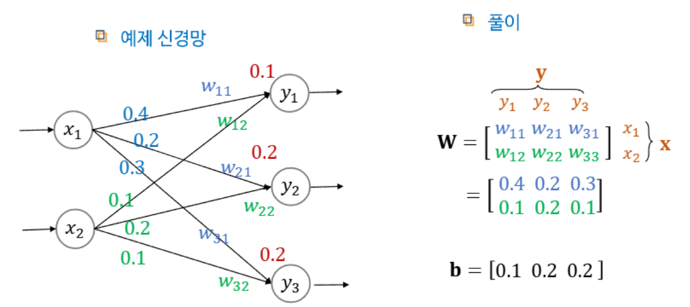{width=25%}

- affine 계층: 선형 뉴런으로 구성된 계층. $xW + b -> y$
- **단일 모드**: 한번에 한개의 입력을 처리
- **배치 모드**: 여러 개의 입력을 한 번에 처리. 병렬처리 가능, 학습 속도 향상, 일반적으로 더 나은 성능
- 배치 처리를 하는 이유: **병렬 처리로 학습 속도 향상, 정확도는 떨어지나 일반화 좋다.**

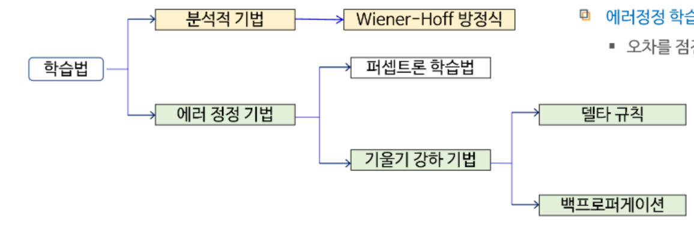{width=20%}

- 평균제곱에러($\frac{1}{2N} \sum_{d=1}^{N} \sum_{i=1}^{q} (d_{di} - y_{di})^2$)
- 기울기 강하법: $x_{t+1} = x_{t} - \eta \nabla f(x_t)$

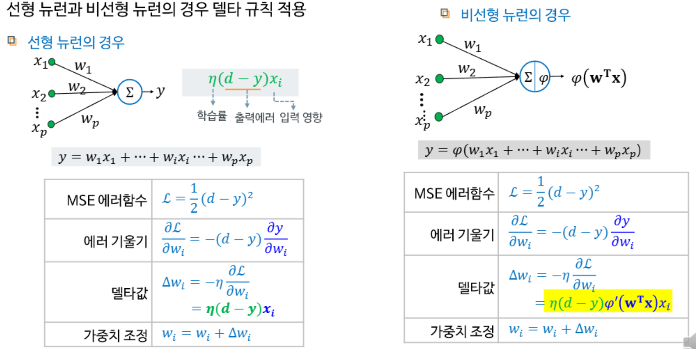{width=30%}

1. 신경망의 학습이 문제로 대두 (※ 델타규칙은 단층신경망에만 유효)
2. 백프로퍼게이션 알고리즘은 다층 신경망의 학습을 가능하게 함
3. 하지만, 기울기 소실 또는 폭증(error gradient vanishing or explosion) 현상으로 계층의 개수가 커지면 실용성이 떨어짐)다층 신경망이 소규모 응용에만 사용이 제한됨
4. 백프로퍼게이션 알고리즘의 여러 다른 이름: 오류 역전파 알고리즘, 역전파 알고리즘, 역전파 학습 알고리즘

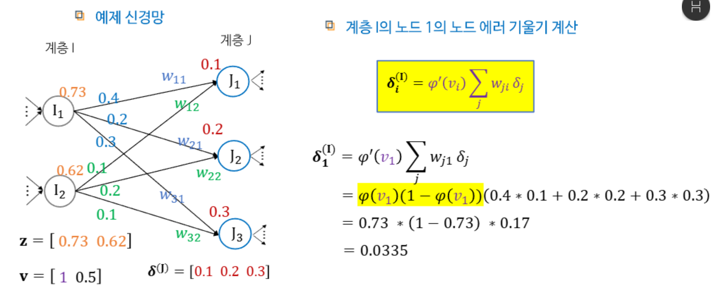{width=30%}

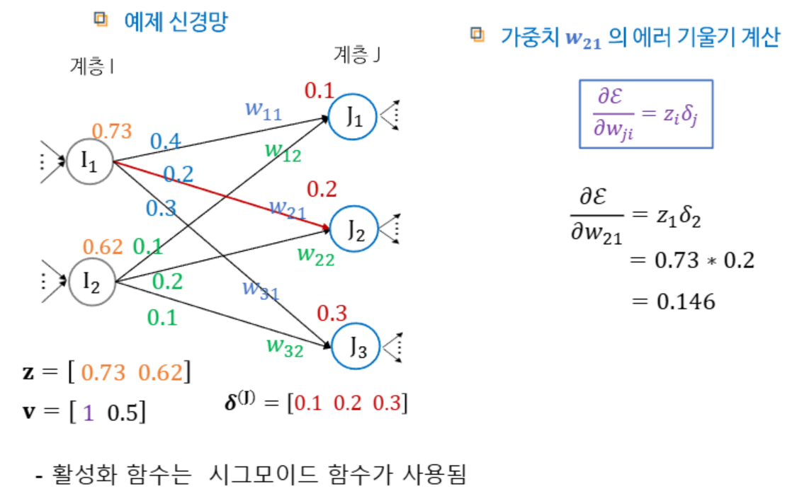{width=30%}

- SGD(stochastic gradient descent): 샘플 단위로 가중치 갱신.(패턴 모드, Online 모드) 전체 샘플 학습 처리를 Epoch라고 함. 미니배치의 크기가 1개 샘플인 경우
- 미니 배치 모드: 배치 모드와 온라인 모드의 절충안. Local minima에 빠져도 나올 가능성이 있음.
- 확률적 순서: 샘플의 학습 순서를 무작위로 선정
