딥러닝과 CNN 이해

- 다층 신겸앙의 근본적 문제점: 계층의 개수가 커지면 **기울기 소실** 또는 **기울기 폭증** 현상 발생
- 2000년 힌튼 교수가 심층신경망의 학습 가능성 데모
- 초기 딥러닝의 기반 모델:
    - **컨볼루션망**: 
        - 여러 노드가 가줓이 공유를 통한 **계산량 축소**
        - 위치와 위상적 **특징 추출 효율화**
        - **서브 샘플링으로 공간 축소**
    - **순환망**:
        - **일종의 상태(memory) 유지 효과**
- 딥러닝 활성화 배경:
    - **혁신 알고리즘**
    - **공개 개발환경**
    - **고성능 컴퓨팅 환경(GPU, Cloud)**
    - **대규모 데이터셋**
- 컴퓨터 비전:
    - 전통적인 컴퓨터 비전: **막대한 수작업** 처리 필요
    - 딥러닝: **자동 특징 추출** 가능
    - 연산 유형: cross-correlation, **convolution**
- CNN:
    - **CNN은 오랜 역사를 지니고 있으며, 최근 딥러닝의 붐을 불러일으키는데 중추 역할**
    - **컴퓨팅 필요량의 최소화를 통해 주로 영상/비전 영역에 큰 장점**을 지님
    - **부분 연결 방식의 계층 사용**, **필터를 학습 대상으로 삼음**
    - 주로 **convolution, pooling, fully connected layer**로 구성

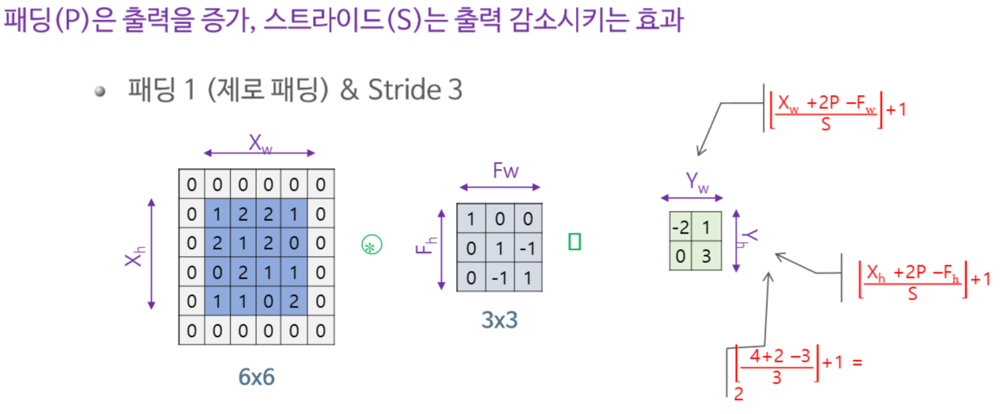{width=30%}

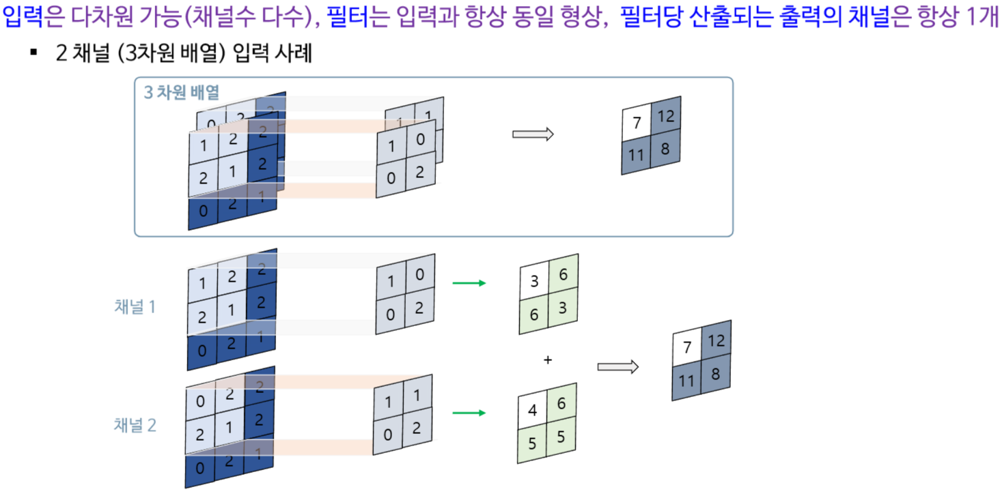{width=30%}

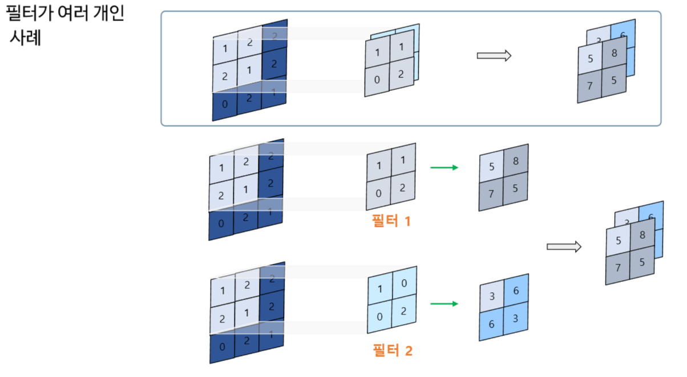{width=30%}

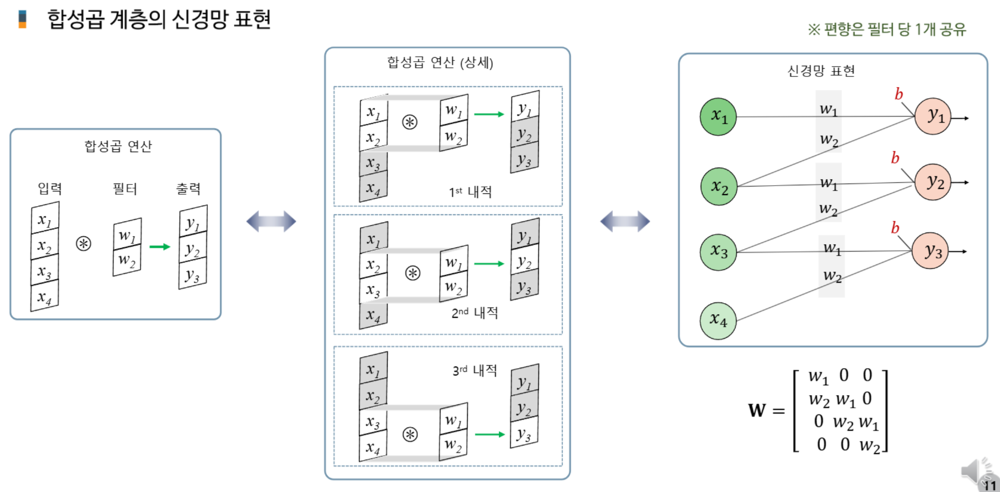{width=30%}

- **결국 필터가 학습 대상이 된다.**

- pooling:
    - **subsampling**이라고도 부름.
    - 일부 특징의 **이동, 잡음, 왜곡 현상에 대한 강인성을 향상**시키는 효과

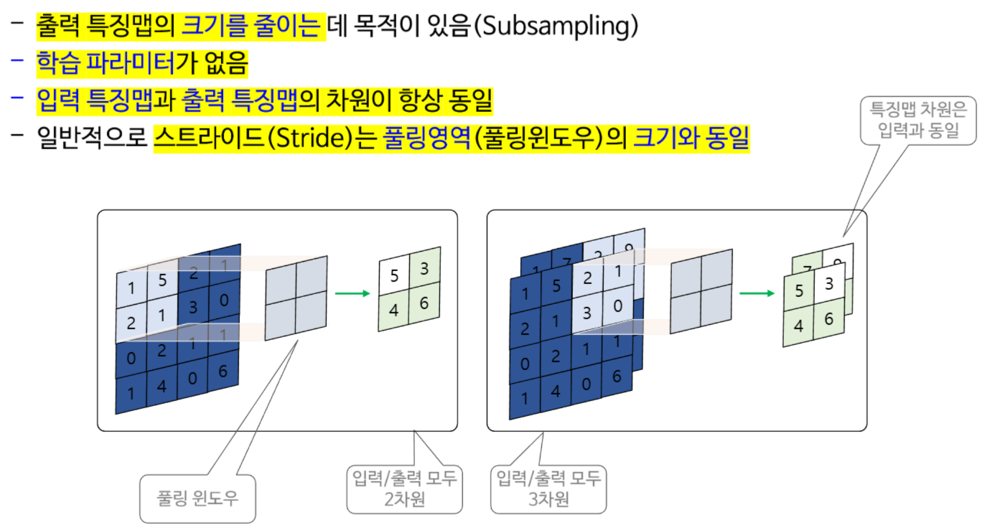{width=30%}

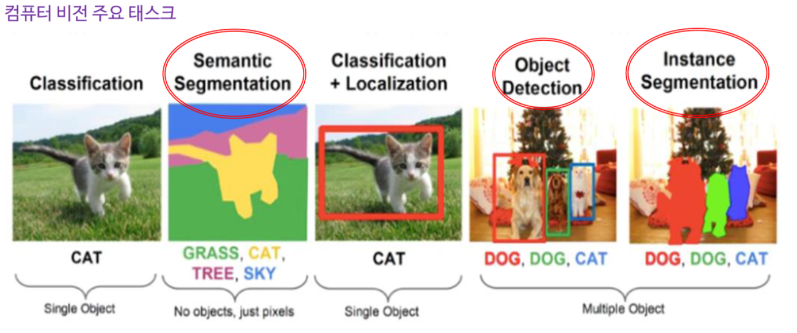{width=30%}

- MNIST 데이터셋:
    - **손글씨 숫자 이미지 데이터셋**
    - 28x28 픽셀, 10개의 클래스(0-9)
    - 60000개의 훈련 이미지, 10000개의 테스트 이미지

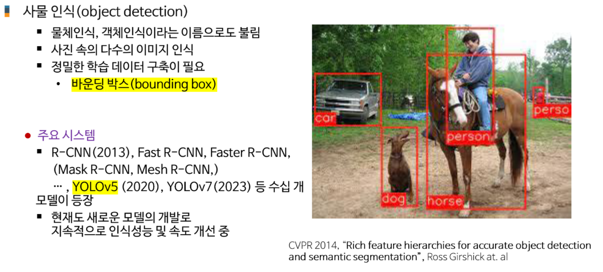{width=30%}

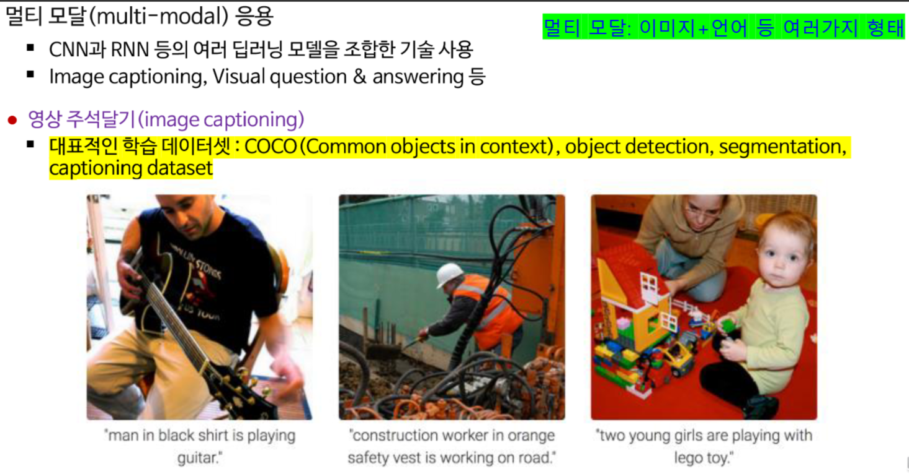{width=30%}

- RNN: 1 time unit delay feedback

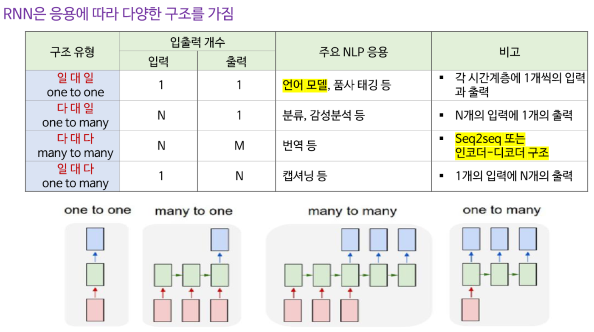

- **SRN(simple recurrent network)**: vanilla RNN, Elman network, RNN의 대표적 모델

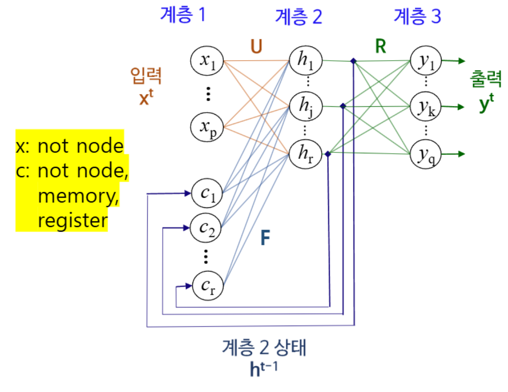{width=30%}

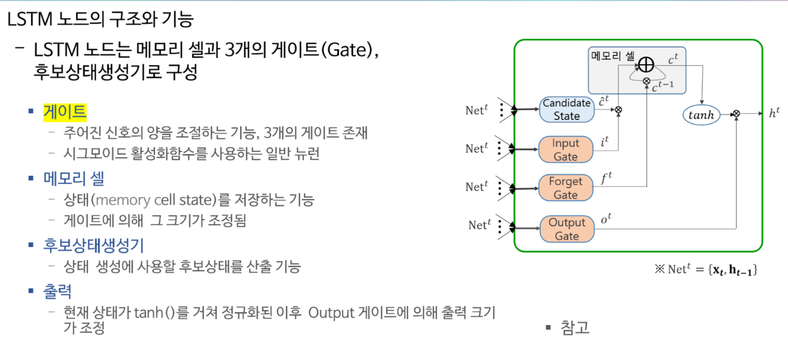{width=30%}

- 에러 기울기 소실 문제가 있었음.

- 자연어 처리(NLP)
    - 자연어: 인공언어와 구별하기 위해 만들어진 언어의 또다른 명칭

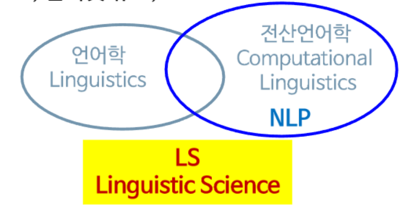{width=30%}

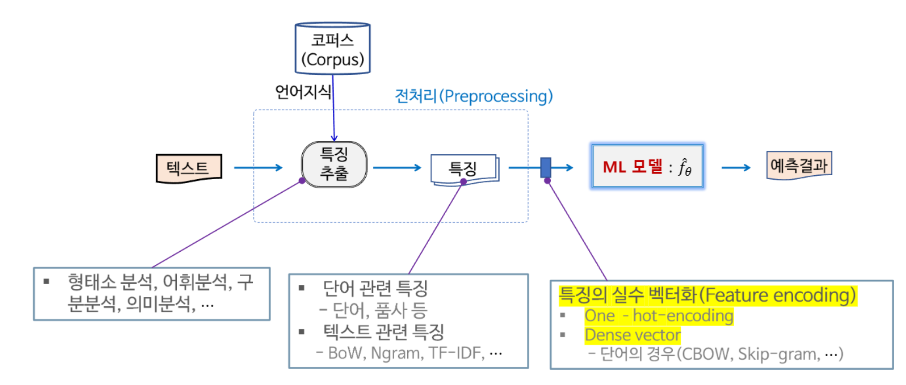{width=30%}

- 코퍼스: 분석에 사용하기 위해 모아놓은 텍스트 모음(코포라(corpora): 말뭉치)
    - 한국어 위키 코퍼스(kowiki), Naver 영화 리뷰 코퍼스, IMDB 영화 리뷰
    - 토큰화 코퍼스와 코드화 코퍼스가 있음

- 임베딩 방법: word2vec, GloVe, FastText 등

- SOTA: Transformer 기반
    - GPT: 트랜스포머의 디코더 사용
    - BERT: 트랜스포머의 인코더 사용
    - 트랜스포머는 Attention 기술을 근간으로 함

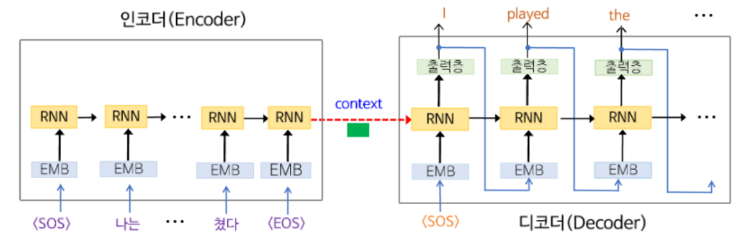{width=30%}

- 기존 seq2seq 모델 구조

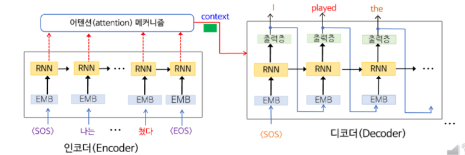{width=30%}

- attention 채용 seq2seq 모델 구조

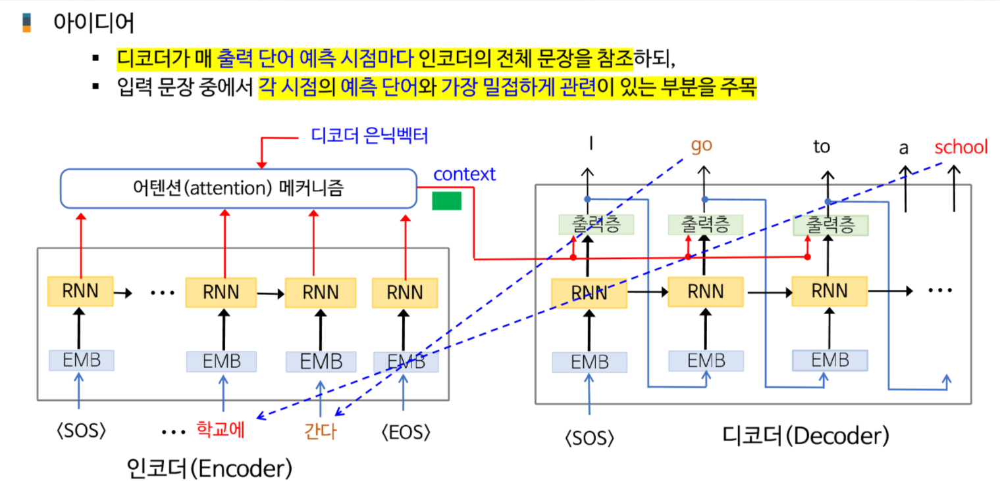{width=30%}

- Q: 디코더의 특정시점 상태를 사용해 제작
- K,V: 인코더의 모든 은닉 상태를 사용해 제작
- 트랜스포머는 seq2seq 모델과 달리 RNN을 사용하지 않음.
    - 입력 시퀀스 동시 처리, 토큰 위치 정보(positional encoding) 추가 사용

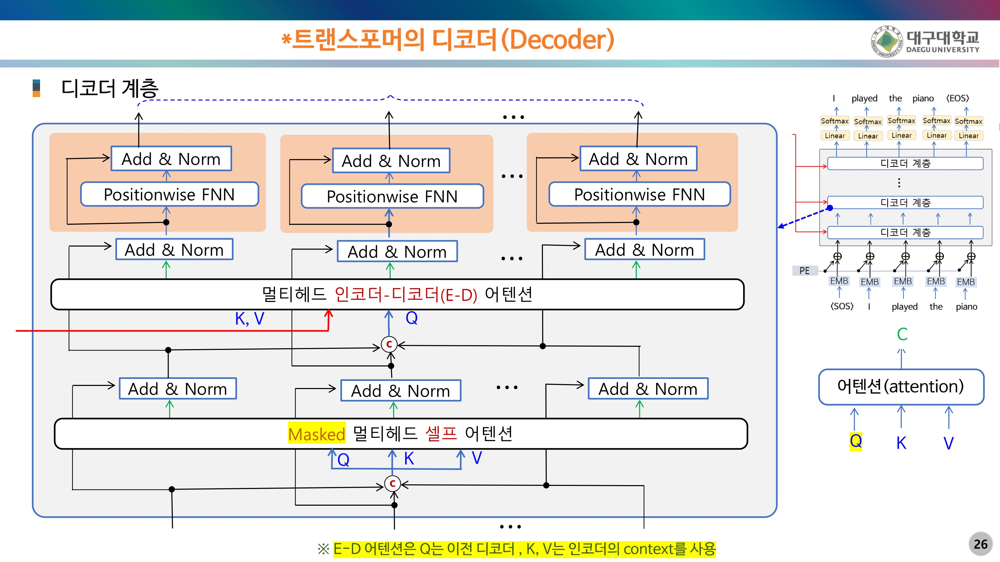{width=30%}

- GAN: 2-player의 경쟁(minmax 게임)에 입각한 학습
    - player1: 생성자, player2: 식별자

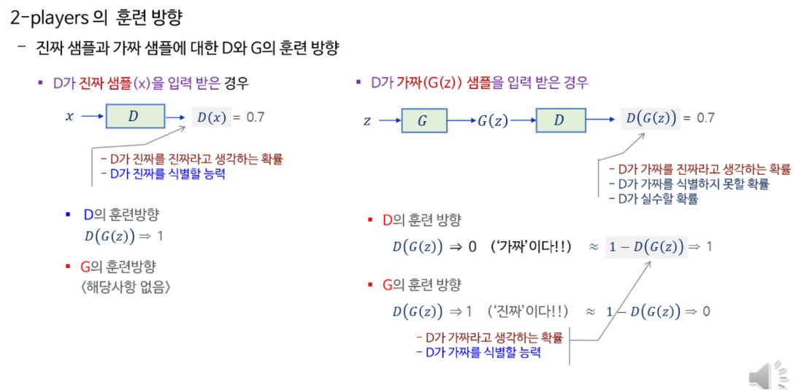
