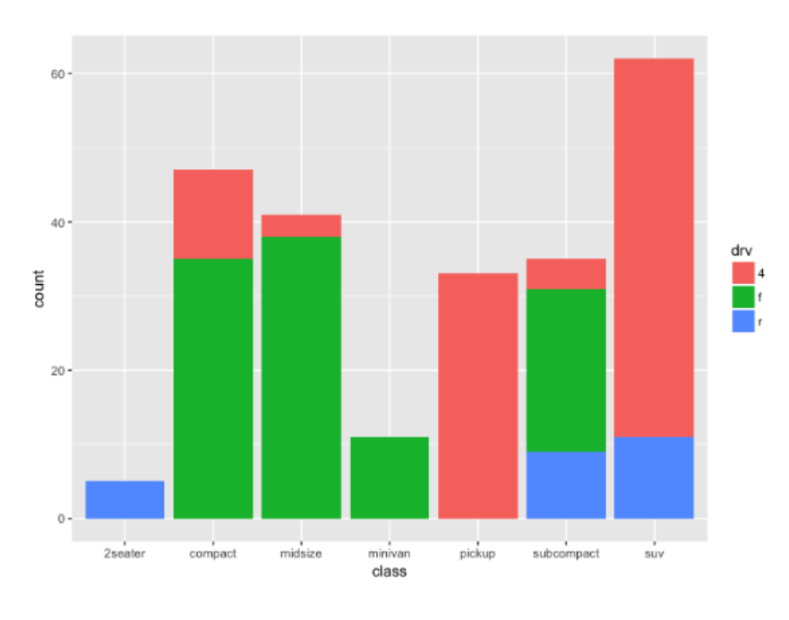
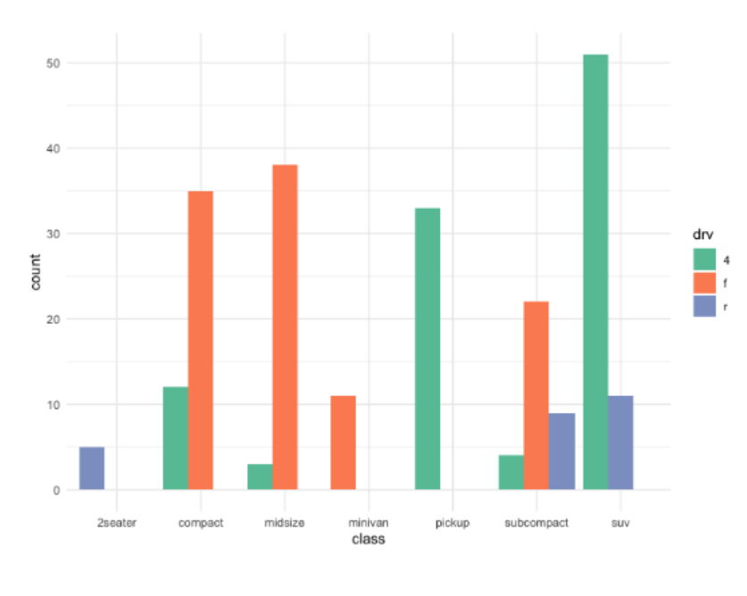
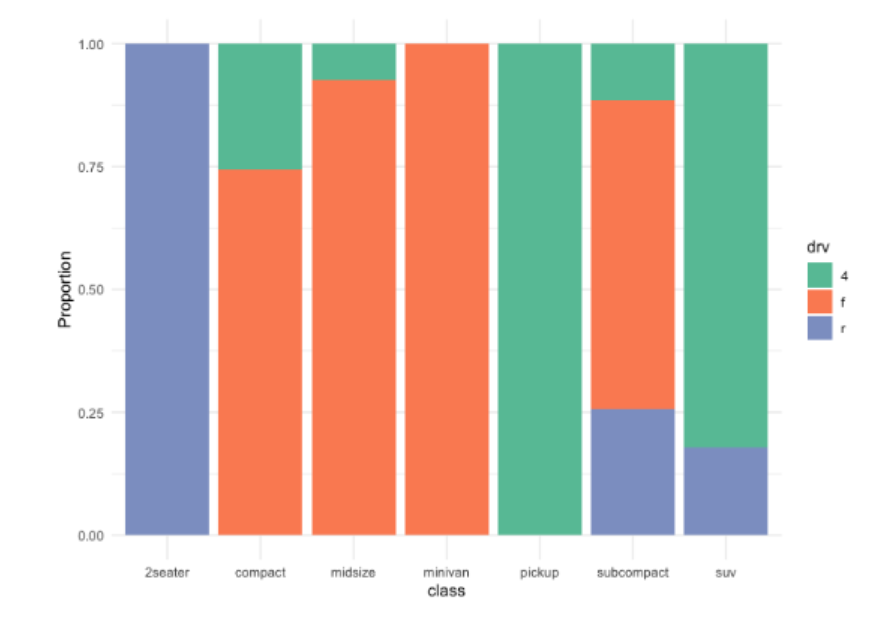
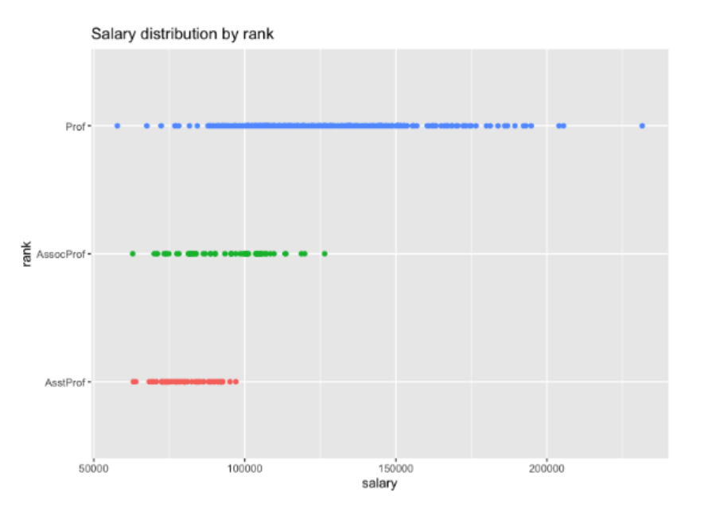
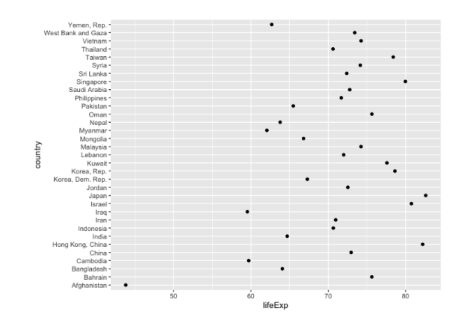

{.post-thumbnail}

## Univariate Graphs

- 하나의 변수에 대한 데이터 분포 표현
    - 범주형 변수: bar_chart, pie_chart(q범주가 적을 때)
    - 수치형 변수: histogram, dot_chart(scatter plot 아님)

## Bivariate Graphs

- 두 변수 간의 관계 표현

### 범주형 vs 범주형

### 수치형 vs 수치형

: scatter_plot, line_chart(`시간의 의미를 가질 경우`)

### 범주형 vs 수치형

box_plot

