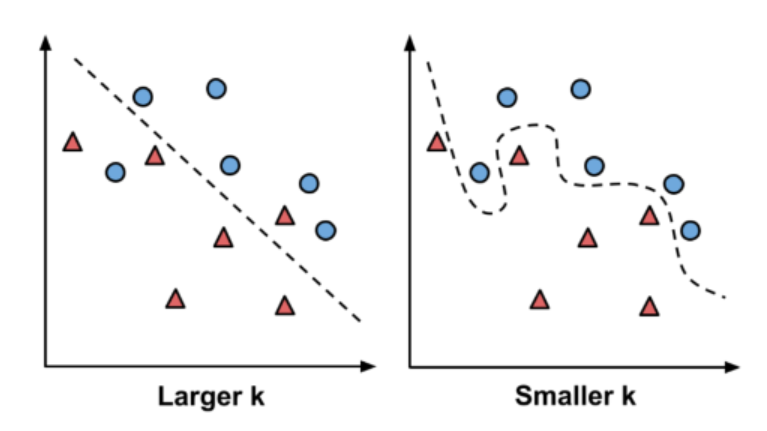

{.post-thumbnail}

- 분류하고자 하는 새로운 item이 주어질 때, training set에서 이 item과 `유사한` `k개`의 item을 식별함.
- 단순하지만 효과적이며, 학습 단계가 없다.
- 모든 데이터와의 거리 계산이 필요하기 때문에, 계산 비용이 증가

## 유사도 측정

- Euclidean distance
- Manhattan distance

## k의 선택

- larger k: higher bias, lower variance
- smaller k: lower bias, higher variance
- 경험적인 k 값: sqrt(n) (n은 training set의 크기)
- parameter tuning을 통해 최적의 k 값 선택
- 보통 홀수 k 값 선택
- `class` 라이브러리
