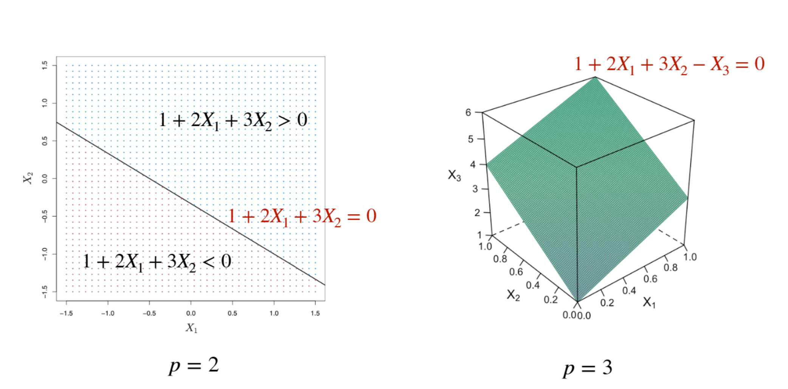
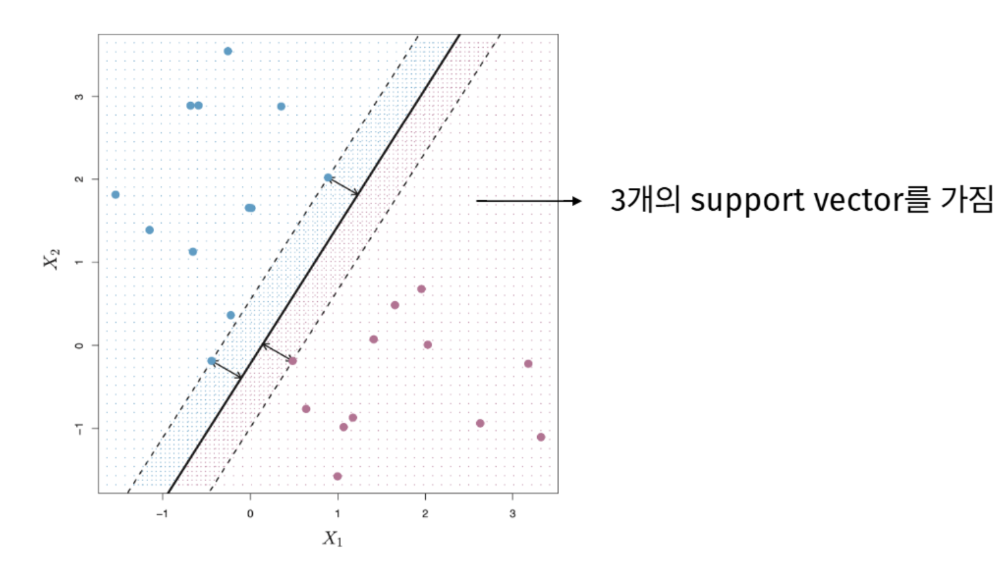
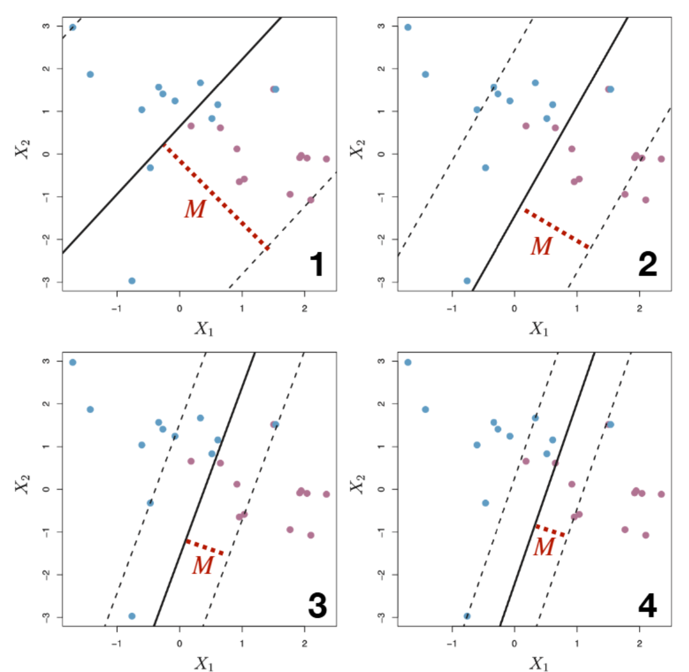
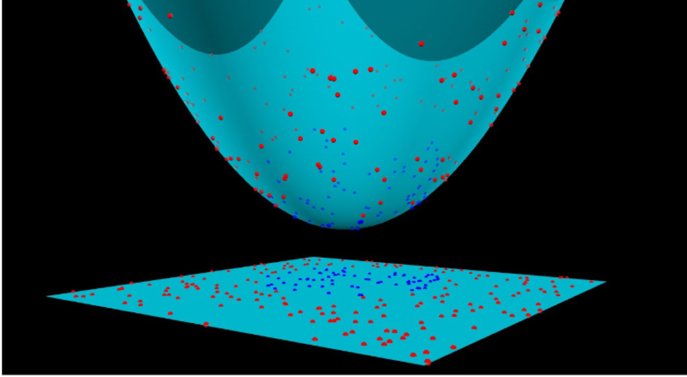
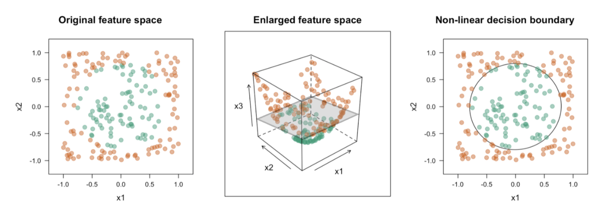
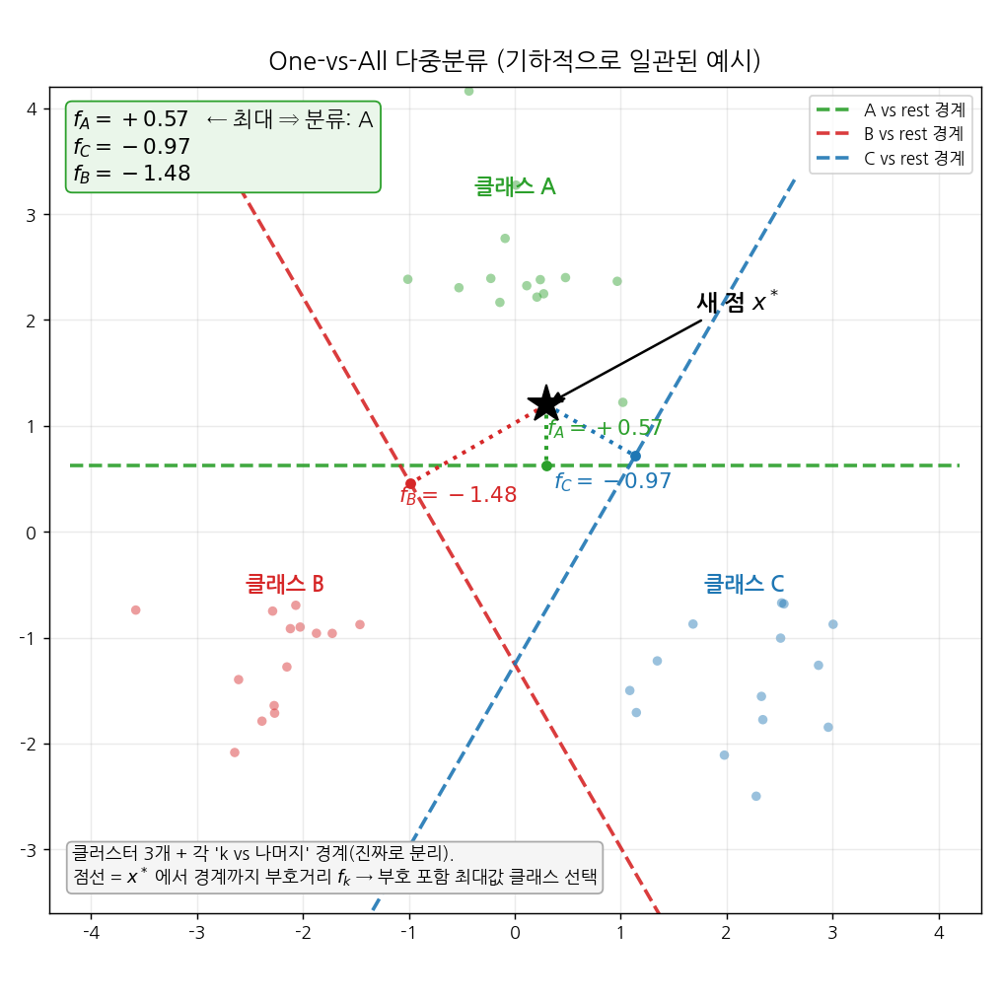

::: {.key-questions}
- **초평면 (hyperplane)** 으로 두 클래스를 나눌 때, 무수히 많은 분리 초평면 중 어떤 것을 골라야 하는가?
- 데이터가 완전히 분리되지 않거나 과적합 위험이 있을 때, 마진을 어떻게 "느슨하게(soft)" 만드는가?
- 경계가 비선형일 때 차원을 확장하면 왜 분리가 가능해지는가?
- 고차원 확장의 계산량 폭발을 **커널 (kernel)** 이 어떻게 회피하는가?
:::

## 1. 초평면과 분리 초평면

::: {.column-margin}
**hyperplane**

$p$차원을 둘로 나누는
$(p-1)$차원 경계
:::

**초평면 (hyperplane)** 은 $p$차원 공간에서 다음을 만족하는 $(p-1)$차원 부분공간이다.

$$\beta_0 + \beta_1 X_1 + \beta_2 X_2 + \cdots + \beta_p X_p = 0$$

- $p=2$이면 직선, $p=3$이면 평면이 초평면이다.
- $\beta_0$가 없으면 원점을 지나고, $\beta_0$는 평행이동 역할을 한다.

두 클래스(파란색 / 보라색)를 완전히 구분하는 초평면을 **분리 초평면 (separating hyperplane)** 이라 한다. 새로운 데이터 $x^*$의 분류는 $f(x^*) = \beta_0 + \beta_1 x_1^* + \cdots + \beta_p x_p^*$ 의 **부호** 로 결정한다. 양수면 한쪽 클래스, 음수면 반대쪽.

::: {.callout-tip title="PDF 자료 연결 (슬라이드 3–4)"}



슬라이드는 $1 + 2X_1 + 3X_2 - X_3 = 0$ 같은 구체적 예로 초평면이 공간을 $>0$, $<0$ 두 영역으로 가르는 것을 보여준다. 분리 초평면은 $f(x)$의 부호로 분류기(classifier)를 정의한다.
:::

## 2. Maximal Margin Classifier

::: {.column-margin}
**margin / support vector**

마진 = 가장 가까운
데이터까지의 거리
:::

분리 가능하면 분리 초평면은 무수히 많다(기울기를 $0.0001$만 틀어도 새 직선). 그렇다면 **training data에서 가장 멀리 떨어진** 초평면을 고르는 것이 자연스럽다.



- **마진 (margin) $M$**: 각 데이터에서 초평면까지의 수직 거리 중 **최소값**.
- 이 마진을 최대화하는 초평면이 **maximal margin hyperplane**, 그 분류기가 **maximal margin classifier**.
- 마진 위에 정확히 걸친 소수의 데이터만 초평면을 결정하며, 이를 **support vector** 라고 한다. 나머지 데이터는 움직여도 초평면에 영향을 주지 않는다.

**최적화 문제** 
$y_i \in \{-1, 1\}$

$$\max_{\beta_0,\dots,\beta_p,\, M} M \quad \text{s.t.} \quad \sum_{j=1}^{p}\beta_j^2 = 1,\quad y_i\,(\beta_0 + \beta_1 x_{i1} + \cdots + \beta_p x_{ip}) \ge M \;\; \forall i$$

- $y_i$를 곱하는 이유: 올바르게 분류되면 $y_i \cdot f(x_i)$가 **항상 양수** 가 되도록 부호를 맞추는 트릭.
- 제약 $\sum \beta_j^2 = 1$이 없으면 $\beta$를 상수배하여 $M$을 무한히 키울 수 있다. 이 제약을 넣으면 좌변이 정확히 초평면까지의 **거리** 를 의미하게 된다.

```{mermaid}
graph LR
    A["분리 초평면 무수히 많음"] --> B["각 점→초평면 거리 계산"]
    B --> C["거리의 최소값 = 마진 M"]
    C --> D["M을 최대화하는 초평면 선택"]
    D --> E["소수의 support vector가 결정"]
```

## 3. Soft Margin Classifier

::: {.column-margin}
**slack $\epsilon_i$ / cost $C$**

오분류를 "허용"하는
느슨한 마진
:::

Maximal margin classifier의 두 가지 문제:

1. **분리 불가능 (non-separable)**: 클래스가 섞여 있으면 어떤 직선도 완전 분리 불가.
2. **과적합 (overfitting)**: 소수 support vector가 결정하므로 데이터 하나만 추가돼도 초평면이 급격히 변함 → variance↑.

해결책: 일부 위반·오분류를 **허용** 하는 **soft margin hyperplane**. 슬랙 변수 $\epsilon_i \ge 0$를 도입한다.

$$y_i\,(\beta_0 + \beta_1 x_{i1} + \cdots + \beta_p x_{ip}) \ge M(1 - \epsilon_i), \qquad \sum_{i=1}^{n}\epsilon_i \le C$$

$\epsilon_i$의 해석:

- $\epsilon_i = 0$: 마진 밖, 정상.
- $0 < \epsilon_i < 1$: 분류는 맞지만 마진 **안쪽** 침범.
- $\epsilon_i > 1$: 초평면 반대쪽 → **오분류**.

::: {.callout-note title="부연 설명 — tuning parameter C의 방향"}



강의/슬라이드 표기에서 $C$는 "전체 마진 위반 허용량"이다. $C$가 **클수록** 더 많은 위반을 허용 → 마진 $M$이 커지고 더 많은 데이터가 support vector가 되어 **variance↓, bias↑**. $C=0$이면 maximal margin classifier와 동일. $C$는 cross-validation으로 결정하는 대표적 bias–variance 조절 손잡이다. (주의: scikit-learn의 `C`는 부호가 반대로 작동하니 라이브러리 사용 시 방향을 반드시 확인할 것.) 출처: [An Introduction to Statistical Learning, Ch.9](https://www.statlearning.com)
:::

```{mermaid}
graph TD
    C1["C 큼"] --> M1["많은 위반 허용 → 마진 큼"]
    M1 --> V1["support vector 많음<br/>variance↓ bias↑"]
    C2["C 작음"] --> M2["위반 적게 허용 → 마진 작음"]
    M2 --> V2["support vector 적음<br/>variance↑ bias↓"]
```

## 4. 비선형 경계와 차원 확장

::: {.column-margin}
**feature 확장**

$X_3 = X_1^2 + X_2^2$
같은 새 feature
:::

결정 경계가 비선형이면 원래 feature space의 soft margin classifier로는 잘 분리되지 않는다. 회귀에서 $X^2$ 항을 추가하듯, **제곱항·교호작용(interaction)** 등을 추가해 feature space를 고차원으로 확장한 뒤 그 공간에서 선형 초평면을 찾는다.



**직관적 예**: $X_3 = X_1^2 + X_2^2$를 추가하면, 원점에서 멀수록 높아지는 "그릇(bowl)" 모양이 된다. 3차원에서는 평면 하나로 두 클래스를 가를 수 있고, 이 평면을 원래 2차원으로 projection하면 **원형 비선형 경계** 가 된다.

세 단계의 발전:

```{mermaid}
graph LR
    A["Maximal Margin<br/>Classifier"] --> B["Soft Margin<br/>Classifier"]
    B --> C["Support Vector<br/>Machine"]
    A -.->|"완전 분리 가정"| A
    B -.->|"오분류 허용"| B
    C -.->|"고차원 확장 + 커널"| C
```

::: {.callout-tip title="PDF 자료 연결 (슬라이드 16–19)"}



$X_1, X_2$만으로 선형 분리가 어려운 데이터에 $X_3 = X_1^2 + X_2^2$를 추가 → 3차원 초평면 $\beta_0 + \beta_1 X_1 + \beta_2 X_2 + \beta_3 X_3 = 0$으로 분리 → 원 공간으로 projection하면 비선형 경계.
:::

## 5. 내적 표현과 쌍대 형식 (dual)

::: {.column-margin}
**inner product**

$\langle x_i, x \rangle$ =
두 벡터의 유사도
:::

분류 함수 $f(x)$는 $\beta$ 대신 **n개의 내적(inner product)** 으로 다시 쓸 수 있다. (유도 과정은 생략되어 있다.)

$$f(x) = \beta_0 + \sum_{i=1}^{n} \alpha_i \langle x_i, x \rangle, \qquad \langle x_i, x \rangle = \sum_{j=1}^{p} x_{ij}\,x_j$$

- **내적의 의미**: $\langle x, y \rangle = \lVert x\rVert\,\lVert y\rVert\cos\theta$ → 두 벡터가 **유사한 방향** 이면 양수, 반대면 음수. 즉 내적은 유사도 측정 도구.
- $\beta_j$를 추정하는 문제가 각 데이터의 가중치 $\alpha_i$를 추정하는 문제로 바뀐다.
- **핵심**: support vector가 아닌 데이터는 $\alpha_i = 0$. 따라서

$$f(x) = \beta_0 + \sum_{i \in \mathcal{S}} \alpha_i \langle x_i, x \rangle \quad (\mathcal{S}: \text{support vector 집합})$$

$\alpha_i$ 추정에는 모든 데이터 쌍에 대한 $\binom{n}{2}=\tfrac{n(n-1)}{2}$개의 내적이, 새 데이터 분류에는 support vector와의 내적만 필요하다. → **반복적인 내적 계산이 병목**.

::: {.callout-note title="부연 — 쌍대 형식 한눈에 (관점 전환)"}
- **무엇이 바뀌었나**: 원래 형태 $f(x)=\beta_0+\beta_1x_1+\cdots+\beta_px_p$ 는 **feature(축)마다 가중치 $\beta_j$** 를 둔다. 쌍대 형식은 **데이터 점마다 가중치 $\alpha_i$** 를 둔다. 같은 직선을 다르게 쓴 것일 뿐.
- **왜 같나**: 결정경계의 방향 $\beta$ 는 데이터 점들의 조합으로 쓸 수 있다 — $\beta=\sum_i \alpha_i x_i$. 직관: $\beta$ 중 모든 데이터와 직교하는 성분은 어떤 점의 예측도 못 바꾸면서 $\lVert\beta\rVert$ 만 키우므로, margin 최대화( $\lVert\beta\rVert$ 최소화) 과정에서 0으로 깎인다. 그래서 최적 $\beta$ 는 데이터가 펼치는 공간 안에만 존재. 이를 $\langle\beta,x\rangle$ 에 대입하면 $\sum_i\alpha_i\langle x_i,x\rangle$.
- **말로 풀면**: 새 점 $x$ 를 "각 학습점 $x_i$ 와 얼마나 닮았나( $\langle x_i,x\rangle$ )"에 가중치 $\alpha_i$ 를 곱해 합산 → 부호로 클래스 판정. "너랑 비슷한 과거 예시들이 투표"하는 구조.
:::

::: {.callout-note title="부연 — 첨자 $i$·$j$ 와 $x$ 의 의미"}
- $i$ = **데이터 점** 인덱스 $(1\dots n)$, $j$ = **feature(변수)** 인덱스 $(1\dots p)$. 즉 $x_{ij}$ = $i$번째 데이터의 $j$번째 feature 값 (행렬로 보면 $i$행 $j$열).
- 안쪽 합 $\langle x_i,x\rangle=\sum_j x_{ij}x_j$ 는 두 점의 feature를 짝지어 곱해 더한 것. 바깥 합 $\sum_i$ 는 데이터 점들에 대한 가중합.
- **$x$ = 분류하려는 새 데이터 점.** 단, $\alpha_i$ 를 **학습**할 땐 $x$ 자리에 다른 학습점이 들어가 학습점끼리의 내적 $\langle x_i,x_k\rangle$ 을 쓴다(자기 자신과의 $\langle x_i,x_i\rangle=\lVert x_i\rVert^2$ 도 포함). **예측**할 때만 $x$ 가 진짜 새 점.
- 계산량 표기: $\binom{n}{2}$ 는 서로 다른 쌍을 대칭 고려해 센 수이고, 자기내적까지 포함한 전체 그람 행렬은 $n\times n$. 어느 쪽이든 복잡도는 **$O(n^2)$** 로 동일 — 본문 표기 그대로 맞음.
:::

::: {.callout-note title="부연 — margin 최대화 = $\lVert\beta\rVert$ 최소화 (section 2 보충)"}
1. 점에서 경계까지 수직거리 $=\lvert f(x)\rvert/\lVert\beta\rVert$ ( $f$ 값을 $\lVert\beta\rVert$ 로 정규화해 순수 거리로).
2. $(\beta,\beta_0)$ 에 같은 상수를 곱해도 경계 선은 불변(스케일 자유도) → 최근접 점(support vector)에서 $y_i f(x_i)=1$ 이 되도록 크기를 고정.
3. 그러면 margin 폭 $=1/\lVert\beta\rVert$.
4. 따라서 margin 최대화 $\Leftrightarrow$ $\lVert\beta\rVert$ 최소화. 제약 $y_i(\beta_0+\beta^\top x_i)\ge 1$ 과 합쳐 $\min \tfrac12\lVert\beta\rVert^2$ — section 2의 최적화 문제가 이것.
:::

## 6. 커널 (Kernel Trick)

::: {.column-margin}
**kernel $K(x,y)$**

고차원 내적을
직접 안 만들고 계산
:::

고차원으로 확장하면 내적 계산량이 폭발한다. 그런데 놀라운 사실: **확장 공간의 내적 $\langle \phi(x), \phi(y)\rangle$ 이 원 공간 내적 $\langle x, y\rangle$ 의 함수로 표현된다.**

3차원 → 9차원(모든 2차 곱) 확장 예시에서:

$$\langle \phi(x), \phi(y)\rangle = \Big(\sum_{j} x_j y_j\Big)^2 = \big(\langle x, y\rangle\big)^2$$

즉 원 공간에서 내적을 구하고 **제곱 한 번** 하면 9차원 내적과 정확히 같다. 고차원 feature를 실제로 만들 필요가 없다. 이 함수를 **커널 $K(x,y)$** 라 하고, $f(x)$의 내적 자리를 $K$로 바꾸기만 하면 된다.

$$f(x) = \beta_0 + \sum_{i \in \mathcal{S}} \alpha_i\, K(x_i, x)$$

**대표 커널 (슬라이드 25–26):**

- **Linear**: $K(x,y) = \langle x,y\rangle$ — 변환 없이 원 공간 그대로.
- **Polynomial**: $K(x,y) = (1 + \langle x,y\rangle)^d$ — $d$차 이하 모든 다항식 feature를 포함하는 공간에서 fitting. (+1이 있어 저차항도 포함)
- **RBF (Gaussian)**: $K(x,y) = \exp\!\big(-\gamma \sum_j (x_j - y_j)^2\big),\ \gamma>0$ — 거리가 멀면 $K \to 0$, 가까우면 $K \to 1$. 이론적으로 **무한 차원** feature space에서 fitting하는 것과 동치.

$d$(polynomial)와 $\gamma$(RBF)는 cross-validation으로 정하는 tuning parameter이며 bias–variance를 조절한다.

::: {.callout-note title="부연 설명 — 왜 '무한 차원'인가"}
RBF 커널은 지수함수를 Taylor 전개하면 무한히 많은 다항 항의 합이 되어, 사실상 무한 차원 feature space의 내적에 대응한다. 커널이 "암묵적으로(implicit)" 고차원으로 lift시키되 좌표를 결코 직접 계산하지 않는 것이 kernel trick의 본질이다. 실무에서는 linear를 먼저 시도하고, 복잡한 경계가 필요하면 RBF로 넘어가 $\gamma$를 조절하는 흐름이 일반적이다. 출처: [Kernel Trick (GeeksforGeeks)](https://www.geeksforgeeks.org/machine-learning/kernel-trick-in-support-vector-classification/), [Implicit Lifting and the Kernel Trick — G. Gundersen](https://gregorygundersen.com/blog/2019/12/10/kernel-trick/), [Polynomial kernel (Wikipedia)](https://en.wikipedia.org/wiki/Polynomial_kernel)
:::

```{mermaid}
graph TD
    A["원 공간 내적 ⟨x,y⟩"] --> B{"커널 함수 K"}
    B -->|"⟨x,y⟩"| L["Linear"]
    B -->|"(1+⟨x,y⟩)^d"| P["Polynomial<br/>d차 이하 전부"]
    B -->|"exp(-γ‖x-y‖²)"| R["RBF<br/>무한 차원"]
    L --> F["f(x)=β0+Σ αᵢ K(xᵢ,x)"]
    P --> F
    R --> F
```

## 7. 다중 클래스 분류 (More than Two Classes)

::: {.column-margin}
**OvO / OvA**

SVM은 본래
이진 분류기
:::

SVM은 두 클래스용이므로 $K$개 클래스는 다음 두 방식으로 확장한다.

- **One-Versus-One (OvO)**: 모든 클래스 쌍에 대해 $\binom{K}{2}$개의 SVM 학습. 새 데이터는 각 모델의 예측 중 **가장 많이 선택된** 클래스로 분류 (다수결).
- **One-Versus-All (OvA)**: 한 클래스 vs 나머지 전부로 $K$개의 SVM 학습. 새 데이터는 margin 값 $f(x^*)$가 **가장 큰** 클래스로 분류.

{#fig-ova width=85%}

::: {.callout-note title="부연 — OvA 결정 규칙 (학습 vs 예측)"}
- **학습**: "k vs 나머지" 이진 SVM을 $k=1\dots K$ 번 **독립적으로** 따로 학습한다(@fig-ova 의 세 경계는 서로 다른 학습의 산물). 한 번에 셋을 같이 푸는 게 아님.
- **예측**: 새 점 $x^*$ 를 $K$개 모델에 각각 넣어 점수 $f_k(x^*)$ 를 구한 뒤, 그 $K$개 중 **부호 포함 최대값**( $\arg\max_k f_k$ )인 클래스로 보낸다.
- $f_k(x^*)$ 는 부호거리라 $f_k>0$ = "$x^*$ 는 $k$쪽", 클수록 그 영역에 더 깊이(=더 확신). **절댓값이 아니라 부호 있는 값**으로 비교한다 — 큰 음수는 "절대 그 클래스 아님"이라 탈락.
- 모든 $f_k<0$ 인 애매지대에서도 규칙은 동일: 가장 덜 음수(=최대)인 클래스 선택.
:::

## 개념 연결

- **Ridge regression** 과의 유사성: maximal/soft margin 모두 $\sum \beta_j^2$ 형태의 제약이 들어간 2차 최적화 문제. 선형이 아닌 목적함수·제약식을 푼다는 점에서 logistic regression과 같은 계열.
- **Bias–variance trade-off** 의 또 다른 사례: $C$(soft margin), $d$·$\gamma$(kernel)가 모두 tuning parameter로서 모델 복잡도를 조절하고 CV로 결정된다. 이전 강의의 regularization·validation 개념이 그대로 재등장.
- **차원 확장 → 회귀의 다항 feature 추가** 와 동일한 발상. SVM은 여기에 커널을 더해 계산 없이 고차원 효과를 얻는다.

::: {.lecture-summary}
- 분리 초평면은 무수히 많으므로 **마진을 최대화** 하는 maximal margin classifier를 선택하며, 소수의 **support vector** 만 초평면을 결정한다.
- 완전 분리가 불가능하거나 과적합 위험이 있으면 슬랙 변수 $\epsilon_i$와 비용 $C$로 위반을 허용하는 **soft margin classifier** 를 쓴다 ($C$↑ → 마진↑, variance↓ bias↑).
- 비선형 경계는 feature를 고차원으로 확장해 선형 초평면을 찾은 뒤 원 공간으로 projection하여 얻는다. 이것이 **SVM**.
- $f(x)$를 내적의 합으로 다시 쓰면, 내적 자리를 **커널** $K$로 바꾸는 것만으로 고차원을 직접 만들지 않고 비선형 분류가 가능하다 (linear / polynomial / RBF).
- 다중 클래스는 **One-vs-One** (다수결) 또는 **One-vs-All** (최대 margin) 로 확장한다.
:::
