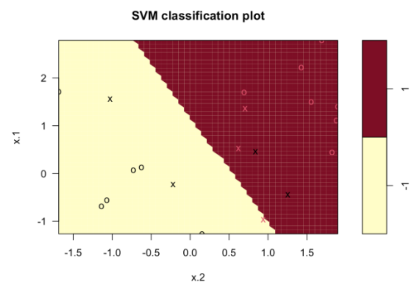

::: {.key-questions}
- R에서 `e1071::svm()` 으로 SVM을 어떻게 적합·시각화·튜닝하는가?
- `cost` 파라미터는 강의노트의 $C$ 와 왜 **반대로** 작동하는가?
- RBF 커널의 `gamma` 는 결정 경계에 어떤 의미를 갖는가?
- 다중 클래스 분류와 $n < p$ 상황에서는 어떤 커널을 써야 하는가?
:::

> 실습 목적: SVM이 어떤 문제에 어떻게 작동하는지, 커널·튜닝 파라미터를 바꾸면 결정 경계와 서포트 벡터가 어떻게 변하는지를 **개념적으로** 이해. (코드는 e1071 패키지)

## 1. 데이터 준비와 e1071 패키지

::: {.column-margin}
**주요 함수**

`svm()`, `tune()`, `predict()`
:::

정규분포에서 임의의 2차원 데이터를 생성해 선형 분리가 **불가능한**(소프트 마진이 필요한) 이진 분류 문제를 만든다.

```r
set.seed(123)
x <- matrix(rnorm(20*2), ncol=2)
y <- c(rep(-1,10), rep(1,10))
x[y==1,] <- x[y==1,] + 1          # class 1을 이동시켜 겹치게
dat <- data.frame(x=x, y=as.factor(y))
plot(x, col=(3-y))
```

SVM은 `e1071` 와 `kernlab` 두 패키지로 가능. `e1071::svm()` 의 주요 인자:

- **`kernel`**: `"linear"`, `"polynomial"`, `"radial"`(RBF) — 주로 이 셋.
- **`cost`**: 소프트 마진 크기 조절(default 1).
- **`scale`**: 표준화 여부(default TRUE) — SVM은 **거리(마진)·내적 기반**이라 피처 스케일을 반드시 통일해야 함.

## 2. 선형 커널과 cost 파라미터

::: {.callout-important title="cost는 강의노트의 C와 반대"}
강의노트 최적화식의 $C$(마진 위반 허용량)와 R `svm()` 의 `cost` 는 **반대로 작동**한다.
**`cost` ↑ → 마진 ↓ (강의노트 $C$ ↓)**, `cost` ↓ → 마진 ↑.
:::

```r
svmfit <- svm(y~., data=dat, kernel="linear", cost=10, scale=TRUE)
plot(svmfit, dat); svmfit$index    # support vector 인덱스
```



- 그림에서 **`X` 표시 = 서포트 벡터**(마진 위/안쪽에 위치한 점), `o` = 그 외 데이터.
- `cost=10` → 서포트 벡터 7개. `cost=0.1` 로 줄이면(= 강의노트 $C$ 가 커짐 = 마진 위반 허용 ↑) → 마진이 커지고 서포트 벡터 수가 크게 늘어남.
- 더 많은 데이터가 초평면을 결정 → **모델 변동성(variance) ↓**.

```{mermaid}
graph LR
    A["cost ↑"] --> B["마진 ↓"] --> C["서포트 벡터 ↓"] --> D["variance ↑ (복잡)"]
    E["cost ↓"] --> F["마진 ↑"] --> G["서포트 벡터 ↑"] --> H["variance ↓ (단순)"]
```

## 3. 파라미터 튜닝: `tune()`

`tune()` 은 **10-fold 교차검증**으로 최적 파라미터를 찾는다. 파라미터 범위가 넓으므로 처음엔 **지수 단위로 넓게**.

```r
set.seed(123)
tune.out <- tune(svm, y~., data=dat, kernel="linear",
                 ranges=list(cost=10^seq(-3,3)))   # 0.001 ~ 1000
summary(tune.out)            # best: cost=1, error=0.15 (accuracy 85%)
bestmodel <- tune.out$best.model
```

- best 근처(예 `cost=1`)에서 더 좁은 범위로 재튜닝하면 정밀도 향상.
- `predict(bestmodel, testdat)` → 테스트셋 confusion matrix로 성능 평가.

## 4. 비선형 경계와 RBF 커널 — `gamma` 의 의미

선형으로 분리 안 되는 데이터에는 **RBF(radial) 커널**. 커널은 두 점의 **유사도**를 측정하는 함수($x,y$ 가 가까우면 1, 멀면 0에 가까움). 내적을 유사도 함수로 대체한 것이 SVM의 핵심.

$$ K(x, x') = \exp(-\gamma \lVert x - x' \rVert^2) $$

::: {.column-margin}
**gamma 직관**

γ ↑ → "더 가까워야 가깝다고 판단" → 국소적 → 복잡
γ ↓ → 멀어도 가깝다고 판단 → 단순
:::

- 앞에 $-\gamma$ 가 있으므로 **`gamma` ↑ → 같은 거리라도 유사도가 빠르게 0** → 각 점이 **국소적으로만** 영향 → 결정 경계가 매우 복잡해지고 variance ↑.
- **KNN의 $K$ 와 유사**: `gamma` ↑ 는 $K$ ↓(주변 소수만 보고 판단)와 비슷.

```r
svmfit <- svm(y~., data=train, kernel="radial", gamma=1, cost=1)    # SV 17개씩
svmfit <- svm(y~., data=train, kernel="radial", gamma=1, cost=1e4)  # cost↑→SV 11개씩, 복잡
svmfit <- svm(y~., data=train, kernel="radial", gamma=50, cost=1)   # gamma↑→경계 과적합
# 동시 튜닝
tune.out <- tune(svm, y~., data=train, kernel="radial",
                 ranges=list(cost=c(0.01,0.1,1,10,100,1000),
                             gamma=c(0.01,0.1,1,10,100)))
# best: cost=10, gamma=1, error=0.07 (accuracy 93%)
```

::: {.callout-note title="cater 패키지와 kernlab의 SVM"}
`caret`의 train함수에 `method="svmRadial"`로 `kernlab`의 SVM을 사용할 수 있다.

이때 사용하는 parameter는 `sigma(gamma)`와 `C(cost)`이다.
:::

::: {.callout-note title="polynomial 커널"}
`kernel="polynomial"` 의 튜닝 파라미터는 차수 `degree`($D$). 보통 2~6 범위(그 이상은 과도하게 복잡). 예제에서 best `cost=10, degree=4` → error 0.12 로, 일반적으로 **RBF(0.07)가 더 우수**. 권장 순서: 먼저 linear → 부족하면 RBF.
:::

## 5. 다중 클래스 분류 (one-vs-one)

이진 SVM을 다중 클래스로 확장. `e1071` 는 기본 **one-vs-one**: $K$ 개 클래스의 모든 쌍에 대해 SVM을 만들고, 새 데이터는 모든 모델에서 분류해 **가장 많이 할당된 클래스**로 최종 예측.

```r
# iris: target 3개 클래스(품종), feature 4개(꽃잎·꽃받침 길이/너비)
svmfit <- svm(Species~., data=iris, kernel="radial")   # 내부적으로 one-vs-one
```

- 사용법은 이진과 동일. confusion matrix가 $3\times3$ 으로 나오고, 각 클래스별 sensitivity·specificity·precision을 따로 계산 가능.

## 6. $n < p$ 상황 — 선형 커널로 충분

데이터 수 $n$ 이 피처 수 $p$ 보다 작으면 **선형 커널로 무조건 완전 분리** 가능(예: 3차원 공간에 점 2개는 항상 초평면으로 분리). RBF 같은 복잡한 커널은 불필요하고 오히려 성능 저하.

```r
# Khan 유전자 발현 데이터: p=2308, train n=63, test n=20
svmfit <- svm(y~., data=khan.train, kernel="linear", cost=10)
# train accuracy 100% (n<p라 항상 완전 분리), test는 일부 오분류
```

::: {.lecture-summary}
- **표준화 필수**(거리·내적 기반). `svm(scale=TRUE)`.
- R `cost` 는 강의노트 $C$ 와 **반대**: cost↑ → 마진↓ → SV↓ → variance↑.
- **RBF `gamma`**: ↑ 일수록 국소적(복잡, variance↑), ↓ 일수록 단순. KNN의 $K$ 와 반대 방향.
- 커널 선택: **linear 먼저, 부족하면 RBF**. $n<p$ 면 linear로 충분.
- `cost`·`gamma` 는 `tune()` 의 10-fold CV로, 처음엔 지수 단위로 넓게 튜닝. 주로 $10^x$나 $2^x$ 형태로 범위 설정하는 것이 효과적이다.
:::
