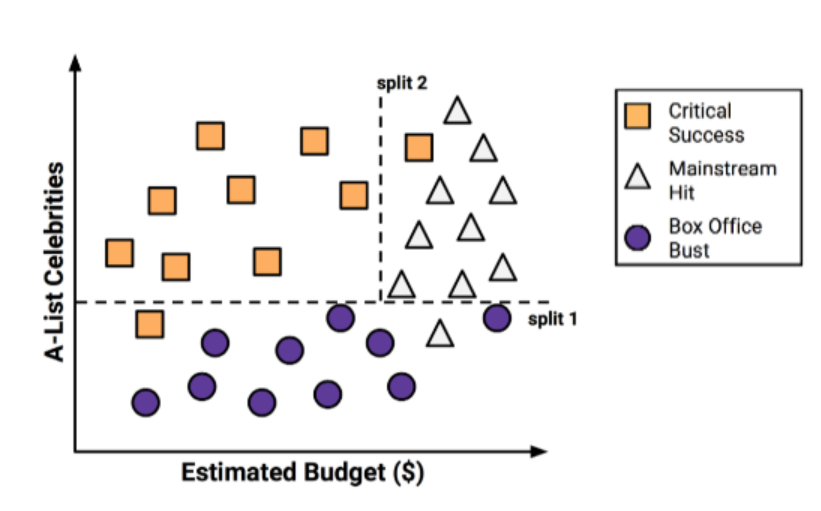
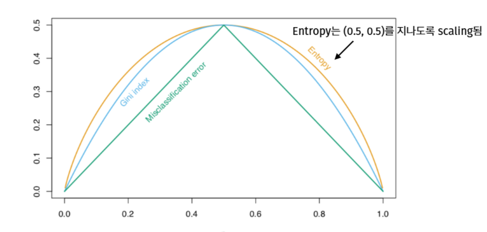

::: {.key-questions}
- 트리 기반 모델은 피처 공간을 어떻게 분할하고, 왜 **해석이 직관적**인가?
- 회귀 트리는 어떤 기준(목적함수)으로 분할을 정하는가?
- 가장 좋은 트리 크기를 어떻게 찾는가? — **비용 복잡도 가지치기(cost complexity pruning)**
- 분류 트리에서 **지니 지수**가 분류 오차율보다 나은 분할 기준인 이유는?
- 트리의 장단점은 무엇이고, 왜 앙상블이 필요한가?
:::

> 시험 포인트: 트리는 선형이 아닌 모델의 출발점. **재귀 이진 분할**, **비용 복잡도 가지치기(α)**, **지니 지수 vs 분류 오차율**이 핵심. 트리 하나는 variance가 커서 성능이 낮다 → 다음 강의(앙상블)로 이어짐.

## 1. 트리 기반 모델의 아이디어

::: {.column-margin}
**핵심**

분할 규칙으로 피처 공간을 겹치지 않는 영역 $R_1,\dots,R_J$ 로 나눔
:::

피처 공간을 **순차적인 분할 규칙(splitting rule)** 으로 겹치지 않는 영역들로 나누고, 각 영역에 대표값을 둔다. 사람의 직관처럼 "기준 하나 → 그 다음 기준" 으로 판단하므로 **해석이 쉽고 직관적**.

- **회귀(regression)**: 각 영역 = 그 안 training data 타깃의 **평균**으로 예측.
- **분류(classification)**: 각 영역 = 가장 **빈도 높은 클래스**로 예측.

예) 영화 흥행 예측 — $X_1$(제작비), $X_2$(유명 배우 수)로 공간을 split 1, split 2 로 나눠 3개 영역(흥행/중간/실패)으로 분류 → 트리 구조로 시각화.



## 2. 회귀 트리와 재귀 이진 분할

Hitters 데이터(통산 안타 `CHits`, 볼넷 `Walks` 로 `Salary` 예측) 예: 루트 노드 전체 평균 527 → `CHits<460` 기준 분할 → 다시 `Walks<61` 분할 → 3개 리프 노드(212, 611, 103).

**목적함수**: 영역 $R_1,\dots,R_J$ 에 대한 오차제곱합(RSS) 최소화.

$$ \sum_{j=1}^{J} \sum_{i \in R_j} (y_i - \hat{y}_{R_j})^2 $$

여기서 $\hat{y}_{R_j}$ 는 영역 $R_j$ 의 training data 타깃 평균.

::: {.callout-important title="왜 greedy 재귀 이진 분할인가"}
$J$ 개 영역으로 나누는 모든 가능한 분할을 탐색하는 것은 **계산적으로 불가능**(경우의 수가 폭발). 그래서 **항상 2개로만**, 하나의 피처 $X_j$ 와 컷포인트 $s$ 로 분할하고 이를 **반복**한다.

$$ R_1(j,s)=\{X \mid X_j < s\}, \quad R_2(j,s)=\{X \mid X_j \ge s\} $$

각 단계에서 RSS를 가장 줄이는 $(j,s)$ 를 찾는 것은 쉽다(피처별로 컷포인트를 훑으며 비교). 최적은 아니지만 충분히 좋은 트리를 얻는다.
:::

```{mermaid}
graph TD
    A["전체 영역 (평균 527)"] -->|CHits < 460| B["R1 (212)"]
    A -->|CHits >= 460| C["772"]
    C -->|Walks < 61| D["R3 (103)"]
    C -->|Walks >= 61| E["R2 (611)"]
```

**종료 조건**(과적합 방지): 계속 분할하면 리프마다 데이터 1개(완전 과적합)가 되므로 제한을 둔다.

- **트리 최대 깊이(max depth)**
- **리프 노드 최소 원소 수(min leaf size)**

## 3. 가지치기 — 비용 복잡도 가지치기 (Cost Complexity Pruning)

트리 하나는 **variance가 매우 크다**: training data가 조금만 바뀌어도 — 특히 첫 분할 변수가 바뀌면 — 누적되어 완전히 다른 트리가 나온다. 리프가 많아질수록 복잡도↑·variance↑·과적합.

**전략**: 충분히 큰 트리 $T_0$ 를 먼저 만들고, 그 **서브트리(가지를 친 더 작은 트리)** 중에서 미지 데이터 성능이 좋은 것을 고른다.

서브트리도 너무 많으므로 파라미터 $\alpha$(cost complexity parameter)로 후보를 정렬한다. 라쏘와 같은 형태의 목적함수:

$$ \sum_{m=1}^{|T|} \sum_{i \in R_m} (y_i - \hat{y}_{R_m})^2 \;+\; \alpha\,|T| $$

- $|T|$: 트리 $T$ 의 리프 노드 수(=영역 수).

::: {.column-margin}
**α 의 역할**

라쏘의 $\lambda$ 와 동일한 trade-off:
훈련 적합도 ↔ 트리 복잡도($|T|$=리프 수)
:::

- 왼쪽 항 = 훈련 적합도(작을수록 복잡한 트리), 오른쪽 $\alpha|T|$ = 리프 노드 수 penalty.
- $\alpha=0$ → 원래 $T_0$. $\alpha$ ↑ → 더 단순한 서브트리.
- **$\alpha$ 를 교차검증으로 선택** → 그 $\alpha$ 에 해당하는 서브트리를 전체 training data에 적용.

**절차**:

1. `tree max depth`, `leaf node 최소 원소 수`가 적용된 $T_0$ 재귀 이진 분할로 생성
2. 여러 $\alpha$ 로 서브트리 생성
3. K-fold CV로 step 1, 2 진행 후 하나의 fold의 RSME의 평균을 α별로 계산
4. RSME가 가장 작은 α 선택
5. step 1, 2에서 만든 서브트리 중 그 $\alpha$ 의 서브트리 채택. (CV 과정의 트리는 성능평가용일 뿐, 최종 모델은 전체 데이터로 다시 적합)

## 4. 분류 트리와 노드 불순도

분류 트리도 만드는 방식(재귀 이진 분할 + 가지치기 + CV)은 동일하나, **분할 기준**이 다르다. 노드 $m$ 에서 클래스 $k$ 의 비율을 $\hat{p}_{mk}$ 라 할 때:

**① 분류 오차율 (classification error rate)**
$$ E_m = 1 - \max_k(\hat{p}_{mk}) $$

**② 지니 지수 (Gini index)**
$$ G_m = \sum_{k} \hat{p}_{mk}(1 - \hat{p}_{mk}) $$

**③ 엔트로피 (entropy)** — 로지스틱의 cross-entropy와 같은 형태
$$ D_m = -\sum_{k} \hat{p}_{mk}\log \hat{p}_{mk} $$

::: {.callout-note title="왜 분할 기준으로 지니 지수를 쓰나"}



$p(1-p)$ 는 베르누이 분산과 같아 $p=0.5$(가장 안 섞임=불순)에서 최대, $p=0/1$(순수)에서 0. 세 지표 모두 순수할수록 작지만, **지니·엔트로피는 0이나 1에 가까울수록 기울기가 커서**(순수해질 때 값이 급감) 노드가 더 **purity** 해지는 분할을 민감하게 포착한다. 분류 오차율은 이를 구별 못 한다.

예) 노드(400,400)를 두 방식으로 분할 — (300/100, 100/300) vs (200/400, 200/0). 분류 오차율은 둘 다 1/4로 **동일**하지만, 지니 지수는 후자가 3/8 < ... 아니라 $3/9 < 3/8$ 로 **더 작아** 순수한 노드를 만드는 후자를 선택한다.
:::

**분할 성능 평가** = 두 자식 노드 불순도의 **가중평균**(각 노드 데이터 수 비율로 가중). 트리 **생성** 시엔 지니 지수, 만든 트리 **성능평가**(CV·α 선택) 시엔 분류 오차율/정확도를 사용.

## 5. 트리의 장단점

::: {.lecture-summary}
**장점**
- 회귀·분류 모두 적용, **순차적 의사결정으로 시각화·해석이 직관적**.
- 데이터 전처리(정규화·더미변수) 거의 불필요. **범주형 피처도 쉽게 분할**($X_1 \in \{A\}$ vs $\{B,C\}$).

**단점**
- **variance가 매우 크다** → training data 작은 변화에 트리 구조가 크게 바뀜.
- 트리 하나는 예측 성능이 낮다 → **bagging, random forest, boosting** 같은 앙상블로 보완(다음 강의).
:::
