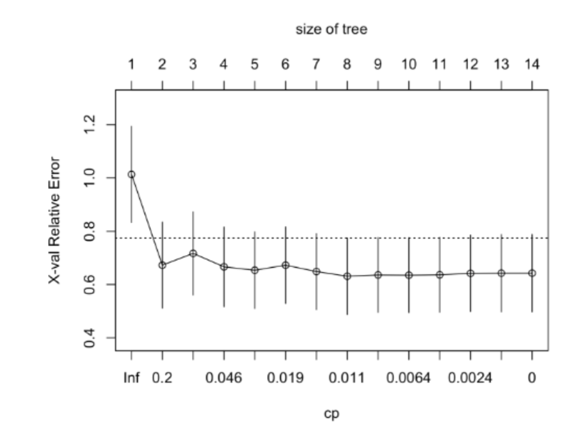
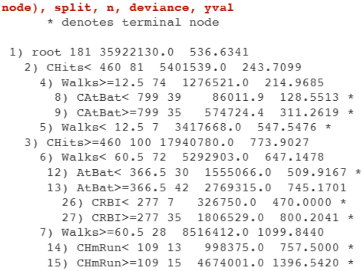

::: {.key-questions}
- R `rpart` 로 회귀/분류 트리를 어떻게 적합하고 시각화하는가?
- $T_0$(큰 트리)를 결정하는 옵션 `minsplit`·`minbucket`·`maxdepth` 의 차이는?
- `printcp()` 출력을 읽고 비용 복잡도 가지치기를 어떻게 수행하는가?
- **1-SE 규칙**으로 어떤 트리를 고르는가?
:::

> 실습 목적: 강의(Lecture 15)의 재귀 이진 분할·비용 복잡도 가지치기를 `rpart`/`rpart.plot` 으로 직접 실행. 회귀(Hitters)와 분류(유방암 진단)에 적용.

## 1. rpart 패키지

::: {.column-margin}
**패키지**

`rpart` — 트리 생성·CV
`rpart.plot` — 시각화
:::

결측치 제거 후 train/test 분할. `rpart()` 가 트리를 만들고, $\alpha$(cost complexity)에 대한 **10-fold CV를 자동** 수행한다.

```r
library(rpart); library(rpart.plot)
fit <- rpart(Salary ~ ., data=train, method="anova",   # anova = 회귀(타깃 수치형)
             control = rpart.control(cp=0, minsplit=20, minbucket=7, xval=10))
```

`rpart.control` 옵션으로 $T_0$ 의 크기를 결정:

- **`minsplit`**: 한 노드를 분할하려면 필요한 **최소 데이터 수**(분할 전 기준, default 20).
- **`minbucket`**: 최종 **리프 노드**가 가져야 할 최소 데이터 수(default `minsplit/3` ≈ 7).
- **`maxdepth`**: 트리 최대 깊이.
- **`cp`**: 최종 선택할 $\alpha$. `cp=0` → 가지치기 없는 큰 트리 $T_0$.
- **`xval`**: CV fold 수(default 10).

## 2. CV 결과 읽기 — `printcp()`

```r
rpart.plot(fit)     # T0 (alpha=0) 시각화 — 충분히 큰 트리
printcp(fit)        # 비용 복잡도 가지치기 CV 결과
```

`printcp()` 출력 열의 의미:

- **`CP`**: $\alpha$ 값(아래로 갈수록 0에 가까움 = 큰 트리).
- **`nsplit`**: 분할 횟수. 리프 노드 수 = `nsplit + 1`(분할 1회마다 노드 1개 증가).
- **`rel error`**: training 오차 (Root Node 기준 상대값) — 아래로 갈수록 감소(과적합).
- **`xerror`**: CV 오차(Root Node 기준 상대값) — 감소하다 다시 증가, **최소가 되는 지점이 best $\alpha$**.
- **`xstd`**: CV 오차의 표준오차(10개 fold 평균의 표준편차).

## 3. 1-SE 규칙과 가지치기

`plotcp()` 그래프(x축 $\alpha$/트리 크기, y축 CV 오차)에서 점선은 **(최소 CV 오차) + 1×표준오차** 높이.



::: {.callout-note title="1-SE 규칙"}
CV 오차 최소값 $\pm$ 1 표준오차 범위 안의 트리들은 성능이 사실상 동등하다고 보고, 그중 **가장 단순한(작은) 트리**를 선택. 예제에선 최소 CV오차 0.631 + 표준오차 → 약 0.777 이하에서 가장 단순한 트리(노드 2개)가 선택됨.
:::

```r
best_cp <- fit$cptable[which.min(fit$cptable[,"xerror"]), "CP"]
pruned  <- prune(fit, cp=best_cp)
rpart.plot(pruned)     # 최종 트리
```



리프 노드 텍스트 출력: 노드번호(깊이 들여쓰기), 분할 기준($X_j$, $s$), `n`(노드 데이터 수), `deviance`(오차제곱합 → $n$ 나누면 MSE, 루트 씌우면 RMSE), `yval`(노드 평균=예측값). 텍스트만 봐도 트리를 그릴 수 있다.

## 4. caret `train` / 분류 적용

```r
# caret으로 tuneLength 자동 튜닝
library(caret)
train(Salary~., data=train, method="rpart", tuneLength=50)   # 50개 cp 자동 탐색
```

- 분류는 처음에 다뤘던 **유방암 진단 데이터**에 동일하게 적용 — 방식은 회귀와 같고 분할 기준만 지니 지수로(자동).

::: {.lecture-summary}
- `rpart(method="anova")` 회귀 / 타깃이 factor면 분류. `cp=0` 으로 $T_0$ 생성.
- $T_0$ 크기 제어: **`minsplit`(분할 전 최소 수) ≠ `minbucket`(리프 최소 수)**, `maxdepth`.
- `printcp()` 의 `xerror` 최소 → best $\alpha$. **`nsplit+1 = 리프 수`**.
- **1-SE 규칙**: 최소 CV오차 + 1SE 내에서 가장 단순한 트리 선택 후 `prune()`.
:::
