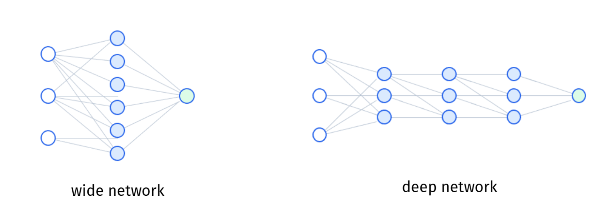

::: {.key-questions}
- 기존 모델(선형·로지스틱·트리·SVM)과 신경망의 **관점 차이**는 무엇인가?
- **뉴런(neuron)** = 무엇 + 무엇인가?
- **활성화 함수(activation)** 가 없으면 신경망은 무엇과 같아지는가?
- 선형 분리가 불가능한 **XOR 문제**를 은닉층은 어떻게 푸는가?
- 신경망이 말하는 **표현 학습(representation learning)** 이란?
:::

> 시험 포인트: 뉴런 = **가중합(weighted sum) + 비선형 활성화**. 활성화가 없으면 층을 아무리 쌓아도 선형회귀 한 번과 동일하다. 은닉 유닛은 **모델이 스스로 학습한 새로운 피처**이고, 신경망은 이 피처(표현)와 타깃 예측을 **동시에** 학습한다(= 표현 학습). 주력 활성화는 **ReLU**, 시그모이드는 이진분류 출력층에서만.

## 1. 왜 신경망인가 — 관점의 점프

지금까지는 정답(타깃 $y$)이 있는 데이터에서 함수관계 $f$ 를 추론해 $\hat f$ 를 찾았다: 선형회귀 → 로지스틱 → 의사결정나무 → SVM → 랜덤포레스트/부스팅. 모델별로 $\hat f$ 의 형태가 다를 뿐, **사람이 정한 비교적 단순한 함수꼴**을 썼다.

현실 문제는 피처-타깃 관계가 훨씬 복잡하다(이미지 기반 분류, 감성 분석, 의료 영상 진단 등). 예: $28\times28$ 흑백 이미지 → **784개 피처**, 컬러면 RGB로 $\times 3$, 고해상도면 수천~수만 피처. 이런 복잡한 관계를 잡으려면 더 표현력 큰 모델이 필요하다.

::: {.column-margin}
**기존 방식의 한계**

복잡한 관계는 사람이 직접 제곱항·상호작용항을 넣거나 피처 엔지니어링으로 설계 → 수작업의 한계.
:::

기존에는 사람이 직접 새 피처(제곱·상호작용·피처 엔지니어링)를 설계했다. 신경망의 핵심은 **피처를 스스로 학습**한다는 것 — 그것도 **타깃 예측 성능이 좋아지는 방향으로**. (PCA는 타깃과 무관하게 분산만 잘 설명하는 피처를 찾았던 것과 대비.)

## 2. 선형/로지스틱 회귀를 네트워크로 그리기

**선형회귀** $\hat y = \beta_0 + \beta_1 x_1 + \cdots + \beta_p x_p$ 를 기호만 바꿔 쓴다:

$$ z = b + w_1 x_1 + w_2 x_2 + \cdots + w_p x_p $$

- $w$ = **가중치(weight)**, $b$ = **편향(bias)**.
- 입력 노드 $x_1,\dots,x_p$ → 가중합 $z$ → 그대로 출력. 이것이 **가장 단순한 네트워크**.

**로지스틱 회귀**는 한 단계 추가: 가중합 $z$ 를 시그모이드에 통과시킨다.

$$ g(z) = \frac{1}{1+e^{-z}} \quad (\text{sigmoid / logistic, } 0\sim1) $$

- 이 $g$ 를 **활성화 함수(activation function)** 라 한다 — 선형 결합 값을 **비선형으로 변환**.
- 출력은 0~1 → 한 클래스에 속할 **확률**.

::: {.callout-note title="뉴런(neuron)의 정의"}
**가중합 + 활성화** 한 묶음 = **뉴런**. 생물의 신경세포(여러 입력을 받아 처리 후 출력을 다음 뉴런으로 전달)에서 따온 이름이라 신경망(neural network)이다.
:::

## 3. 뉴런을 쌓아 은닉층 만들기

입력 $x_1,x_2,x_3$ 에 대해 뉴런을 여러 개($a_1,a_2,a_3$) 만들어 한 줄로 쌓으면 **은닉층(hidden layer)**, 그 안의 각 뉴런이 **은닉 유닛(hidden unit)** 이다.

$$ a_k = g\!\left(b_k + \sum_{j} w_{k j}\, x_j\right) $$

```{mermaid}
graph LR
    x1((x1)) --> a1((a1))
    x2((x2)) --> a1
    x3((x3)) --> a1
    x1 --> a2((a2))
    x2 --> a2
    x3 --> a2
    x1 --> a3((a3))
    x2 --> a3
    x3 --> a3
    a1 --> y((ŷ))
    a2 --> y
    a3 --> y
    subgraph 입력층
    x1
    x2
    x3
    end
    subgraph 은닉층
    a1
    a2
    a3
    end
    subgraph 출력층
    y
    end
```

- 입력층(input layer) → 은닉층(hidden layer) → 출력층(output layer).
- 출력 노드는 문제에 따라 1개 또는 여러 개.
- 의미: $x$ 를 조합해 **새로운 피처 $a_1,a_2,a_3$** 를 만들고, 그 새 피처로 타깃을 예측 → 로지스틱 회귀의 확장.

::: {.callout-tip title="보편 근사 정리 (Universal Approximation)"}
은닉 유닛 개수를 충분히 늘리면(수백~수천), 이런 구조로 **세상에 존재하는 거의 모든 함수를 근사**할 수 있다는 것이 이론적 출발점. (학부 범위에서는 수식 증명 생략, 개념·활용 위주.)
:::

## 4. XOR — 선형으로 못 푸는 문제를 은닉층으로

$x_1, x_2 \in \{0,1\}$ 의 **XOR**(서로 다르면 1, 같으면 0):

| $x_1$ | $x_2$ | XOR |
|:---:|:---:|:---:|
| 0 | 0 | 0 |
| 0 | 1 | 1 |
| 1 | 0 | 1 |
| 1 | 1 | 0 |

평면에 찍으면 **어떤 직선으로도 두 클래스를 나눌 수 없다**(선형 분리 불가능의 가장 간단한 예).

은닉 유닛 2개로 가중치를 **직접 지정**하면 풀린다(활성화는 시그모이드):

$$ a_1 = g(20x_1 + 20x_2 - 10), \qquad a_2 = g(-20x_1 - 20x_2 + 30) $$
$$ \hat y = g(20a_1 + 20a_2 - 30) $$

**검산** $(x_1,x_2)=(1,0)$: $a_1=g(10)\approx1$, $a_2=g(10)\approx1$, $\hat y=g(10)\approx1$ ✓
네 조합 모두 넣으면 출력이 $0,1,1,0$ 에 가깝게 나온다.

::: {.column-margin}
**학습한 피처의 의미**

$a_1$ ≈ **OR** (하나라도 1이면 1)
$a_2$ ≈ **NAND** (둘 다 1이면 0)
→ XOR = OR AND NAND
:::

해석: $a_1$ 은 **OR**, $a_2$ 는 **NAND** 처럼 행동한다. 원래 입력으로는 표현 못 하던 $y$ 가, **새로 학습된 피처 $a_1,a_2$** 로는 표현된다. (여기서는 가중치를 손으로 줬지만, 실제로는 데이터로 학습 → 다음 강의.)

## 5. 활성화 함수가 없으면? — 선형회귀로 붕괴

활성화 $g$ 를 빼고 $c_1, c_2$ 를 선형 결합만으로 만들면:

$$ \hat y = W_1 x_1 + W_2 x_2 + B $$

즉 **선형 결합을 아무리 반복·중첩해도 결국 선형 결합 한 번**과 같다(상수 곱·합의 합성은 다시 상수 곱·합). 유닛을 아무리 많이 쌓아도 **선형회귀 한 번과 차이 없음**.

> **활성화의 역할** = 모델에 **비선형성**을 부여해 복잡한 함수를 표현 가능하게 하는 것.

## 6. 활성화 함수의 종류

::: {.column-margin}
**ReLU**
$$g(x)=\max(0,x)$$
계산이 단순 → 학습이 매우 빠름. **현대 신경망의 기본값.**
:::

- **Sigmoid** $1/(1+e^{-z})$: 0~1. 옛날 방식. 지금은 **이진분류 출력층에서만** 사용.
- **Tanh**: $-1\sim1$, 시그모이드보다 학습이 다소 빠르나 요즘은 잘 안 씀.
- **ReLU** (Rectified Linear Unit) $\max(0,x)$: 음수→0, 양수→자기 자신. 계산이 단순해 **학습이 압도적으로 빠름** → 현대 신경망에서 거의 항상 사용.

ReLU가 단순한 꺾은선인데도 강력한 이유: **piecewise linear**(구간별 선형) — 직선 조각을 여러 번 꺾어 이어 붙이면 복잡한 비선형 함수도 근사할 수 있다. 단순한 ReLU를 여러 층 반복하면 매우 복잡한 비선형 함수가 표현된다.

## 7. 표현 학습 (Representation Learning)

각 은닉 유닛 $a_k$ 는 **모델이 학습한 새로운 피처**다. 예) 고객 구매 예측에서 입력 피처(나이·소득·방문빈도·최근 구매액·가입기간)로부터 은닉층이 "가격 민감도가 높은 고객", "활동이 감소한 장기 고객", "광고 반응 가능성" 같은 **고차원 의미의 피처**를 새로 만들어낸다.

| 방식 | 새 피처를 만드는 주체 | 타깃 사용 | Feature 변환 형태 |
|---|---|:---:| --- |
| **피처 엔지니어링** | 사람이 수동 설계 | ✗ | 수동 |
| **PCA / PCR** | 분산을 잘 설명하는 선형결합(자동) | ✗ | 선형 |
| **신경망** | 예측오차가 작아지도록 자동 학습(**비선형**) | ✓ | 비선형 |

> 신경망은 **좋은 표현(피처)의 학습**과 **그 표현을 이용한 타깃 예측**을 **동시에** 수행한다. 이것이 기존 방법들과 결정적으로 다른 아이디어. "학습한다" = 가중치 $w$ 와 편향 $b$ 의 값을 정한다는 뜻.

### 깊이(depth)와 표현의 추상화



은닉층을 **옆으로 늘리면(유닛 수 ↑)** 폭(width), **여러 층으로 쌓으면(층 수 ↑)** 깊이(depth). 깊게 쌓을수록(=**deep** neural network) 각 층은 이전 층의 표현을 입력받아 **새 표현을 다시 만들고**, 층을 지날수록 입력(raw data)에서 점점 **추상적인 피처**로 발전한다.

이미지 분류 예($28\times28\times3$ 입력 → 개·고양이·새):

```{mermaid}
graph LR
    I["입력<br/>raw 픽셀 ~2,352개"] --> E["초반층<br/>에지·선"]
    E --> T["중간층<br/>텍스처·질감·패턴"]
    T --> P["후반층<br/>부위(눈·코·귀 윤곽)"]
    P --> O["출력<br/>개/고양이/새 확률"]
```

- 입력은 가장 **날것(raw)**, 출력은 가장 **추상적**. 초반 층은 단순한 에지·선, 갈수록 에지가 모여 텍스처 → 부위 → 전체 객체로.
- 이것이 **표현 학습의 원리**: deep하게 쌓으면 입력에서 점점 추상적인 형태로 스스로 학습. 이미지는 이런 식, 텍스트 등 다른 데이터는 또 다른 방식으로 표현을 쌓는다.
- 폭·깊이 두 방향으로 네트워크를 키우면 입력↔출력 관계를 **더 복잡한 함수**로 표현할 수 있다.
- 하지만 모델의 flexibility가 커질수록 overfitting 위험도가 증가한다. -> early stopping, dropout, regularization 등 다음 강의에서 다룰 테크닉으로 제어.

## 8. 출력층(Output Layer) — 문제 유형별

::: {.column-margin}
**softmax**

$$P_k=\frac{e^{z_k}}{\sum_j e^{z_j}}$$
지수로 변환 후
전체 합으로 나눠
확률(합=1)로.
:::

- **회귀**: 노드 1개, 활성화 없이 값 그대로 예측.
- **이진분류**: 노드 1개 + **시그모이드 활성화**(0~1 확률). 출력층에 시그모이드가 있어야 한다는 점이 회귀와의 차이.
- **다중분류**: 클래스 수만큼 노드 + **softmax**(확률 합=1).

**softmax 계산** — 출력 노드 점수 $z_k$ 를 지수함수에 넣어 전체 합으로 나눠 확률로 변환한다. 합이 1이 되도록 정규화:
$$ P_k = \frac{e^{z_k}}{\sum_{j} e^{z_j}} $$

예) 개·고양이·새 3-클래스에서 출력 점수가 $(2,\,1,\,0.1)$ 이면 → $P=(0.65,\,0.24,\,0.11)$ 처럼 변환(합=1), 가장 큰 확률인 **개**로 분류. (강의에선 밑을 2로 든 예시 $2^2,2^1,2^{0.1}$ 로 직관 설명 — 밑이 $e$ 든 2든 원리는 동일.) softmax는 "마지막 활성화"로 보거나 "확률 변환"으로 봐도 된다. **출력 노드가 여러 개 = 다중분류**.

## 9. 신경망의 데이터 분할 — CV 대신 train/validation/test

::: {.column-margin}
**비율 예시**

98 : 1 : 1
(train : valid : test)
:::

신경망은 **교차검증(CV)을 잘 쓰지 않고**, 데이터를 **train / validation / test 세 덩어리로 한 번에 나눈다.**

- **이유**: 모델이 복잡해 학습에 **아주 많은 데이터**가 필요하고, CV는 fold마다 재학습해 **시간 비용이 너무 크다**. 반면 딥러닝은 보통 데이터가 충분히 많다.
- **비율**: 전통적 방법(예: 8:2)보다 **train 비중을 훨씬 크게**, validation·test는 같은 비율로 **작게**. 예: 980만 / 10만 / 10만 ($\approx 98{:}1{:}1$).
- 데이터가 많으면 **1%(=10만 개)만으로도** 성능 평가에 충분한 크기라, validation·test 비율이 작아도 문제없다.
- validation = 모델·하이퍼파라미터 튜닝용, test = 최종 성능 평가용.

::: {.lecture-summary}
- **뉴런 = 가중합 + 비선형 활성화**. 선형회귀·로지스틱 회귀를 네트워크로 그린 것이 출발점.
- 뉴런을 쌓으면 **은닉층**, 각 은닉 유닛 = 모델이 학습한 **새 피처**. 보편 근사로 거의 모든 함수 근사 가능.
- **XOR**(선형 분리 불가)도 은닉 유닛 2개($a_1$≈OR, $a_2$≈NAND)로 해결.
- **활성화가 없으면** 층을 쌓아도 선형회귀 한 번과 동일 → 활성화 = 비선형성의 원천.
- 활성화: **ReLU**(기본), sigmoid(이진분류 출력층 전용), tanh(거의 미사용).
- 신경망 = **표현 학습**: 좋은 피처와 타깃 예측을 동시에 학습. **깊게(depth) 쌓을수록** 입력(raw)→추상 피처로 발전(이미지: 에지→텍스처→부위→객체).
- 출력층: 회귀(노드1·활성화X) / 이진분류(노드1·sigmoid) / 다중분류(노드 다수·**softmax** $P_k=e^{z_k}/\sum e^{z_j}$).
- 데이터 분할: 신경망은 **CV 대신 train/validation/test**로 한 번에 분할, train 비중 매우 큼($\approx$ 98:1:1) — 데이터 많고 CV는 비용 큼.
:::
