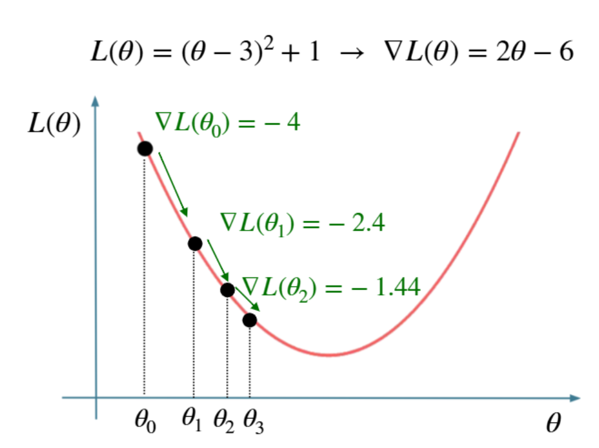
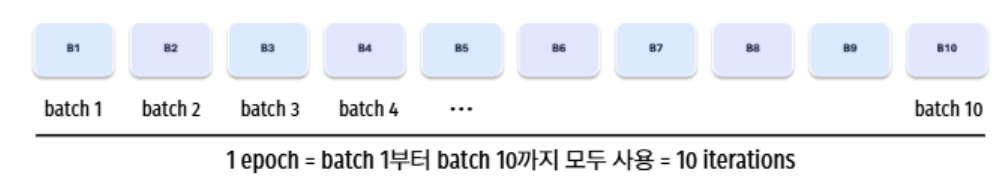
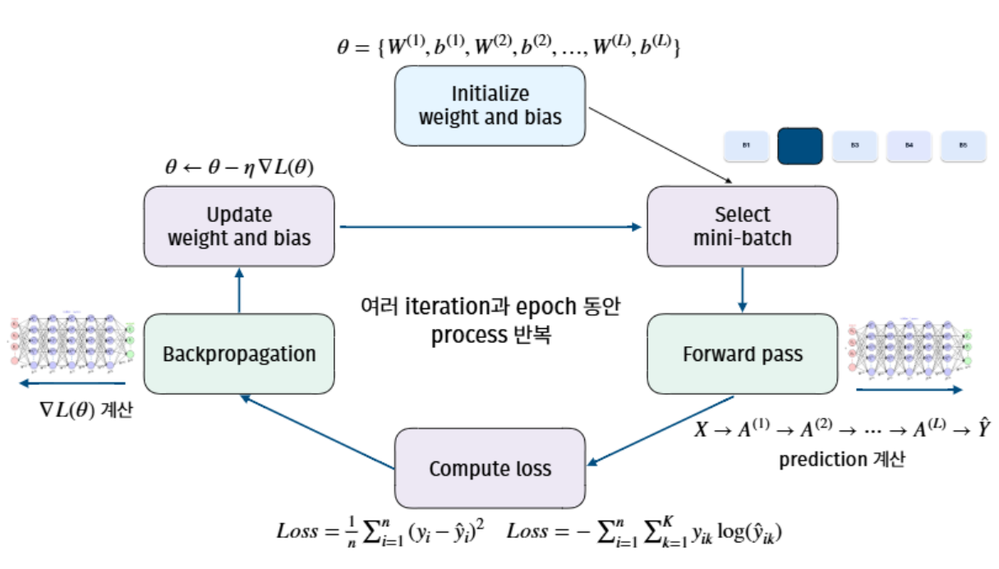
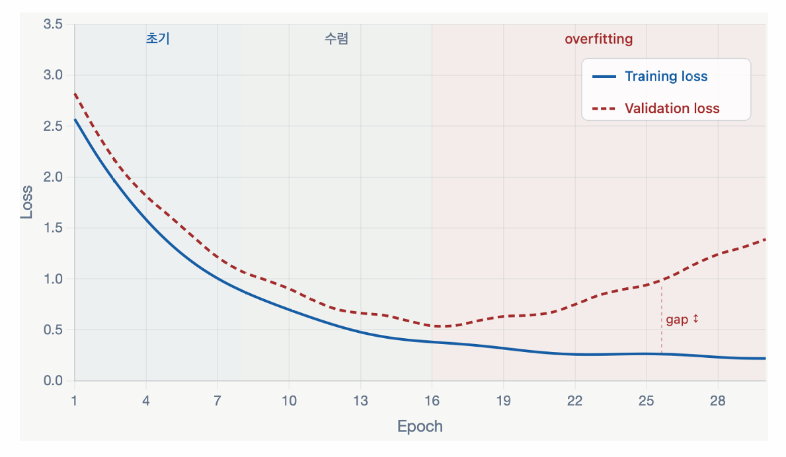

::: {.key-questions}
- 신경망의 파라미터(가중치 $W$, 편향 $b$)는 **어떻게 결정**하는가?
- **손실(loss)** 은 회귀/분류에서 각각 어떻게 정의되는가?
- **경사하강법(gradient descent)** 과 **역전파(backpropagation)** 의 원리는?
- **epoch / batch / iteration** 의 차이는?
- 심층신경망의 **오버피팅**을 어떻게 줄이는가? (early stopping · weight decay · dropout)
:::

> 시험 포인트: 학습 = 모든 가중치·편향을 모은 $\theta$ 에 대해 **손실 $L(\theta)$ 를 최소화**하는 것. 한 번에 못 풀어서 **경사하강법**($\theta \leftarrow \theta - \eta \nabla L$)으로 조금씩 내려가고, 그래디언트는 **역전파**(체인룰, 역방향)로 계산한다. 모델이 복잡해 오버피팅이 필연 → **early stopping, weight decay(=L2/ridge), dropout** 세 가지로 정규화.

## 1. 지난 시간 복습 + 오늘의 목표

신경망 = 뉴런(가중합+활성화)을 쌓은 은닉층의 반복 → 깊게 쌓으면 **심층신경망(DNN)**, 이를 다루는 게 **딥러닝**. 각 은닉층은 예측에 유용한 **표현(representation)** 을 스스로 학습한다.

지금까지는 가중치·편향이 **주어졌다고 가정**하고 구조만 봤다. 오늘의 두 질문:

1. **$W, b$ 를 어떻게 결정하는가?** (학습)
2. 깊어질수록 복잡도↑ → variance↑ → 오버피팅. **어떻게 줄이는가?** (정규화)

> 아이디어는 기존(선형회귀·SVM·트리)과 **똑같다. 단지 복잡할 뿐**.

## 2. 파라미터 표기

::: {.column-margin}
**한 층의 파라미터 수**

이전 층 $N$ 노드 → 현재 층 $M$ 노드:
가중치 $M\times N$ 개 + 편향 $M$ 개
:::

- $W^{(l)}$ : $l$ 번째 층을 만드는 가중치 **행렬**. 원소 $w^{(l)}_{ij}$ = 이전 층 $j$ 번째 노드 → 현재 층 $i$ 번째 노드 아크의 가중치.
- $b^{(l)}$ : $l$ 번째 층의 **편향 벡터**(노드마다 하나, $M$ 차원).

선형회귀($\beta_0,\dots,\beta_p$)와 비교하면 결정할 파라미터가 **훨씬 많다.**

## 3. 순전파(Forward Pass)

$W, b$ 가 주어졌을 때 입력을 넣어 출력을 계산하는 **한 번의 과정** = 순전파(forward propagation) = 예측.

$$ a^{(l)} = g\!\left(W^{(l)} a^{(l-1)} + b^{(l)}\right), \qquad a^{(0)} = x $$

가중합 → 활성화를 층마다 반복해 최종 출력까지 흘려보낸다.

## 4. 손실 함수(Loss)

출력을 실제값과 비교해 **현재 $W,b$ 가 충분히 좋은지 평가**한다.

- **회귀**: 평균제곱오차(MSE)
$$ L = \frac{1}{n}\sum_{i=1}^{n}(y_i - \hat y_i)^2 $$
- **분류**: 교차 엔트로피(cross-entropy) — 로지스틱 회귀의 우도(로그변환)를 다중 클래스로 확장
$$ L = -\frac{1}{n}\sum_{i=1}^{n}\sum_{k=1}^{K} y_{ik}\,\log \hat y_{ik} $$

::: {.callout-note title="교차 엔트로피 예 — 개/고양이/새 분류"}
실제 정답이 고양이면 원-핫 $y=(0,1,0)$. 출력은 **softmax** 확률(합=1).
- 예측 $(0.659,\,0.242,\,0.099)$ → 정답(고양이) 확률 0.242 → $-\log 0.242 = 1.427$ (큰 손실, 오분류).
- 예측 $(0.022,\,0.969,\,0.009)$ → 정답 확률 0.969 → $-\log 0.969 = 0.03$ (작은 손실).
정답 클래스의 확률이 1에 가까울수록 손실 → 0. **정답 확률을 높이는 방향**으로 학습.
:::

## 5. 학습 = 손실 최소화 문제

::: {.column-margin}
**파라미터 폭증 예**

$28\times28$ 흑백(784 입력) → 은닉 128 → 출력 10:
$784\times128 + 128 + 128\times10 + 10 \approx$ **101,770개**

레이어 하나짜리 단순망인데도 약 10만 개.
:::

모든 가중치·편향을 모아 $\theta = \{W^{(1)},b^{(1)},\dots,W^{(L)},b^{(L)}\}$. 학습 = **$L(\theta)$ 를 최소화하는 $\theta^{*}$ 찾기**. (선형회귀에서 $\theta=\beta$, $L=$ 잔차제곱합이었던 것과 같은 구조.)

문제는: 파라미터가 수십만 개, 활성화 때문에 $L(\theta)$ 가 **비선형** → 한 번에 최적해를 못 구함(손으로도 컴퓨터로도 불가능). 그래서 **경사하강법**으로 "최대한 좋은" 값을 찾는다.

## 6. 경사하강법(Gradient Descent)

비선형 최적화의 범용 알고리즘(SVM·로지스틱 회귀도 이걸로 풂). 단순화해서 $\theta$ 가 하나, $L(\theta)=(\theta-3)^2+1$ 라 하자.

::: {.column-margin}
**갱신 규칙**
$$\theta \leftarrow \theta - \eta\,\nabla L(\theta)$$
$\eta$ = 학습률(learning rate)
:::



1. 초기값 $\theta_0$ (랜덤 등) 에서 시작. 예: $\theta_0=1$.
2. **그래디언트**(=미분) $\nabla L = 2(\theta-3)$. $\theta=1$ 에서 $-4$.
   - 그래디언트는 **손실이 가장 빠르게 증가하는 방향·크기**. 따라서 **반대 방향**으로 가면 손실 감소.
3. 갱신: $\theta_1 = 1 - 0.2\times(-4) = 1.8$ (학습률 $\eta=0.2$ → 20%만 이동).
4. 반복: $1.8 \to 2.28 \to 2.568 \to \cdots \to 3$ 으로 **수렴**.

$$ \theta \leftarrow \theta - \eta\,\nabla L(\theta) $$

```{mermaid}
graph LR
    A["θ₀ = 1<br/>∇L = -4"] -->|"-η∇L"| B["θ₁ = 1.8<br/>∇L = -2.4"]
    B -->|"-η∇L"| C["θ₂ = 2.28<br/>∇L = -1.44"]
    C --> D["... → θ* = 3<br/>(최소)"]
```

::: {.callout-warning title="학습률 η 의 영향"}
- **너무 작으면**: 한 번에 조금씩만 이동 → 수렴까지 너무 많은 시간/비용.
- **너무 크면**: 최소점을 지나쳐 **좌우로 진동·발산** → 학습 불안정, 수렴 실패.
- 적절한 $\eta$ → 손실이 **빠르고 안정적으로** 감소. (적절값 선택이 중요)
:::

## 7. 역전파(Backpropagation)

수십만 개 파라미터 **각각**에 대해 그래디언트 $\partial L / \partial w^{(l)}_{ij}$ 를 계산해야 한다. 이를 효율적으로 하는 게 역전파.

- 순전파는 입력→출력(곱·합·활성화). **역전파는 손실에서 출발해 역방향**으로 흘러가며 모든 파라미터의 그래디언트를 계산.
- 핵심 도구 = **체인룰(chain rule)**. 순전파만큼의 단순 계산으로 전체 그래디언트를 얻는다.
- 계산된 그래디언트로 모든 $W,b$ 를 동시에 갱신.

## 8. epoch / batch / iteration

데이터 10만 개를 1만 개씩 **10개 배치**로 나눈다고 하자.

| 용어 | 의미 |
|---|---|
| **batch(배치)** | 전체 데이터를 나눈 한 덩어리(예: 1만 개) |
| **iteration(이터레이션)** | 배치 하나로 forward→loss→backprop→**1회 갱신** |
| **epoch(에폭)** | 모든 배치를 한 번씩 다 사용(= 전체 데이터 1회 통과) |



::: {.column-margin}
**배치 크기**

보통 $2^n$: 32, 64, 128, 256.
:::

- **미니배치 GD**: 배치 단위로 갱신(현실의 표준). 속도와 안정성의 절충.
- **SGD(확률적 GD)**: 데이터 1개로 갱신 → 빠르지만 불안정.
- **(풀)배치 GD**: 전체 데이터로 1회 갱신 → 안정적이지만 느림.



> 참고: ChatGPT·Gemini 같은 LLM도 이 원리로 학습된다. 네트워크 형태·입력 처리만 다를 뿐. GPT 버전업 = 수개월간 이 과정을 반복해 손실을 더 낮춘 것. GPU를 많이 쓰면 미니배치를 병렬 계산해 학습이 빨라진다.

## 9. 오버피팅 — 검증 손실로 진단

신경망은 train/validation/test로 나누고(CV 대신 **validation set** 사용), epoch마다 두 손실을 함께 본다.



- **train loss**: epoch↑ → 계속 감소(알고리즘이 train 성능을 높이므로).
- **validation loss**: 어느 시점까지 감소하다 **다시 증가** → **오버피팅 신호**. 두 곡선의 갭이 점점 벌어진다.

> 파라미터가 많고(깊고) 데이터가 충분하면 train 성능은 크게 오르지만, 복잡도가 높아 **오버피팅이 필연**.

## 10. 정규화(Regularization) 세 가지

오버피팅을 줄이는 모든 기법 = 정규화. 딥러닝 필수 3종:

### ① Early Stopping (조기 종료)
구조를 바꾸지 않고, validation loss가 **더 이상 개선되지 않으면** 학습을 중단. **patience**(인내) 값으로 제어 — "patience=3"이면 3 epoch 연속 개선 없을 때 종료.

::: {.column-margin}
**patience 트레이드오프**

작으면(=1): 우연한 미개선에도 너무 일찍 종료.
크면(=10): 오버피팅 단계 깊이 진입 후 종료.
:::

- validation loss는 매끄럽지 않고 진동할 수 있어, 오버피팅 전에 우연히 멈출 위험도.
- 장점: 가장 간단. 단점: 항상 오버피팅을 막는다는 보장은 없음.

### ② Weight Decay (가중치 감쇠)
**릿지 회귀(L2)와 동일**. 손실에 가중치 제곱 합 페널티를 추가:

$$ L_{\text{total}} = L + \lambda \sum_{l,i,j} \left(w^{(l)}_{ij}\right)^2 $$

- 가중치 크기를 낮춰 모델 variance↓. 가중치가 크면 train 데이터에 과민 반응 → 줄여서 안정화. (릿지와 100% 같은 원리.)

### ③ Dropout (드롭아웃)
::: {.column-margin}
**드롭 확률**

$p = 0.2 \sim 0.5$ (20~50% 뉴런 비활성화)
$p$↑ → 정규화 강하나 학습 느려짐.
:::

매 iteration마다 각 뉴런을 확률 $p$ 로 **무작위 비활성화**(출력 0, forward·backward에서 제외). 다음 iteration엔 다른 뉴런이 꺼짐 → 매번 더 단순한 네트워크를 학습.

- **효과 1 (단순화)**: 네트워크가 작아져 variance↓.
- **효과 2 (과의존 방지)**: 어떤 뉴런이 꺼질지 모르므로 특정 뉴런·경로에 과의존하지 못함 → 각 뉴런이 독립적으로 유용한 피처 학습.
- **효과 3 (앙상블)**: iteration마다 다른 네트워크를 학습·누적 → **랜덤 포레스트처럼** 서로 다른 모델을 평균내는 분산 감소 효과.
- 단점: 꺼진 뉴런의 가중치는 그 iteration에 갱신 안 됨 → 학습이 느리고 불안정해질 수 있음.

> 이하 **11~12장은 온라인(녹화) 강의**로 진행된 부분. PDF 자료 기준으로 정리하고, 구두 설명만 별도 표기.

## 11. 신경망의 하이퍼파라미터 (Hyperparameters)

학습 **전에** 사람이 미리 정해야 하는 값들. 학습으로 결정되는 $W,b$(파라미터)와 달리, 좋은 값은 **validation set**으로 tuning한다. 세 묶음으로 정리:

- **구조 (Architecture)**: hidden layer 수, hidden unit 수, activation function
- **학습 방식 (Training)**: 학습률 $\eta$ (learning rate), batch size, epoch 수
- **정규화 (Regularization)**: weight decay $\lambda$, dropout rate $p$, early stopping patience

::: {.callout-note title="튜닝 순서 (온라인 강의 구두 설명)"}
**architecture는 일반적으로 통용되는 구성(표준적인 layer 수·unit 수·activation)이 있어 잘 튜닝하지 않는** 편이고, 주로 training·regularization 쪽을 조정한다.
:::

## 12. 실무 고려사항 (Practical Considerations)

**신경망이 유리한 경우**

- 데이터가 **매우 많을 때** (파라미터가 많아 학습에 많은 데이터가 필요).
- feature–target 관계가 **복잡**(비선형·고차원 상호작용)해 linear model·tree로는 부족할 때.
- **raw data를 직접** 다룰 때 — 이미지(pixel), 텍스트(token), 음성(waveform)처럼 feature를 직접 설계하기 어려운 경우 신경망이 **representation을 스스로 학습**.
- 추천·생성·검색 등 **representation learning이 중요한** task.

**주의할 점**

- **높은 학습 비용**: 데이터·모델이 크면 학습 시간이 길고 GPU 등 자원이 필요한 경우가 많음.
- **hyperparameter tuning 부담**: 조정할 값이 많고 조합에 따라 성능 차이가 큼 → 경험과 반복 실험이 필요.
- **작은/정형(tabular) 데이터**에선 linear model, SVM, **gradient boosting**이 신경망보다 나은 경우가 많음.

::: {.lecture-summary}
- **학습** = 모든 $W,b$ 를 모은 $\theta$ 에 대해 손실 $L(\theta)$ 최소화. 회귀=MSE, 분류=교차 엔트로피(softmax).
- 파라미터가 수십만 개·비선형 → 한 번에 못 풂 → **경사하강법** $\theta \leftarrow \theta - \eta\nabla L$ 로 조금씩 하강.
- 그래디언트는 **역전파**(체인룰, 역방향)로 효율 계산. **학습률 $\eta$** 는 너무 작으면 느리고 크면 진동.
- **epoch**(전체 1회)/**batch**(덩어리)/**iteration**(배치 1회 갱신). 표준은 **미니배치 GD**(배치 $2^n$).
- validation loss 재증가 = **오버피팅 신호**. 필연적이므로 정규화 필요.
- 정규화 3종: **early stopping**(patience), **weight decay**(=L2/ridge), **dropout**($p$=0.2~0.5, 앙상블 효과).
- **하이퍼파라미터**(학습 전 설정, validation으로 tuning) 3묶음: architecture / training / regularization. architecture는 표준 구성을 써 잘 안 건드리고, 주로 training·regularization을 조정.
- 신경망은 **데이터 多·관계 복잡·raw data** 일 때 유리. 정형·소규모 데이터는 linear/SVM/**gradient boosting**이 더 나을 때 많음.
:::
