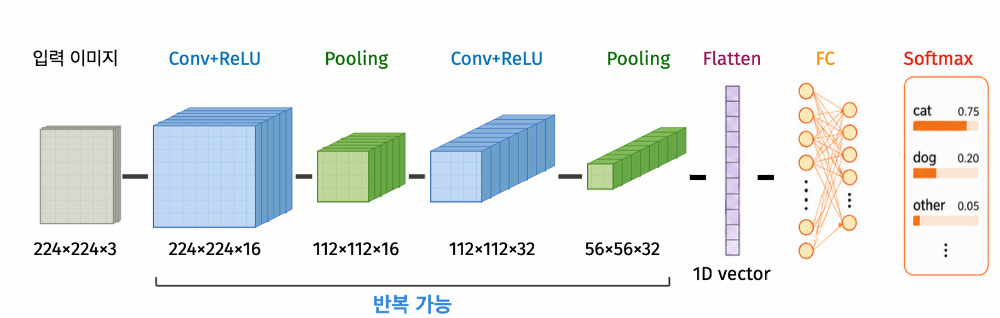
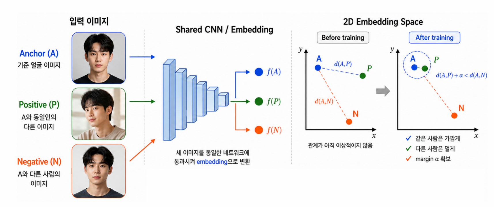
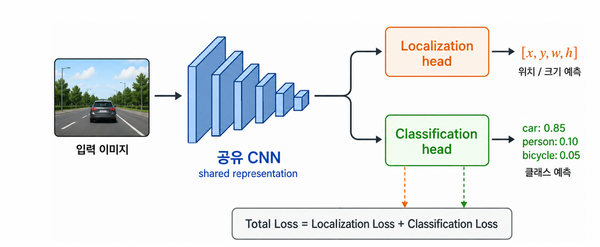
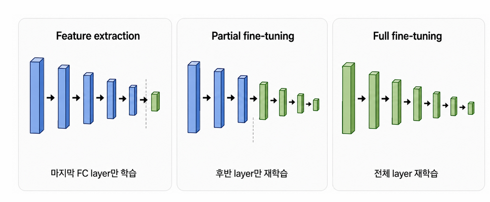

::: {.key-questions}
- **CNN**(합성곱·필터·풀링)은 왜 이미지에 적합한가?
- **얼굴 인식**은 왜 분류 문제로 풀 수 없고, 어떻게 푸는가? (임베딩 + triplet loss)
- **객체 탐지(object detection)** 의 멀티태스크 구조와 YOLO 원리는?
- **전이 학습(transfer learning)·파인튜닝** 은 무엇이고 언제 쓰는가?
:::

> 시험 포인트: CNN은 **필터(가중치 공유)** 로 파라미터 폭발을 막고 이미지의 계층적 표현을 스스로 학습한다. 같은 CNN 백본에 **입력·출력·손실만 바꾸면** 분류·얼굴인식·객체탐지로 확장된다. 얼굴 인식 = **임베딩 벡터 + triplet loss**(open-set라 분류 불가). 객체 탐지 = **YOLO**(셀마다 박스+클래스 동시 예측, 멀티태스크). 데이터·시간 절약은 **전이 학습**.

## 1. 표현에서 응용으로 (From Representation to Application)

신경망은 예측에 유용한 **표현(representation)** 을 스스로 학습한다. 이 표현 학습을 이미지의 여러 응용에 그대로 적용할 수 있는데, **응용마다 input의 형태·network 구조·loss function만 바뀐다.**

- **이미지 분류(Image Classification)**: 한 장 이미지 → (edge→texture→object) 표현 → 클래스
- **얼굴 인식(Face Recognition)**: 얼굴 이미지 → face embedding → 같은 사람인지 여부
- **객체 탐지(Object Detection)**: 한 장에 여러 물체 → 위치+클래스 특징 → bounding box + 클래스

> 이번 강의 전체를 관통하는 주제: **같은 CNN 백본**에 입력·출력·손실만 바꿔 끼우면 세 응용으로 확장된다.

## 2. 왜 CNN인가 — 완전연결망의 한계

::: {.column-margin}
**파라미터 폭발**

$224\times224\times3 = 150{,}528$ feature.
첫 hidden layer 64 units → 약 **963만** 개 가중치($150{,}528\times64$) + bias 64.
:::

완전연결망(FC)으로 이미지를 처리하면 두 가지 문제가 생긴다.

- **공간 구조(spatial structure) 손실**: 이미지를 FC에 넣으려면 1D로 flatten해야 하는데, 그러면 인접 픽셀끼리의 **공간적 위치 관계가 사라진다.** 같은 물체 패턴이 이미지의 다른 위치에 나타나도 FC는 위치마다 가중치가 달라 일반화하지 못함.
- **파라미터 문제**: $224\times224$ RGB = 150,528개 input feature. 첫 hidden layer에 64 unit만 둬도 약 1,000만 개 가중치가 필요. 픽셀 수만큼 가중치가 폭발 → 학습에 필요한 데이터도 그만큼 늘어남.

→ 이미지의 **공간 구조를 활용하면서 가중치 수를 줄인** 것이 **CNN**.

## 3. 합성곱 연산 (Convolution)

**합성곱 layer**의 핵심: 작은 **필터(filter)** 를 이미지 위에서 슬라이딩하며 국소적(local) 패턴을 검출한다.

- 작은 영역(예 $3\times3$)에서 **가중합 + 활성화**를 계산해 feature map의 한 값을 만든다:

$$ \text{FeatureMap}_{ij} = g\!\left(\sum_m\sum_n W_{mn}\, X_{(i+m)(j+n)} + b\right) $$

($W$ = 필터 가중치, $X$ = 해당 영역 픽셀, $b$ = bias, $g$ = 활성화(보통 ReLU))

- **가중치 공유**: 하나의 필터를 이미지 전체에 슬라이딩하며 **같은 가중치**를 모든 위치에 적용 → 위치가 달라도 같은 패턴을 잡고, 가중치 수도 절감.

::: {.column-margin}
**패딩(padding)**

가장자리에 0을 채움.
6×6 + padding=1 + 3×3 필터 → **6×6 유지**.
:::

- **패딩(padding)**: 가장자리에 0을 두르면 ① 가장자리 픽셀도 필터에 충분히 반영되고 ② feature map 크기를 줄이지 않고 유지할 수 있다.
- **채널(channel)**: RGB 3채널 이미지는 필터도 3채널 → $3\times3\times3 = 27$개 가중치 + bias 1개로 한 위치를 계산.

$$ \text{FeatureMap}_{ij} = g\!\left(\sum_c\sum_m\sum_n W_{cmn}\, X^{(c)}_{(i+m)(j+n)} + b\right) \quad (c=\text{채널 index}) $$

::: {.callout-note title="부연 — 채널은 '합산', 필터는 '스택'"}
헷갈리기 쉬운 지점: 채널별로 feature map을 따로 만들어 보관하는 게 **아니다**.

- **입력 채널 방향(한 필터 내부)**: 각 채널의 가중합을 구해 **전부 더한다**($\sum_c$) + bias + 활성화 → 그 위치의 출력값 1개. 즉 **필터 1개 → feature map 1장**.
- **필터 방향(필터 여러 개)**: 서로 다른 필터의 결과는 더하지 않고 **쌓는다(stack)** → 다음 layer의 채널이 됨.

그래서 $224\times224\times3$ 에 필터 64개를 쓰면 출력은 (공간크기)$\times64$. 입력 채널 수(3)는 합산되어 사라지고, 출력 채널 수는 **필터 수(64)** 로 정해진다.
:::

## 4. 여러 필터·풀링·전체 구조

**여러 필터(multiple filters)**: 필터 하나는 한 종류 패턴만 잡으므로, 여러 필터를 두어 다양한 패턴을 동시에 검출한다.

- 예) $224\times224\times3$ 에 필터 64개 → 가중치 $(3\times3)\times3\times64 = 1{,}728$ + bias 64. **FC의 약 1,000만 개보다 훨씬 적다.**
- 필터 가중치는 사람이 정하지 않고 **학습으로 자동 결정**(gradient descent로 loss를 줄이는 방향) → task마다 유용한 패턴이 만들어짐 = **CNN의 표현 학습**.

**풀링(pooling)**: 합성곱 뒤 feature map을 축소(보통 **max pooling**).

- 크기↓ → 이후 layer 연산량↓
- 패턴의 정확한 위치보다 "존재 여부"를 중시 → **작은 위치 변화에 강건**(translation invariance).

**전체 구조(CNN architecture)**: `Input → [Conv + ReLU + Pooling] ×L → Flatten → FC → 출력`

```{mermaid}
graph LR
    IMG["이미지<br/>224×224×3"] --> C1["[Conv+ReLU+Pool]<br/>저수준: 선·색"]
    C1 --> C2["[Conv+ReLU+Pool]<br/>중수준: 형태"]
    C2 --> C3["[Conv+ReLU+Pool]<br/>고수준: 추상"]
    C3 --> F["Flatten (1D)"]
    F --> FC["FC → 출력<br/>(softmax 등)"]
```

| 구성요소 | 역할 |
|---|---|
| Conv + ReLU | 국소 패턴 검출 + 비선형 변환 |
| Pooling | feature map 축소, 위치 변화에 강건 |
| Flatten | 3D feature map → 1D 벡터 |
| FC | 표현 종합 → 최종 예측 |

- 레이어가 깊어질수록 **공간 크기($H\times W$)는 줄고, 채널 수($C$)는 늘어난다** ($224\to\cdots\to7$).



::: {.callout-note title="모델 진화 (CNN Model Evolution)"}
LeNet(1998, 5층) → AlexNet(2012, 8층, ReLU+Dropout, **ImageNet 우승**) → VGG(2014, 3×3 필터로 깊게) → ResNet(2015, **skip connection** 으로 100층+ 학습 가능) → MobileNetV3·EfficientNet(2019, 경량·효율). 2012 AlexNet의 ImageNet 우승이 딥러닝 붐을 촉발했고, 깊을수록 더 추상적인 표현을 학습한다.
:::

## 5. 이미지 분류와 계층적 표현 학습

**이미지 분류(Image Classification with CNN)**: output layer를 **클래스 수 $K$개 unit + softmax** 로 두면 각 클래스 확률이 나온다. loss = **cross-entropy**. 각 클래스를 잘 구분하는 표현을 CNN이 스스로 학습.

**계층적 표현 학습(Hierarchical Representation)**: 각 layer는 이전 layer의 출력을 모아 점점 추상적인 표현을 만든다.

- 초기 layer: 선·경계(edge) 등 단순 패턴
- 중간 layer: 모서리(corner)·질감(texture)
- 후반 layer: 눈·코·바퀴 같은 **object part**

> 이 표현은 사람이 설계한 게 아니라 **loss를 줄이는 과정에서 자동으로** 만들어진다. = 계층적 표현 학습.

## 6. 얼굴 인식 (Face Recognition)

핸드폰 잠금 해제·공항 게이트처럼, 저장된 얼굴과 새로 들어온 얼굴이 **같은 사람인지** 판단.

::: {.callout-warning title="왜 분류 문제로 못 푸는가"}
- **클래스 폭발**: 전 국민·수백만 명을 클래스로 둘 수 없음.
- **Open-set 문제**: 학습 때 **한 번도 본 적 없는 사람**이 들어올 수 있음 → 어떤 클래스에도 속하지 않아 분류 불가능.
:::

**해결: 임베딩 벡터(embedding vector)**. 이미지를 CNN에 통과시켜 출력층이 확률이 아니라 **$D$ 차원 벡터**(예 $D=100$)를 내게 한다. 각 차원이 피부색·눈 크기·눈 사이 거리·입술 모양 등 얼굴을 수치화한 표현.

- **같은 사람** 이미지들 → 임베딩이 **가깝게** 모임.
- **다른 사람** → 임베딩이 **멀게**.
- 새 얼굴의 임베딩과 저장된 임베딩의 거리가 충분히 작으면 "같은 사람". (고차원 공간에선 점 하나가 "우주의 먼지" — 다른 사람을 충분히 떨어뜨릴 여유가 큼. 핸드폰 오류율 ~10만분의 1.)

### Triplet Loss 로 학습



이미지 **3장**을 동시에 입력: **Anchor(A, 기준)**, **Positive(P, 같은 사람)**, **Negative(N, 다른 사람)**. **같은 가중치**의 CNN에 셋을 넣어 임베딩 $f(A), f(P), f(N)$ 을 얻는다.

목표: $A$-$P$ 는 가깝게, $A$-$N$ 은 멀게. 단순히 멀게가 아니라 **마진 $\alpha$ 만큼 항상 차이**나게:

$$ D_{AP} + \alpha \le D_{AN} $$

::: {.column-margin}
**마진의 의미**

$D_{AP}=10$, $\alpha=5$ → $D_{AN}$ 은 항상 15 이상이 되도록. 둘이 "비슷하게 가까운" 상태를 방지.
:::

위반 크기를 손실로:

$$ L = \max\!\left(0,\; \|f(A)-f(P)\|^2 - \|f(A)-f(N)\|^2 + \alpha\right) $$

조건을 만족하면($\le 0$) 손실 0, 위반하면 그 크기만큼 손실 → 역전파로 가중치·편향 갱신, 반복. **백본 CNN은 분류와 동일**, 출력(임베딩)과 손실(triplet)만 다름.

## 7. 객체 탐지 (Object Detection)

자율주행 카메라처럼, **이미지 안 여러 물체의 위치와 클래스를 동시에** 예측.

- **위치** = **바운딩 박스** $(x, y, w, h)$: 중심 좌표 $(x,y)$ + 폭 $w$ + 높이 $h$.
- **클래스** = 물체 종류 + confidence score(예: 사람 0.92, 자동차 0.95).
- 하나의 네트워크가 **위치 회귀 + 클래스 분류**를 동시에 → **멀티태스크 러닝**.

### YOLO (You Only Look Once)

이미지를 **격자(grid)** 로 나눈다(예 $7\times7$). 한 번만 보고 모든 걸 결정.

```{mermaid}
graph TD
    A["이미지를 S×S 격자로 분할"] --> B["각 물체의 중심이<br/>속한 셀이 그 물체를 담당"]
    B --> C["셀마다 타깃 벡터 예측<br/>[pc, x, y, w, h, 클래스 one-hot]"]
```

- 물체의 **중심이 속한 셀**이 그 물체를 예측.
- 각 셀의 **타깃 벡터**: $[\,p_c,\; x, y, w, h,\; \text{클래스 one-hot}\,]$
  - $p_c$ = 셀에 물체 있으면 1, 없으면 0.
  - 물체 없는 셀은 $p_c=0$, 나머지는 무시(don't care).
- 클래스 3개면 벡터 크기 = $1+4+3 = 8$. 물체 4개면 셀 4개에 대해 예측.

::: {.callout-note title="부연 — 출력 구조와 '셀 책임'"}



**입력은 이미지 한 장, 출력은 한 번에.** YOLO("You Only Look Once")는 이미지 전체를 CNN에 **한 번** 통과(single forward pass)시키고, 출력은 $S\times S\times(5+C)$ **3D 텐서**다.

- $S\times S$ 격자의 각 원소(위치)가 **셀 하나**, 깊이 $(5+C)$ 가 그 셀의 벡터 $[p_c,x,y,w,h,\text{클래스}]$. **셀을 잘라 따로 넣는 게 아니라, 출력 격자의 위치가 곧 셀**이다. 이 깊이 $(5+C)$ 는 마지막 conv layer의 **채널 수(=필터 수)** 로 만들어진다. (예: 격자 $7\times7$·클래스 3개 → $7\times7\times8$.)
- **셀 책임(responsibility)**: 물체 하나는 **중심이 든 셀 1개**만 담당($p_c=1$, 박스·클래스 전부 학습). 박스가 여러 셀에 걸쳐도 **중심이 없는 셀은 그 물체에 대해 $p_c=0$** 으로 둔다(중심 셀이 큰 박스를 통째로 예측).
- **박스는 어떻게 만드나 — 책임 셀이 $x,y,w,h$ 를 직접 회귀**: 박스를 셀 크기 안에서 만들거나 여러 셀을 모아 만드는 게 **아니라**, 책임 셀이 4개 숫자를 직접 출력해 임의 크기 박스를 그린다. 인코딩이 핵심:
  - $x,y$(중심) = **그 셀 내부의 상대 위치**(0~1) → 셀은 위치의 *기준점(anchor)* 역할.
  - $w,h$(폭·높이) = **이미지 전체 기준 비율**(0~1), 셀 크기와 무관 → 셀보다 훨씬 큰 박스도 가능.
  - 디코딩: 실제 중심 $=$ (셀 위치 $+$ 셀 내 offset)$\times$셀 간격, 실제 크기 $=(w,h)\times$이미지 크기. 그래서 "셀 1개 담당"과 "박스가 셀보다 큼"이 모순이 아니다.
- **빈 셀의 don't-care 범위**: $p_c=0$ 셀의 **박스·클래스($x,y,w,h$·class)는 무시**(어떤 값이든 무관). 단 **$p_c$ 자체는 0으로 학습**해야 추론 때 "물체 없음"을 구분할 수 있다 — 실제 YOLO엔 모든 셀에 적용되는 objectness(confidence) 손실이 있고 빈 셀은 $\lambda_{noobj}$ 로 down-weight된다. (아래 강의 손실식은 "물체 셀만 합산"으로 단순화한 형태.)
- **공유 CNN + 2 head**: 위치·분류는 별도 네트워크가 아니라, **공유 CNN 표현** 위에 **localization head**($x,y,w,h$)와 **classification head**(클래스 softmax)가 얹힌 **하나의 end-to-end 네트워크**. 두 head 출력이 합쳐져 위 셀 벡터가 되고, Total Loss = 위치 손실 + 분류 손실로 함께 학습.
:::

### YOLO 손실 — 두 손실의 합

$$ L = \underbrace{\lambda\sum_{\text{물체 셀}}\left[(x-\hat x)^2+(y-\hat y)^2+(\sqrt w-\sqrt{\hat w})^2+(\sqrt h-\sqrt{\hat h})^2\right]}_{\text{① 위치(localization) 손실}} + \underbrace{\sum_{\text{물체 셀}}\left(-\sum_k y_k \log \hat y_k\right)}_{\text{② 분류 손실(cross-entropy)}} $$

- **① 위치 손실**: 좌표·크기 예측의 제곱오차($w,h$ 는 루트 적용).
- **② 분류 손실**: 교차 엔트로피.
- $\lambda$ = 두 손실의 가중치(무엇을 더 중시할지). 합은 **물체가 있는 셀에 대해서만**.
- (식 암기 불필요 — 형태와 의미만.)

초기 레이어는 일반 이미지 분류처럼 색·질감을 잡고, 후반 레이어가 **위치+클래스를 동시에 설명하는 표현**을 학습.

## 8. 전이 학습(Transfer Learning) & 파인튜닝

처음부터 전체 네트워크를 학습하면 시간이 오래 걸린다. → **이미 학습된 네트워크**(가중치·편향이 정해진 것, 예: ImageNet으로 학습된 CNN)를 가져온다.

::: {.column-margin}
**레이어별 일반성**

초기 레이어 = 범용 정보(색·질감) → 거의 안 바뀜.
후반 레이어 = 태스크 특화 → 새 태스크에 맞게 조정.
:::

- 백본의 가중치를 그대로 가져오고 **마지막 출력 레이어만** 내 태스크(의료 영상 분류, 공장 불량 탐지 등)에 맞게 교체.
- 랜덤 초기화보다 **좋은 가중치에서 출발** → 학습이 훨씬 빠르고, 내 데이터가 적어도 좋은 성능.

**파인튜닝(fine-tuning)** — 데이터 양에 따라 조절:



| 내 데이터 양 | 전략 |
|---|---|
| 적음 | 초기 CNN **동결(freeze)**, 마지막 FC만 학습 |
| 중간 | 초기 layer 동결, 후반 레이어만 재학습 |
| 많음 | 전체 재학습(그래도 좋은 시작점이라 빠름) |

::: {.lecture-summary}
- **CNN**: 필터(가중치 공유)로 파라미터 폭발 방지, 풀링으로 압축. 크기↓·깊이↑, 계층적 표현 학습.
- 같은 CNN 백본 + **입력·출력·손실 변경** = 분류 / 얼굴인식 / 객체탐지로 확장.
- **얼굴 인식**: open-set라 분류 불가 → **임베딩 벡터**(같은 사람 가깝게) + **triplet loss**(마진 $\alpha$).
- **객체 탐지**: 바운딩 박스$(x,y,w,h)$ + 클래스 = 멀티태스크. **YOLO**(셀마다 $[p_c,x,y,w,h,\text{클래스}]$ 예측), 손실 = 위치 손실 + 분류 손실(가중치 $\lambda$).
- **전이 학습/파인튜닝**: 사전학습 모델을 가져와 마지막 레이어 교체·조정 → 빠르고 데이터 적어도 OK.
:::
