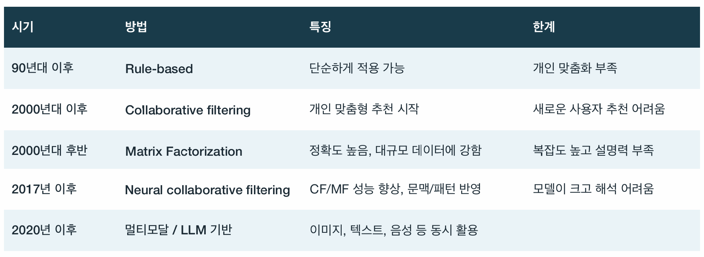
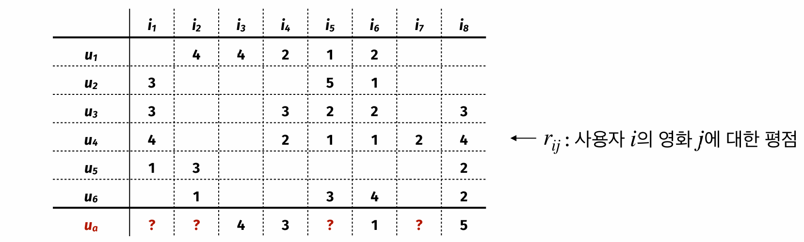
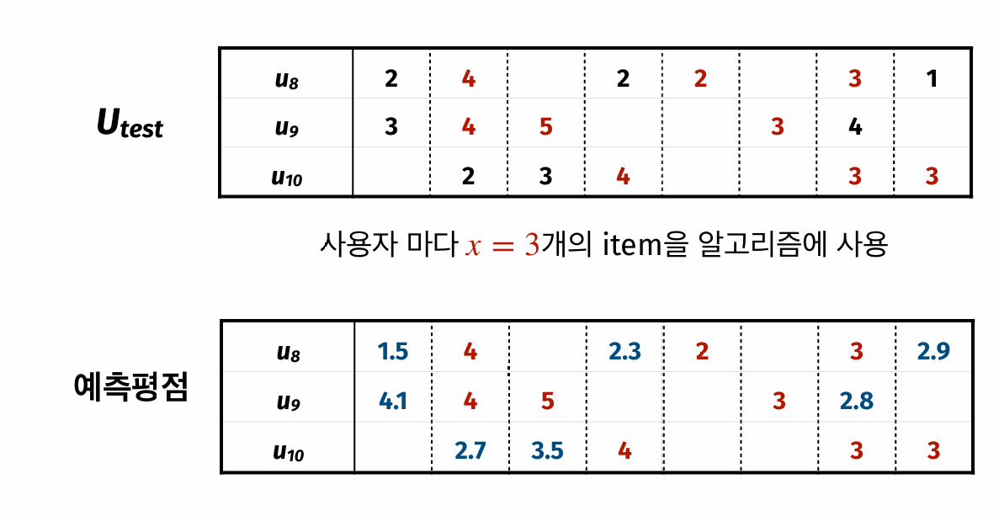
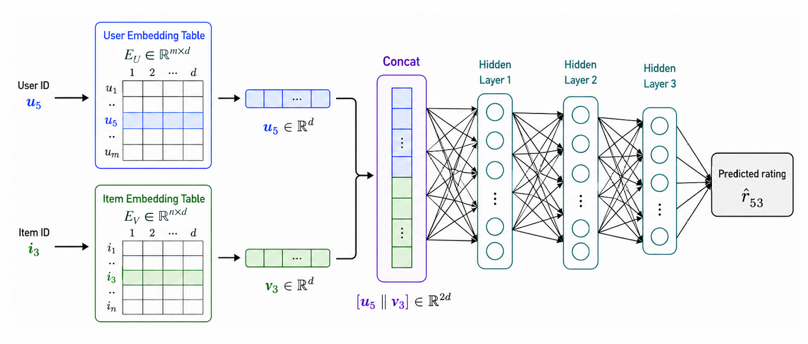

::: {.key-questions}
- **협업 필터링(collaborative filtering, CF)** 은 사용자 기반(user-based)과 아이템 기반(item-based)으로 어떻게 나뉘는가?
- 사용자 기반 CF에서 **유사도(similarity)** 를 계산하고 이웃(neighbor)의 평점으로 추천하는 절차는?
- **행렬분해(matrix factorization, MF)** 는 왜 CF보다 큰 데이터에서 강하고, 어떤 한계를 갖는가?
- **신경망 협업 필터링(neural collaborative filtering, NCF)** 은 MF의 내적 구조를 어떻게 확장하는가?
- 추천 알고리즘의 성능평가와 **cold-start** 문제는 어떻게 다루는가?
:::

> 시험 포인트: 이번 강의의 중심은 **사용자-아이템 기록 행렬**이다. CF는 나와 비슷한 사용자 또는 내가 좋아한 아이템과 비슷한 아이템을 찾고, MF는 평점 행렬 $R$을 $U V^T$로 근사하며, NCF는 사용자/아이템 **임베딩(embedding)** 을 신경망에 넣어 비선형 관계를 학습한다. 평가는 이미 본 아이템 일부를 숨기고 예측한 뒤 MAE/RMSE로 비교한다.

## 1. 추천 시스템의 흐름

::: {.column-margin}
**강의 범위**

Rule-based → CF → MF → NCF 순서.
본론은 CF, MF, NCF.
:::

**추천 시스템(recommender systems)** 은 사용자의 히스토리와 선호도를 바탕으로 상품, 영화, 음악, 책, 웹 페이지, 뉴스 기사 등을 추천하는 시스템이다. 강의에서는 Netflix, Amazon, Instagram, YouTube처럼 추천이 일상 서비스의 핵심 기능이 된 사례에서 출발했다.

초기에는 **규칙 기반(rule-based)** 추천이 많았다. 예를 들어 "A를 구매한 사람은 B도 구매한다"처럼 함께 구매되는 패턴을 규칙으로 쓰는 방식이다. 이후 **협업 필터링(collaborative filtering, CF)** 이 개인 단위 맞춤 추천을 가능하게 했고, 이를 더 수식적으로 학습하는 **행렬분해(matrix factorization, MF)**, 신경망을 붙인 **신경망 협업 필터링(neural collaborative filtering, NCF)** 로 확장된다.



::: {.callout-note title="콘텐츠 기반과 협업 필터링의 구분"}
강의의 본론은 **협업 필터링(collaborative filtering)** 이다. 협업 필터링은 아이템의 내용 자체보다 "어떤 사용자가 어떤 아이템을 평가·구매·클릭했는가"라는 상호작용 기록을 쓴다.

**콘텐츠 기반 추천(content-based recommendation)** 은 장르, 줄거리, 이미지, 배우, 제작비 같은 아이템 자체 정보를 활용하는 방향으로 이해할 수 있다. 이 강의에서는 별도 알고리즘으로 전개하지 않았고, MF의 장르 예시와 NCF의 side information을 통한 cold-start 완화 맥락에서만 연결했다.
:::

## 2. 협업 필터링 (Collaborative Filtering)

**협업 필터링(collaborative filtering, CF)** 은 사용자 단위의 개별 추천을 위한 대표적인 방법이다. 중심을 어디에 두느냐에 따라 두 가지로 나뉜다.

- **사용자 기반 CF(user-based CF)**: 추천 대상 사용자와 비슷한 행동 패턴을 보이는 다른 사용자를 찾고, 그 사용자가 선호한 아이템을 추천한다.
- **아이템 기반 CF(item-based CF)**: 사용자가 과거에 선호한 아이템과 다른 사용자들에게 유사하게 선호된 아이템을 찾아 추천한다.

예를 들어 음악 서비스에서 사용자 기반 CF는 "나와 비슷하게 음악을 들은 다른 사람이 좋아한 앨범"을 추천한다. 아이템 기반 CF는 "내가 들은 특정 아티스트와 유사하게 소비되는 다른 아티스트나 앨범"을 추천한다. 강의의 계산 예시는 사용자 기반 CF를 중심으로 진행했다.

## 3. 사용자 기반 CF 절차

::: {.column-margin}
**평점 행렬**

$r_{ij}$ = 사용자 $i$가 아이템 $j$에 매긴 평점.
빈칸 = 아직 보지 않음.
:::

사용자 기반 CF(user-based CF)는 두 단계로 요약된다.

1. 추천 대상 사용자와 유사한 다른 사용자 그룹, 즉 **이웃(neighbor)** 을 찾는다.
2. 대상 사용자가 아직 접하지 않은 아이템 중 이웃들이 높게 평가한 아이템을 추천한다.



강의 예시는 사용자 6명과 영화 8개의 평점 행렬에서 시작한다. 행은 사용자, 열은 영화, 값은 1점부터 5점까지의 평점이다. 빈칸은 해당 사용자가 아직 영화를 보지 않았다는 뜻이다. 추천 대상 사용자를 $u_a$라고 하면, $u_a$가 이미 평가한 영화는 $i_3=4$, $i_4=3$, $i_6=1$, $i_8=5$이고, $i_1$, $i_2$, $i_5$, $i_7$에 대한 예측 평점을 계산해야 한다.

이때 각 사용자의 평점 행을 하나의 벡터로 보고, 대상 사용자 $u_a$와 다른 사용자의 벡터 유사도를 계산한다. 유사도가 높은 $k$명의 이웃을 고른 뒤, 이웃들이 남긴 평점의 평균 또는 가중평균으로 아직 보지 않은 영화의 평점을 예측한다.

```{mermaid}
graph TD
    A["평점 행렬 R"] --> B["공통 평가 아이템 선택"]
    B --> C["유사도 계산<br/>Pearson / Cosine"]
    C --> D["k개 neighbor 선택"]
    D --> E["이웃 평점 평균 또는 가중평균"]
    E --> F["예측 평점 높은 아이템 추천"]
```

## 4. 유사도 척도 (Similarity Measures)

유사한 사용자를 찾는 일은 결국 두 벡터 사이의 거리를 재는 문제다. 수치형 피처에는 **유클리드 거리(Euclidean distance)** 를 쓸 수 있지만, 평점·구매 여부처럼 값의 종류가 제한된 데이터에서는 강의에서 **피어슨 상관계수(Pearson correlation)** 와 **코사인 유사도(cosine similarity)** 를 주로 언급했다.

두 사용자가 공통으로 평가한 아이템 집합을 $I_{ab}$라고 하자.

**피어슨 상관계수(Pearson correlation)**:

$$
\operatorname{Corr}(u_a,u_b)
=
\frac{
\sum_{j\in I_{ab}}(r_{aj}-\bar r_a)(r_{bj}-\bar r_b)
}{
\sqrt{\sum_{j\in I_{ab}}(r_{aj}-\bar r_a)^2}
\sqrt{\sum_{j\in I_{ab}}(r_{bj}-\bar r_b)^2}
}
$$

두 벡터의 선형 상관관계를 나타내며 $-1$에서 $1$ 사이 값을 가진다.

**코사인 유사도(cosine similarity)**:

$$
\operatorname{CosSim}(u_a,u_b)
=
\frac{\sum_{j\in I_{ab}} r_{aj} r_{bj}}
{\sqrt{\sum_{j\in I_{ab}} r_{aj}^2}\sqrt{\sum_{j\in I_{ab}} r_{bj}^2}}
= \cos\theta
$$

두 벡터 사이 각도 $\theta$의 코사인을 계산한다. 방향이 비슷하면 $1$에 가까워지고, 반대 방향이면 작아진다. 강의에서는 이런 평점 벡터에서 코사인 유사도를 주로 쓰는 것으로 설명했다.

::: {.callout-tip title="계산 예시"}
슬라이드 예시에서 $u_1$과 $u_a$가 공통으로 평가한 영화는 $i_3$, $i_4$, $i_6$이다. 이 세 값만 써서 계산하면 $\operatorname{Corr}(u_1,u_a)\approx 0.756$, $\operatorname{CosSim}(u_1,u_a)\approx 0.960$이다.

공통 평가 아이템이 1개뿐이면 코사인 유사도가 항상 1이 될 수 있으므로, 강의 예시에서는 그런 사용자를 neighbor 후보에서 제외했다.
:::

## 5. Neighbor로 예측 평점 만들기

코사인 유사도를 기준으로 $k=3$명의 이웃을 고르면 예시에서는 $u_1$, $u_3$, $u_4$가 선택된다. 이들이 각 미평가 영화에 준 평점을 평균내면 $u_a$의 예측 평점을 얻는다.

| 영화 | 예측 평점 | 해석 |
|---|---:|---|
| $i_2$ | 4.00 | 가장 추천하기 좋음 |
| $i_1$ | 3.50 | 두 번째 후보 |
| $i_7$ | 2.00 | 낮아서 실제 추천은 애매함 |
| $i_5$ | 1.33 | 추천하기 어려움 |

단순 평균 대신 유사도를 가중치로 한 **가중평균(weighted average)** 을 쓸 수도 있다. 예를 들어 $i_5$에 대한 가중평균은 다음처럼 계산된다.

$$
\hat r_{a5}
=
\frac{0.960\cdot 1 + 0.936\cdot 2 + 0.995\cdot 1}
{0.960+0.936+0.995}
\approx 1.324
$$

유사도가 높은 이웃의 평점을 더 강하게 반영하겠다는 의미다.

## 6. 정규화와 데이터 형태

평점은 사용자의 주관적 기준을 강하게 탄다. 어떤 사용자는 대체로 높은 점수를 주고, 어떤 사용자는 매우 엄격하게 점수를 준다. 그래서 사용자별 평점을 **z-score 표준화(z-score normalization)** 한 뒤 CF를 적용하기도 한다.

$$
z_{ij}=\frac{r_{ij}-\bar r_i}{s_i}
$$

여기서 $\bar r_i$는 사용자 $i$의 평균 평점, $s_i$는 사용자 $i$의 평점 표준편차다. 표준화는 유사도 계산에서 사용자별 평점 스케일 차이를 줄이는 역할을 한다.

평점 데이터가 아니어도 같은 구조를 쓸 수 있다. 쇼핑몰에서는 구매 여부를 $0/1$로 둘 수 있고, 장바구니에 담았지만 구매하지 않은 경우를 중간값처럼 설계할 수도 있다. $0/1$ 값이면 예측값은 구매 또는 클릭 확률처럼 해석될 수 있다.

## 7. CF의 한계와 Cold Start

사용자 기반 CF는 단순하지만 한계도 분명하다.

- **계산 비용(computational cost)**: 모든 사용자의 기록을 유지하고 유사도를 계산해야 하므로 사용자 수가 커질수록 메모리와 시간이 든다.
- **Cold-start 문제**: 새 사용자나 새 아이템은 평점·구매 기록이 거의 없어서 유사도를 계산하기 어렵다. 스트리밍 서비스가 가입 직후 좋아하는 영화를 몇 개 고르게 하는 이유가 여기에 있다.
- **희소성(sparsity)**: 사용자-아이템 행렬은 대부분 빈칸이다. 한 해에 영화가 많이 나와도 한 사용자가 보는 영화는 일부뿐이므로, 실제 평점이 채워진 비율이 낮아 유사도 계산이 부정확해질 수 있다.

## 8. 추천 알고리즘 평가

추천 알고리즘도 답이 있는 문제처럼 평가할 수 있다. 핵심은 이미 알고 있는 평점을 일부러 숨기고, 알고리즘이 그 값을 얼마나 잘 예측하는지 보는 것이다.

1. 전체 사용자를 training set과 test set으로 나눈다.
2. test 사용자마다 이미 평가한 아이템 중 $x$개만 알고리즘에 보여준다.
3. 나머지 평점은 "안 본 것처럼" 가리고 예측한다.
4. 숨겨둔 실제 평점과 예측 평점의 차이를 계산한다.

평가지표로는 **평균절대오차(Mean Absolute Error, MAE)**, **평균제곱오차(Mean Squared Error, MSE)**, **제곱근평균제곱오차(Root Mean Squared Error, RMSE)** 를 쓴다.

$$
\operatorname{MAE}
=\frac{1}{|\mathcal T|}\sum_{(i,j)\in\mathcal T}|r_{ij}-\hat r_{ij}|
$$

$$
\operatorname{MSE}
=\frac{1}{|\mathcal T|}\sum_{(i,j)\in\mathcal T}(r_{ij}-\hat r_{ij})^2,
\qquad
\operatorname{RMSE}=\sqrt{\operatorname{MSE}}
$$



여기서 $\mathcal T$는 평가 대상으로 숨긴 사용자-아이템 쌍의 집합이다. 슬라이드 예시에서는 평가 대상 7개 평점에 대해 $\operatorname{MAE}=0.886$, $\operatorname{RMSE}=1.024$로 계산했다.

## 9. 행렬분해 (Matrix Factorization)

**행렬분해(matrix factorization, MF)** 는 사용자-아이템 평점 행렬 $R$을 두 행렬의 곱으로 근사한다.

$$
R \approx U V^T
$$

사용자 수가 $m$, 아이템 수가 $n$, 잠재요인 수가 $d$라면 다음처럼 둔다.

$$
R\in\mathbb{R}^{m\times n},\quad
U\in\mathbb{R}^{m\times d},\quad
V\in\mathbb{R}^{n\times d}
$$

사용자 $i$의 벡터를 $u_i$, 아이템 $j$의 벡터를 $v_j$라고 하면 예측 평점은 두 벡터의 내적으로 계산한다.

$$
\hat r_{ij}=u_i^T v_j
$$

강의에서는 먼저 장르 예시로 직관을 설명했다. 사용자의 장르 선호 벡터와 영화의 장르 벡터가 유사하면 그 사용자가 영화를 좋아할 가능성이 높다고 보는 것이다. 하지만 실제 MF에서는 각 열이 반드시 "액션 선호"나 "다큐 선호"처럼 해석되는 것은 아니다. 예측 성능을 높이도록 학습된 숨은 축이므로 **잠재요인(latent factor)** 이라고 부른다.

::: {.callout-note title="MF 학습의 핵심"}
처음에는 $U$와 $V$ 값을 랜덤으로 둔다. 관측된 평점이 있는 위치에서 $\hat r_{ij}=u_i^T v_j$를 계산하고, 실제 평점 $r_{ij}$와의 차이를 손실로 둔다.

$$
\mathcal L(U,V)
=
\frac{1}{|\mathcal D|}
\sum_{(i,j)\in\mathcal D}(r_{ij}-u_i^T v_j)^2
$$

$\mathcal D$는 실제 평점이 존재하는 사용자-아이템 쌍이다. 이후 경사하강(gradient descent)처럼 손실을 줄이는 방향으로 $U$와 $V$를 반복 업데이트한다. 강의에서는 이 흐름을 신경망의 weight와 bias를 랜덤 초기화하고 손실에 따라 업데이트하는 과정과 같은 구조로 설명했다.
:::

MF는 단순히 가까운 이웃의 평균을 내는 CF보다, 평점 행렬을 직접 근사하는 수식 관계를 학습한다. 데이터가 충분히 크면 일반적으로 CF보다 예측 정확도가 높아질 수 있다. 대신 잠재요인의 의미를 해석하기 어렵고, $U$와 $V$를 추정하는 학습 단계가 필요하다. 또한 새 사용자나 새 아이템의 기록이 없으면 여전히 cold-start 문제가 남는다.

## 10. 신경망 협업 필터링 (Neural Collaborative Filtering)


MF의 $u_i$와 $v_j$는 사용자와 아이템을 $d$차원 벡터로 압축한 **임베딩 벡터(embedding vector)** 로 볼 수 있다. 이전 이미지 강의에서 얼굴 이미지를 CNN이 임베딩 벡터로 바꾸고, 가까운 임베딩끼리 같은 사람으로 해석했던 것과 같은 생각이다.

MF는 두 임베딩의 내적, 즉 선형 관계로 상호작용을 모델링한다.

$$
\hat r_{ij}=u_i^T v_j
$$

**신경망 협업 필터링(neural collaborative filtering, NCF)** 은 내적 대신 사용자 임베딩과 아이템 임베딩을 이어 붙인 뒤 신경망에 넣는다.



NCF에서 학습 대상은 두 종류다.

- 사용자와 아이템의 임베딩 테이블 $E_U$, $E_V$
- hidden layer의 가중치(weight)와 편향(bias)

MF에서는 내적을 해야 하므로 사용자 임베딩과 아이템 임베딩의 차원이 같아야 한다. 반면 NCF는 두 벡터를 연결(concat)해서 신경망에 넣기 때문에 두 임베딩 차원이 달라도 적용할 수 있다. 신경망의 장점은 단순 내적보다 더 복잡한 비선형 관계를 표현할 수 있다는 점이다.

평점 예측이면 손실은 MF와 마찬가지로 MSE를 쓴다.

$$
\mathcal L
=
\frac{1}{|\mathcal D|}
\sum_{(i,j)\in\mathcal D}(r_{ij}-\hat r_{ij})^2
$$

구매나 클릭처럼 $r_{ij}\in\{0,1\}$인 문제라면 **교차 엔트로피(cross-entropy)** 를 쓴다.

$$
\mathcal L
=
-\frac{1}{|\mathcal D|}
\sum_{(i,j)\in\mathcal D}
\left[
r_{ij}\log \hat r_{ij}
+(1-r_{ij})\log(1-\hat r_{ij})
\right]
$$

## 11. Side Information과 Cold Start 완화

CF와 MF는 사용자-아이템 상호작용 기록이 없으면 새 사용자나 새 아이템에 취약하다. NCF는 여기에 **부가 정보(side information)** 를 넣는 네트워크를 붙여 cold-start를 완화할 수 있다.

아이템에는 줄거리, 배우, 제작비, 포스터 이미지 같은 정보가 있을 수 있다. 사용자는 가입 정보나 프로필 정보가 있을 수 있다. 이런 정보를 입력받아 사용자 또는 아이템 임베딩을 출력하는 별도 네트워크를 학습하면, 아직 평점이 없어도 어느 정도 임베딩을 만들 수 있다.

예를 들어 이미지는 CNN 형태로, 텍스트는 텍스트를 수치 벡터로 바꾸는 네트워크 형태로 연결할 수 있다. 강의에서는 이것이 cold-start를 완전히 해결한다기보다, 평점 정보가 아닌 다른 정보로 임베딩을 얻어 문제를 **완화**하는 방향이라고 설명했다.

## 개념 연결

- **k-NN**: 사용자 기반 CF는 대상 사용자와 가까운 neighbor를 찾는다는 점에서 k-NN과 구조가 비슷하다.
- **SVM의 내적**: MF에서 $u_i^T v_j$로 유사도를 계산하는 방식은 내적이 유사도 측정 수단으로 쓰인다는 앞선 강의와 연결된다.
- **신경망 학습**: MF의 $U,V$ 업데이트와 NCF의 임베딩·가중치 업데이트는 손실을 계산하고 경사하강으로 파라미터를 조정한다는 점에서 신경망 학습과 같은 흐름이다.
- **표현 학습(representation learning)**: 사용자와 아이템을 임베딩 벡터로 표현한다는 생각은 얼굴 인식 임베딩, 이후 단어 임베딩과 이어진다.

::: {.lecture-summary}
- **CF**는 사용자-아이템 기록을 기반으로 추천한다. 사용자 기반은 비슷한 사용자를, 아이템 기반은 비슷하게 소비되는 아이템을 중심에 둔다.
- 사용자 기반 CF는 공통 평가 아이템으로 **피어슨 상관계수(Pearson correlation)** 또는 **코사인 유사도(cosine similarity)** 를 계산하고, $k$개 neighbor의 평점 평균 또는 가중평균으로 예측한다.
- 평점 성향 차이는 사용자별 **z-score 표준화**로 줄일 수 있고, 성능은 숨긴 평점에 대한 **MAE/RMSE** 로 평가한다.
- CF의 한계는 계산 비용, **cold-start**, **희소성(sparsity)** 이다.
- **MF**는 $R\approx U V^T$, $\hat r_{ij}=u_i^T v_j$로 평점 행렬을 근사한다. 큰 데이터에서 정확도가 좋아질 수 있지만 해석 가능성이 낮고 학습 단계가 필요하다.
- **NCF**는 사용자/아이템 임베딩을 연결해 신경망에 넣고 비선형 관계를 학습한다. 평점은 MSE, 구매·클릭 여부는 cross-entropy를 손실로 쓴다.
- NCF에 **side information** 네트워크를 붙이면 새 사용자·아이템의 임베딩을 보완해 cold-start를 완화할 수 있다.
:::
