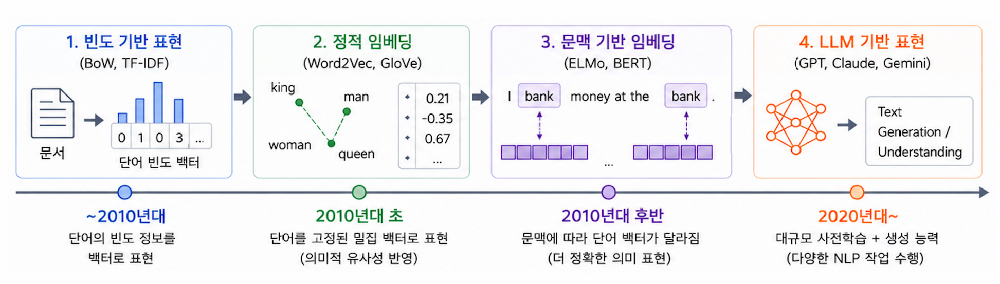
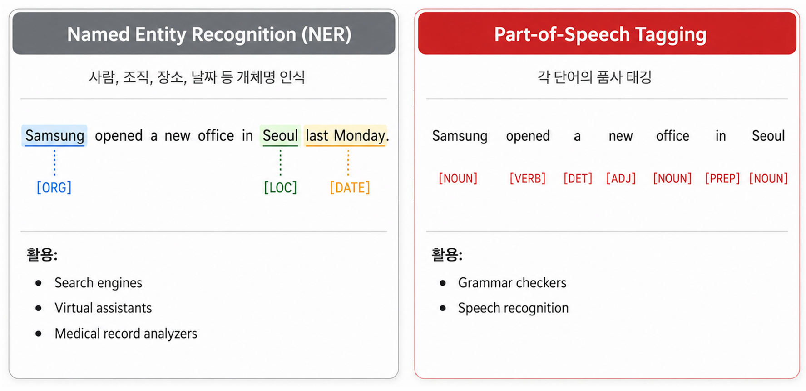
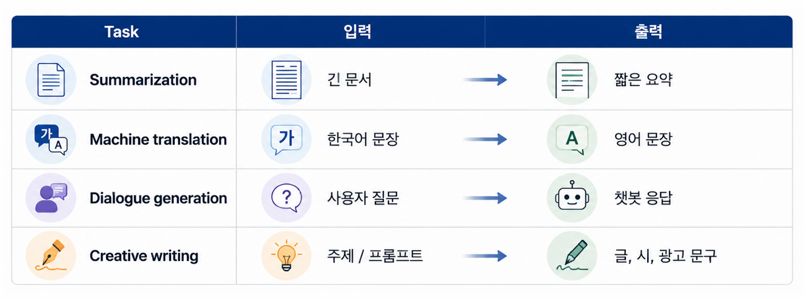
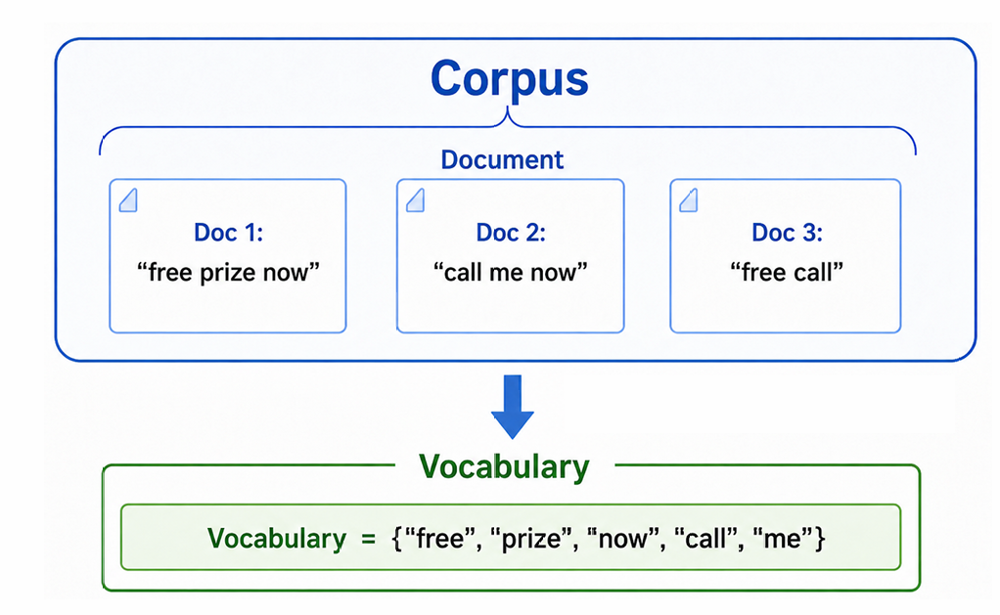
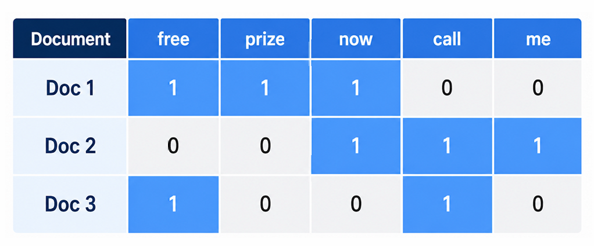

::: {.key-questions}
- **텍스트** 데이터는 왜 이미지보다 입력으로 다루기 어려운가?
- **토큰화(tokenization)** 와 BoW(Bag of Words) 로 텍스트를 어떻게 같은 크기 벡터로 만드는가?
- **DTM** 의 한계(희소성·오버피팅)와 **TF-IDF** 가 그것을 어떻게 보정하는가?
- R `tm` 패키지로 스팸 분류를 끝까지 돌리는 전처리 파이프라인은?
- 빈도 기반 표현의 근본적 한계(순서·문맥·부정·동의어)는 무엇인가?
:::

> 시험 포인트: 텍스트는 길이·구조가 제각각인 **비정형(unstructured)** 데이터라 같은 크기 벡터로 만드는 게 출발점. **BoW** = 순서·문맥 다 무시하고 단어 등장 **횟수**만 센 **DTM**(행=문서, 열=단어). 단점은 **희소(sparse) 행렬·오버피팅**. **TF-IDF** = TF(문서 내 빈도) × IDF($\log\frac{\text{전체 문서수}}{\text{단어 포함 문서수}}$) 로 "흔한 단어"를 깎고 "특정 문서에만 자주 나오는 단어"를 키움. 한계 = 순서·문맥·부정·동의어를 못 담음 → 다음 강의(word embedding) 로.

## 1. 왜 텍스트는 어려운가 — 입력 표현의 문제

::: {.column-margin}
**이미지 vs 텍스트**

이미지 = 처음부터 픽셀(숫자) 벡터, 크기 규격 고정.
텍스트 = 길이·표현·문법 제각각인 **비정형** 데이터.
:::

지금까지 다룬 데이터(수치형·범주형)는 모두 **정형(structured)** — 피처 개수가 고정이라 바로 숫자 벡터로 쓸 수 있었다. 이미지조차 결국 픽셀(RGB 채널)값이라 **처음부터 수치형**이다.

텍스트는 다르다. 같은 질문도 사람마다 길이가 다르고, 표현·문법이 일정하지 않은 **비정형(unstructured)** 데이터다. "이걸 어떻게 같은 크기의 숫자로 바꾸나"가 가장 먼저 막히는 지점.

- **모호성(ambiguity)**: "I put my bag in the car, **it** is large and blue" — `it` 이 가방인지 차인지 문장만 봐선 모른다.
- **문맥 의존**: "**배**가 고프다"(신체) vs 그냥 "배"(과일·선박). "오늘 경기 진짜 **미쳤다**"(칭찬? 비난?)는 텍스트 전체를 봐야 안다.
- **띄어쓰기**: "now here" ↔ "nowhere", "아버지가방에들어가신다" 등 분절에 따라 의미가 달라짐.



이번 장은 **①번 빈도 기반 표현**(모든 텍스트를 같은 크기 벡터로). ③번 문맥 반영은 다음 장

::: {.callout-note title="텍스트 애널리틱스 vs NLP"}
강의에서 영어 용어 자체는 중요치 않다고 했지만 정리하면: **텍스트 애널리틱스**는 우리가 해온 분류·예측을 텍스트에 적용하는 수준, **NLP(Natural Language Processing)** 는 생성까지 포함해 더 큰 범위로 컴퓨터가 언어를 이해·분석·생성하게 하는 분야.
:::

### NLP 의 대표 태스크

- **분류(classification)**: 리뷰 감성분석(positive/negative), SMS·메일 스팸 탐지, 고객 문의 의도 분류(환불/배송…), 뉴스 토픽 분류.
- **라벨링 — NER(Named Entity Recognition)**: 텍스트에서 고유명사(사람·지명·날짜·기관)를 찾아내는 것. 검색 등에서 활용.



- **생성(generation)**: 챗봇, 번역, 요약, 글쓰기 보조 등. 다음 강의에서 다룰 문맥 반영 표현이 핵심.



## 2. 토큰화(Tokenization)

이미지의 최소 피처 단위가 **픽셀**이듯, 텍스트도 피처 역할을 할 **최소 단위 = 토큰(token)** 을 만들어야 한다. 토큰을 만드는 과정이 **토큰화**.

- **기본 단위 = 단어**. 영어는 띄어쓰기·구두점으로 단어 분리가 비교적 쉽다.
- **형태소(morpheme)**: 단어를 더 쪼갠 의미 단위. "doing" = do + ing, "좋았어요" = 좋 + 았(과거) + 어요. 목적·태스크에 따라 필요한 토큰 형태가 달라진다.

::: {.column-margin}
**한국어가 까다로운 이유**

조사·어미가 단어에 붙음.
"배송**이** 빠르다" vs "배송**은** 빠르다" — 의미가 달라짐.
→ 단순 공백 분리로는 부족, 형태소 분석 필요.
:::

영어는 공백·구두점 분리로 충분한 경우가 많고, 한국어는 조사·어미 결합 때문에 형태소 단위 처리가 필요하다. 언어마다 토큰화 방법이 독립적으로 발전해 왔다. (이 강의는 기본적으로 **영어, 단어 = 토큰** 으로 가정.)

## 3. Bag of Words(BoW) 와 DTM

가장 단순한 방법: **순서·문법·문맥·의미를 전부 무시**하고, 텍스트 안에 특정 단어가 **몇 번 등장했는지만 카운트**한다. 문장의 토큰들을 "가방에 다 넣고 섞었다"고 생각 → 순서가 사라지고 빈도만 남음. 그래서 **Bag of Words**.

::: {.column-margin}
**핵심 용어 계층**

토큰 ⊂ 보캐뷸러리 → 문서(document) → 코퍼스(corpus)
:::



- **코퍼스(corpus)**: 전체 텍스트 데이터의 집합 (예: 쇼핑몰 리뷰 전체).
- **문서(document)**: 코퍼스 안의 텍스트 하나하나 (예: 리뷰 1건, SMS 1통).
- **보캐뷸러리(vocabulary)**: 코퍼스 전체에 등장한 **고유 토큰의 집합**.

보캐뷸러리의 **토큰 하나하나가 피처(feature)** 가 된다. 단어 종류가 수만~수십만 개라 피처 수가 매우 커진다.

### DTM (Document-Term Matrix)

- **행 = 문서(document)**, **열 = 텀(term, 토큰 하나)**.
- 값 = 그 문서에 그 단어가 등장한 **횟수**.



각 문서를 "보캐뷸러리 크기의 벡터"로 만든 행렬. 이렇게 하면 텍스트가 **고정 크기 수치 피처**가 되어, 타깃(예: 스팸/햄)을 붙이면 **지금까지 배운 로지스틱 회귀·SVM 등 모든 분류·예측 기법을 그대로 적용**할 수 있다.

::: {.callout-warning title="DTM 의 두 가지 문제"}
**① 희소 행렬(sparse matrix)**: 하나의 문서는 보캐뷸러리 중 극히 일부 단어만 포함 → 행렬의 대부분(99.99%)이 0. 메모리·계산시간 급증.

**② 오버피팅**: 어떤 스팸에 우연히 한 번만 나온 특이 단어가 "100% 스팸" 처럼 보여 모델이 거기에 과적합.
:::

**간단한 해결**: 등장 빈도가 매우 낮은 단어(피처)를 제거해 열 개수를 줄인다 (예: 6559개 → 수백 개).

## 4. TF-IDF — "자주 나온다고 중요한 건 아니다"

DTM은 단순 빈도라, `make, get, take, time` 처럼 **어느 문서에나 흔한 단어**도 큰 값을 가진다. 하지만 이런 단어는 문서를 **특징짓지 못한다**. 반대로 `lottery(복권)` 처럼 **특정 문서(스팸)에만 자주, 코퍼스 전체에선 드물게** 나오는 단어가 분류에 강력하다.

→ "이 문서에서 얼마나 자주(TF)" × "코퍼스 전체에선 얼마나 드문가(IDF)" 를 결합.

::: {.column-margin}
**직관**

흔한 단어 → IDF 작음 → 깎임.
특정 문서에만 + 전체엔 드묾 → IDF 큼 → 강조됨.
모든 문서에 등장 → IDF $=\log 1 = 0$ → 값 0.
:::

- **TF (Term Frequency)**: 단어 $t$ 가 문서 $d$ 에 등장한 횟수 — 곧 DTM 의 값 그대로. $\text{tf}_{t,d}$.
- **IDF (Inverse Document Frequency)**: 단어가 코퍼스 전체에서 드물수록 커지는 값.

$$ \text{idf}_t = \log\frac{N}{\text{df}_t} \qquad (N=\text{전체 문서 수},\; \text{df}_t=\text{단어 }t\text{ 를 포함한 문서 수}) $$

$$ \text{tf-idf}_{t,d} = \text{tf}_{t,d}\times \text{idf}_t $$

::: {.callout-tip title="강의 예시 계산 (N = 5559)"}
- **get**: 문서 내 3회, 포함 문서 4500개 → $\text{idf}=\log\frac{5559}{4500}\approx0.3$ → tf-idf $= 3\times0.3 = 0.9$
- **free**: 문서 내 2회, 포함 문서 300개 → $\log\frac{5559}{300}$ (훨씬 큼)
- **lottery**: 문서 내 2회, 포함 문서 15개 → $\log\frac{5559}{15}\approx8.53$ → tf-idf 매우 큼

→ 문서 내 등장 횟수(3,2,2)는 비슷해도, **코퍼스 전체에서의 희소성** 때문에 lottery 가 압도적으로 높은 값을 받아 스팸 판별에 큰 역할을 한다. 모든 문서에 나오는 단어는 $\log\frac{N}{N}=0$ 이라 값이 0이 됨.
:::

## 5. 실습 — R `tm` 으로 SMS 스팸 분류

데이터: `sms_spam.csv`, **5559개 SMS** (햄 4872 / 스팸 747 — 약 13%로 **불균형**).

```{mermaid}
graph LR
    A["원문 텍스트"] --> B["코퍼스 생성<br/>Corpus / VCorpus"]
    B --> C["전처리<br/>(토큰화)"]
    C --> D["DTM 생성"]
    D --> E["TF-IDF 변환"]
    E --> F["희소 단어 제거"]
    F --> G["로지스틱 회귀<br/>(glm)"]
```

### 전처리 단계 (`tm` 패키지)

1. **코퍼스 생성**: 텍스트 → `Corpus`/`VCorpus` 로 문서·코퍼스 구조 생성.
2. **소문자 변환**: 대소문자 구분이 의미 없으니 통일.
3. **숫자 제거**: 날짜·시간 등 대부분 의미 없음.
4. **불용어(stopwords) 제거**: 관사·전치사·대명사처럼 자주 나오지만 의미 식별에 도움 안 되는 단어.
5. **구두점 제거**.
6. **스테밍(stemming, 어간 추출)**: `run / runs / running` 처럼 같은 어간 파생어를 하나로 통일. `SnowballC` 패키지의 **Porter 알고리즘** 사용. 규칙 기반이라 완벽하진 않음 (예: `morning → morn`, 사전에 없는 단어가 나올 수도 — 그래도 무방).

### 모델링

- 전처리 후 `DocumentTermMatrix()` → **5559 × 6559** 행렬(거의 0).
- TF-IDF 가중치 적용(정수 → 실수값).
- **희소 단어 제거** `removeSparseTerms(…, 0.995)`: 약 0.5%(≈28개) 미만 문서에만 나오는 단어 제거 → 피처 **6559 → 306개**(약 1/20).
- 데이터프레임 + 타깃 → train/test 분할 → `glm`(로지스틱 회귀).
- 불균형이라 **F1 score** 로 평가 → **약 0.82**. 단순 빈도만으로도 스팸 분류는 꽤 잘 됨 (태스크가 단순하면 모델도 단순해도 충분).

## 6. 빈도 기반 표현의 한계

오분류 사례를 보면 `call, alert` 같은 단어가 들어가면 정상 메시지도 스팸으로 분류되곤 한다 — **단어 등장 횟수만** 보기 때문. 근본 한계:

| 한계 | 설명 |
|---|---|
| **순서 무시** | "개가 사람을 문다" = "사람이 개를 문다" (빈도 동일) |
| **다의성(문맥)** | `bat` 가 야구방망이인지 박쥐인지 구별 못함 |
| **부정 처리** | `not good` 과 `good` 이 둘 다 good 1회 → 정반대인데 비슷하게 취급 |
| **동의어** | `좋다 / 훌륭하다 / 최고다` 가 의미상 비슷한데 전부 독립 단어로 처리 |

→ 더 정확하려면 **단어 주변 문맥·의미까지** 수치화해야 한다. 그게 다음 방식(**word embedding**, Lecture 26).

## 개념 연결

- DTM/TF-IDF 로 텍스트가 **수치 피처 행렬**이 되면, 이전까지 배운 **로지스틱 회귀·SVM·앙상블** 등을 그대로 쓸 수 있다(피처 엔지니어링의 한 형태).
- 희소·고차원·오버피팅 문제는 SVM·트리에서 본 **차원/정규화** 논의와 연결.
- 한계(순서·문맥·의미)를 풀기 위한 **표현 학습(representation learning)** 의 흐름은 Lecture 22(이미지 임베딩)와 같은 발상 → Lecture 26 word embedding 으로 이어짐.

::: {.lecture-summary}
- 텍스트는 길이·구조가 제각각인 **비정형** 데이터 → 같은 크기 수치 벡터로 만드는 게 핵심 과제.
- **토큰화**: 피처 최소 단위(토큰=단어) 생성. 한국어는 조사·어미 때문에 형태소 단위 필요.
- **BoW/DTM**: 순서 무시, 단어 빈도만 카운트(행=문서, 열=단어). → 기존 분류·예측 기법 그대로 적용 가능. 단, **희소 행렬·오버피팅** 문제.
- **TF-IDF** = TF × $\log\frac{N}{\text{df}}$: 흔한 단어 깎고, 특정 문서에만 드물게 나오는 단어 강조.
- **실습**: `tm` 전처리(소문자·숫자·불용어·구두점 제거 + 스테밍) → DTM → TF-IDF → 희소 단어 제거(6559→306) → 로지스틱 회귀, F1 ≈ 0.82.
- **한계**: 순서·문맥(다의성)·부정·동의어를 못 담음 → word embedding 으로.
:::
